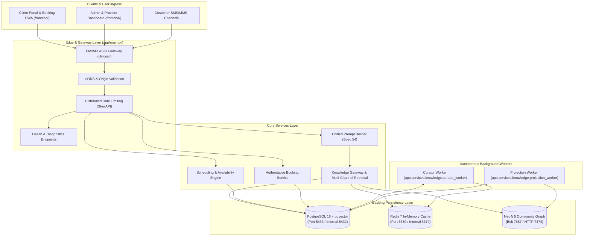
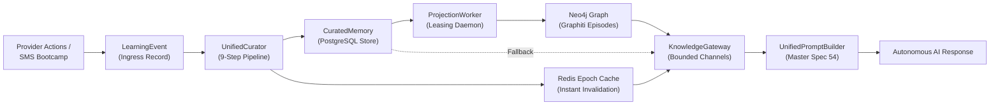

# FastAPI Bookings — Multi-Tenant Autonomous Booking & Knowledge Platform

FastAPI Bookings is a high-concurrency, multi-tenant appointment scheduling, provider operations, and autonomous learning platform. Built with Python, FastAPI, SQLAlchemy, Alembic, Vite/React, and Neo4j/Graphiti, the platform provides discrete calendar slot allocation, double-booking prevention, automated SMS/AI conversational workflows, and continuous epistemic knowledge graph curation with sub-millisecond Redis caching.

---

## 1. Executive Summary & Purpose

FastAPI Bookings is authoritative for:
- **Tenants, Providers, and Users**: Multi-tenant isolation across organizations, staff providers, resources, and customers.
- **Scheduling & Availability**: Real-time slot computation, calendar holds, discrete double-booking lockouts, and schedule rules.
- **Autonomous Learning & Memory**: Long-term epistemic memory curation, automated PII sanitization, and temporal knowledge graphs.
- **Omnichannel Dialogue & Booking**: Conversational AI booking orchestration, SMS arrival notices, and customer self-service portals.

### High-Level Architecture Topology



---

## 2. Core Architecture & Technologies

### Backend Stack
- **Framework**: FastAPI (ASGI asynchronous application).
- **ORM & Database**: SQLAlchemy with declarative models and connection pooling.
- **Migrations**: Alembic with full versioned migration history (Head: `b2c3d4e5f6a7_add_learning_event_worker_leasing.py`).
- **Telemetry & Observability**: OpenTelemetry instrumentation with low-cardinality structural attributes, correlation IDs (`X-Request-ID`), and SigNoz OTLP exporter.

### Frontend Stack (`frontend/`)
- **Framework**: React 18 with TypeScript and Vite.
- **State & Routing**: React Router DOM, React Query / TanStack Query, and Lucide Icons.
- **UI Components**: Modern responsive design with Tailwind CSS and atomic component architecture.
- **Build Output**: Static assets compiled to `frontend/dist/` for edge CDN or reverse-proxy serving.

### Backing Stores & Infrastructure
- **Relational Store**: PostgreSQL 16 with `pgvector` extension for transactional relational records, slot allocations, outbox events, and curated memory vectors. Default dev port: `5433` (internal: `5432`).
- **Ephemeral State & Cache**: Redis 7 Alpine for distributed rate limiting, composite epoch cache invalidation, and session locks. Default dev port: `6380` (internal: `6379`).
- **Epistemic Knowledge Graph**: Neo4j 5 Community Edition with APOC plugins for Graphiti episodic memory, temporal relationships, and ontological entity projections. Ports: Bolt `7687`, HTTP `7474`.

### Dedicated Background Workers
1. **`curator-worker` (`app/services/knowledge/curator_worker.py`)**:
   - Polls and claims uncurated `LearningEvent` rows using transactional lease locks (`lease_owner`, `lease_expires_at`).
   - Executes the 9-step continuous curation pipeline: validation, PII scrubbing, dynamic operational data rejection, safety quarantining, supersession tracking, and atomic persistence into `CuratedMemory`.
   - Atomically enqueues pending projections into the `KnowledgeGraphProjection` ledger and invalidates Redis tenant/provider epochs.
2. **`projection-worker` (`app/services/knowledge/projection_worker.py`)**:
   - Polls and leases `pending` or `retry` items from the `knowledge_graph_projections` ledger using database row locks (`skip_locked`).
   - Constructs ontological Graphiti episodes (nodes, edge predicates, temporal validity, rich provenance) and projects them into Neo4j.
   - Enforces exponential backoff on transient errors and transitions exhausted attempts to `dead_letter` status.

---

## 3. Autonomous Learning Loop & Knowledge Subsystem

The platform features an autonomous, closed-loop epistemic memory pipeline that continuously learns provider preferences, operational rules, and behavioral boundaries while strictly isolating tenant and provider boundaries.



### End-to-End Pipeline Stages

1. **Ingress**: Provider instructions, manual corrections, customer interactions, or Bootcamp training sessions create an immutable `LearningEvent` record.
2. **Curation**: The `UnifiedCurator` runs the event through 9 validation filters:
   - Scope and boundary validation (`tenant_id`, `provider_id`).
   - Automated PII and credential scrubbing.
   - Dynamic operational data rejection (rejects live booking slots, quotes, time-sensitive holds from polluting graph memory).
   - System safety and prompt-injection quarantining.
   - Semantic deduplication and supersession marking (`supersedes_memory_id`).
3. **Relational Persistence**: Approved knowledge is written to `CuratedMemory` and an outbox record is inserted into `knowledge_graph_projections`.
4. **Graph Projection**: The `ProjectionWorker` claims the ledger item, builds an ontological Graphiti episode (`Entity`, `Predicate`, `Boundary`, `TemporalValidity`), and projects it into Neo4j.
5. **Epoch Invalidation**: The Redis composite epoch (`tenant_epoch:provider_epoch`) is incremented, immediately busting stale cached retrievals in $O(1)$ time without expensive wildcard key deletions.
6. **Bounded Retrieval**: When conversational prompts require factual or behavioral context, the `KnowledgeGateway` performs bounded multi-channel retrieval (Facts, Behaviors, Examples) against Neo4j or safe PostgreSQL fallback paths.
7. **Prompt Assembly**: The `UnifiedPromptBuilder` merges operational constraints, curated knowledge, and conversation history according to strict hierarchical precedence.

---

## 4. Master Spec 54 Precedence & System Invariants

### 10-Layer Prompt Precedence Order (Master Spec 54)
When assembling prompts for conversational AI, the following strict hierarchy is enforced:

| Layer | Component | Authority & Rule |
| :--- | :--- | :--- |
| **Layer 1** | System Role & Immutable Safety | Foundational system directives, tool usage contracts, and safety guardrails. Cannot be overridden. |
| **Layer 2** | **Operational & Tool Truth** | **Calendar slots, active holds, pricing, service durations, and live availability.** Strictly overrides Layer 6. |
| **Layer 3** | Provider Boundary & Identity | Specific identity, tone, and operational boundaries of the active provider. |
| **Layer 4** | Behavioral Guidance | Curated rules regarding booking policies, lead times, and communication tone. |
| **Layer 5** | Location & Resource Rules | Location-specific operational constraints, physical resources, and room availability. |
| **Layer 6** | **Curated Factual Context** | Epistemic knowledge graph memories (services, general FAQs, provider bio). **Subordinate to Layer 2.** |
| **Layer 7** | Few-Shot Examples | Curated exemplar dialogue turns demonstrating desired format and style. |
| **Layer 8** | Conversation Context | Recent message history and customer session dialogue. |
| **Layer 9** | Current Customer Message | Inbound prompt or SMS trigger requiring action. |
| **Layer 10** | Execution Trigger | Immediate instruction directing the AI to generate the next response or tool call. |

> [!IMPORTANT]
> **Operational Truth Invariant**: Live calendar availability, active booking holds, service pricing, and database constraints (Layer 2) **always strictly override** any semantic or graph memory (Layer 6). If curated knowledge says a service is $50 but the relational database service record is configured at $75, the database price is the authoritative operational truth.

### Multi-Tenant & Provider Isolation
- Every database query and graph query must explicitly partition by `tenant_id`.
- Provider-specific knowledge and settings must never leak into shared tenant space or cross provider boundaries.
- Neo4j Graphiti groups strictly partition into:
  - `tenant:{tenant_id}:shared` (for tenant-wide rules, policies, and locations).
  - `tenant:{tenant_id}:provider:{provider_id}` (for private provider preferences, styles, and overrides).

### Zero-DDL Feature Flag Rollback Safety
- Knowledge graph projections and Graphiti retrievals are gated behind feature flags:
  - `GRAPH_KNOWLEDGE_ENABLED=false`: Instantly reverts retrieval to the PostgreSQL `CuratedMemory` fallback path without runtime DDL or schema teardown.
  - `GRAPH_SHADOW_WRITE=true`: Allows shadow projection to Neo4j while keeping PostgreSQL authoritative.
  - `GRAPH_SHADOW_READ=true`: Compares Graphiti retrieval against PostgreSQL fallback retrieval with zero customer-facing impact.
  - `GRAPH_CANARY_PROVIDER_IDS` / `GRAPH_CANARY_TENANT_IDS`: Enables fine-grained canary rollouts by provider or tenant ID.

---

## 5. Repository Layout & Key Modules

```text
fastapi_bookings/
├── alembic/                      # Database migrations
│   ├── env.py                    # Alembic configuration & migration harness
│   └── versions/                 # Migration revisions (Head: b2c3d4e5f6a7)
├── app/
│   ├── api/
│   │   ├── deps.py               # Authentication, tenant scoping, and session dependencies
│   │   └── routers/              # API router endpoints
│   │       ├── auth.py           # Authentication, JWT, and session management
│   │       ├── bookings.py       # Core booking creation, modification, and cancellation
│   │       ├── availability.py   # Discrete availability computation and slot allocations
│   │       ├── diagnostics.py    # Health, granular readiness, and telemetry status
│   │       ├── sms_*.py          # SMS conversations, accounts, and arrival webhooks
│   │       └── ...
│   ├── core/
│   │   ├── config.py             # Application settings & environment parsing
│   │   ├── redis.py              # Redis client pool and connectivity checks
│   │   └── telemetry.py          # OpenTelemetry initialization and tracing setup
│   ├── db/
│   │   ├── base_class.py         # SQLAlchemy Base model declaration
│   │   └── database.py           # Engine creation, connection pooling, and session factory
│   ├── models/                   # SQLAlchemy ORM declarative models
│   │   ├── booking.py            # Booking records, statuses, and allocations
│   │   ├── curated_memory.py     # Curated epistemic memory and knowledge proposals
│   │   ├── knowledge_projection.py # Knowledge graph projection ledger
│   │   ├── learning_event.py     # Raw learning events for continuous curation
│   │   ├── provider.py           # Service providers and staff
│   │   └── ...
│   ├── schemas/                  # Pydantic v2 validation models and DTOs
│   ├── services/                 # Business logic and domain engines
│   │   ├── booking/              # Authoritative booking orchestration
│   │   ├── scheduling/           # Availability algorithms and double-booking guards
│   │   ├── knowledge/            # Autonomous Knowledge Graph Subsystem
│   │   │   ├── curator.py        # 9-step UnifiedCurator pipeline
│   │   │   ├── curator_worker.py # Background leasing worker for LearningEvents
│   │   │   ├── projection_worker.py # Background leasing worker for Neo4j Graphiti
│   │   │   ├── gateway.py        # KnowledgeGateway API
│   │   │   ├── retrieval.py      # Bounded multi-channel retrieval & safe fallback
│   │   │   ├── cache.py          # Redis composite epoch cache
│   │   │   └── shadow_evaluator.py # Shadow evaluation & canary gating
│   │   └── sms/                  # SMS dialogue engine, webhook dispatch, and arrivals
│   └── main.py                   # FastAPI application factory and ASGI entrypoint
├── frontend/                     # Vite + React 18 TypeScript frontend web application
│   ├── src/
│   │   ├── components/           # UI components, calendar views, widgets
│   │   ├── pages/                # Admin portal, public booking flows, client views
│   │   └── lib/                  # API client, telemetry helpers, state management
│   ├── package.json              # Frontend npm dependencies and scripts
│   └── vite.config.ts            # Vite configuration
├── docker-compose.yml            # Local development infrastructure composition
├── docker-compose.prod.yml       # Production multi-worker isolated container composition
├── Dockerfile                    # Multi-stage production container build
├── requirements.txt              # Production Python dependencies
├── requirements-dev.txt          # Development, linting, and testing dependencies
└── tests/                        # Comprehensive pytest test suite
    ├── conftest.py               # Test harness, fixtures, and synthetic tenant seeds
    └── test_production_rollout_stages.py # Full canary verification suite
```

---

## 6. Production Diagnostics & Monitoring

FastAPI Bookings exposes comprehensive health and readiness probes designed for Kubernetes, Docker Swarm, Cloudflare Tunnels, or load balancers:

| Endpoint | Access | Purpose & Response Details |
| :--- | :--- | :--- |
| `GET /health` | Public | Basic HTTP liveness probe (`{"ok": true}`). |
| `GET /ready` | Public | Shallow database readiness check (`SELECT 1`). |
| `GET /health/granular` | Public | Comprehensive component-level readiness reporting the status of FastAPI, PostgreSQL, Redis, Neo4j, Projection Worker, and Curator Worker. |
| `GET /readiness` | Public | Alias to `/health/granular` for automated container orchestrators. |
| `GET /api/v1/diagnostics/readiness` | Public | Granular JSON health schema adhering to Version 1 API specifications. |
| `GET /api/admin/diagnostics/metrics` | Admin | Real-time projection backlog depth, dead letter counts, rollout mode, error rates, and canary configurations. |
| `GET /api/admin/diagnostics/telemetry/status` | Admin | Non-sensitive OpenTelemetry collector pipeline status (zero tokens or secret exposure). |

---

## 7. Docker Production Deployment

The production deployment leverages `docker-compose.prod.yml`, running all internal dependencies within an isolated private bridge network (`fastapi_bookings_internal`). Databases, caches, and graph stores have zero public port bindings.

### Starting Production Services

```bash
# 1. Provide validated production environment variables
cp .env.example .env.prod
# (Ensure database passwords, OpenAI keys, and secrets are configured securely)

# 2. Launch container fleet in detached mode
docker compose -f docker-compose.prod.yml up -d --build

# 3. Check health and readiness
curl -f http://127.0.0.1:8000/api/v1/diagnostics/readiness
```

### Production Service Roster

- **`fastapi_bookings_web`**: 4-worker Uvicorn ASGI server binding to `127.0.0.1:8000`.
- **`fastapi_bookings_curator_worker`**: Dedicated background daemon processing `LearningEvent` items.
- **`fastapi_bookings_projection_worker`**: Dedicated background daemon projecting ledger items to Neo4j Graphiti.
- **`fastapi_bookings_postgres_prod`**: PostgreSQL 16 + pgvector with healthcheck (`pg_isready`).
- **`fastapi_bookings_redis_prod`**: Redis 7 Alpine with append-only persistence and authenticated connection.
- **`fastapi_bookings_neo4j_prod`**: Neo4j 5 Community Edition with APOC plugins and tuned heap memory.

---

## 8. Development Setup & Verification

### Local Environment Setup

1. **Activate Python Virtual Environment**:
   ```powershell
   & "f:\Projects\fastapi_bookings\.venv\Scripts\Activate.ps1"
   ```

2. **Start Local Infrastructure** (PostgreSQL on 5433, Redis on 6380, Neo4j on 7474/7687):
   ```bash
   docker compose up -d db redis fastapi-bookings-neo4j
   ```

3. **Apply Database Migrations**:
   ```bash
   alembic upgrade head
   ```

4. **Start Backend Development Server**:
   ```bash
   uvicorn app.main:app --reload --port 8000
   ```

5. **Start Frontend Development Server**:
   ```bash
   cd frontend
   npm install
   npm run dev
   ```

### Verification & Testing Suite

Always verify changes with the project test suites before committing:

```bash
# Run backend production canary rollout verification suite
& "f:\Projects\fastapi_bookings\.venv\Scripts\python.exe" -m pytest tests/test_production_rollout_stages.py -v

# Run targeted knowledge subsystem tests
& "f:\Projects\fastapi_bookings\.venv\Scripts\python.exe" -m pytest tests/test_knowledge_*.py -v

# Run frontend test suite
npm --prefix frontend test

# Verify frontend production build
npm --prefix frontend run build
```

---

## 9. Security, Privacy & Safety Guidelines

All development and automated agent operations must strictly adhere to [`AGENTS.md`](file:///f:/Projects/fastapi_bookings/AGENTS.md):
- **Zero Secrets / Zero PII in Logs**: Never log or commit credentials, API keys, customer phone numbers, booking notes, or raw embeddings.
- **Deterministic Testing**: Never initiate live SMS dispatch (ClickSend) or make unmocked calls to external APIs (OpenAI, Stripe) during automated tests.
- **Chatwoot Isolation**: Chatwoot remains an external messaging integration and is decoupled from authoritative booking logic and knowledge graph memory.
- **Strict Scope Discipline**: Work within approved task boundaries. Never execute runtime DDL (`Base.metadata.create_all`) or perform destructive Git resets.
