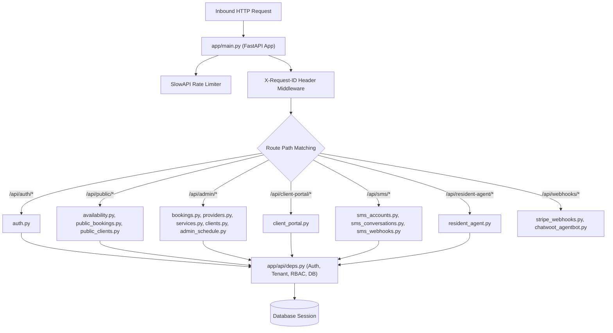

# HTTP REST API Layer (`app/api/routers`)

This module provides the HTTP REST API router registry, endpoint handlers, request/response serialization, rate-limiting, and error transformation for **FastAPI Bookings**.

---

## 1. Purpose & Scope

The API router module owns:
- HTTP ingress, routing, path parameter validation, and JSON serialization.
- Public intake endpoints for the frontend booking widget and client portal.
- Authenticated administration endpoints for owners, managers, and service providers.
- Webhook ingress handlers for SMS gateways, Stripe payment events, and Chatwoot agent events.
- Centralized error formatting into standardized envelope responses (`ok: false`, `error: {...}`).

This module deliberately avoids direct SQL query generation where service facades exist, long-running blocking operations (which are delegated to outbox workers or background tasks), and business logic bypassing tenant scoping.

---

## 2. Architecture & Key Files

The router registry is mounted in [app/main.py](file:///F:/Projects/fastapi_bookings/app/main.py) and authenticated via [app/api/deps.py](file:///F:/Projects/fastapi_bookings/app/api/deps.py).



### Key Router Files
- [auth.py](file:///F:/Projects/fastapi_bookings/app/api/routers/auth.py): User login, credential verification, JWT token issuance.
- [bookings.py](file:///F:/Projects/fastapi_bookings/app/api/routers/bookings.py): Primary booking management, admin scheduling, status updates (`CONFIRMED`, `CANCELLED`, `COMPLETED`).
- [availability.py](file:///F:/Projects/fastapi_bookings/app/api/routers/availability.py): Real-time availability calculation across provider schedules and buffer rules.
- [public_bookings.py](file:///F:/Projects/fastapi_bookings/app/api/routers/public_bookings.py): Intake endpoints consumed by the public booking widget.
- [client_portal.py](file:///F:/Projects/fastapi_bookings/app/api/routers/client_portal.py): Self-service client appointment views, reschedules, and cancellations.
- [sms_conversations.py](file:///F:/Projects/fastapi_bookings/app/api/routers/sms_conversations.py): SMS conversation thread view, message history, human takeover toggle.
- [sms_webhooks.py](file:///F:/Projects/fastapi_bookings/app/api/routers/sms_webhooks.py): Inbound webhook receiver for ClickSend and external SMS carriers.
- [resident_agent.py](file:///F:/Projects/fastapi_bookings/app/api/routers/resident_agent.py): Operational health checks, deep audit trigger, and fuzzer controls.
- [deps.py](file:///F:/Projects/fastapi_bookings/app/api/deps.py): Core dependency injection functions: `get_current_tenant`, `get_current_user`, `require_role`, `get_current_client`.

---

## 3. Setup, Configuration & Dependencies

### Dependencies
- **FastAPI** & **Starlette**: HTTP routing, request parsing, and exception handling.
- **SlowAPI**: Rate limiting middleware for public routes (`default_limits=["10/minute"]`).
- **SQLAlchemy Session**: Injected into every route handler via `Depends(get_db)`.
- **Pydantic Schemas**: Request validation and response serialization models ([app/schemas/](file:///F:/Projects/fastapi_bookings/app/schemas/)).

### Environment Variables
Configured in [app/core/config.py](file:///F:/Projects/fastapi_bookings/app/core/config.py):
- `FRONTEND_ORIGINS`: Allowed CORS origins for widget and admin dashboards.
- `SECRET_KEY`: Used to sign and verify HMAC-SHA256 JWT tokens.
- `PUBLIC_API_KEY`: API key for public booking widget authentication.

---

## 4. Core Workflows & Contracts

### 4.1 Standardized Error Schema
All uncaught exceptions, Starlette HTTP exceptions, and validation errors are intercepted by global handlers in [app/main.py](file:///F:/Projects/fastapi_bookings/app/main.py) to guarantee a consistent JSON response:

```json
{
  "ok": false,
  "error": {
    "code": "NOT_FOUND",
    "message": "Booking not found",
    "details": {},
    "request_id": "9b1deb4d3b7d4bad9bdd2b0d7b3dcb6d"
  }
}
```

Standard error codes:
- `400`: `BAD_REQUEST`
- `401`: `UNAUTHORIZED`
- `403`: `FORBIDDEN`
- `404`: `NOT_FOUND`
- `409`: `CONFLICT` (e.g. double booking collision)
- `422`: `VALIDATION_ERROR` (Pydantic schema validation failure)
- `429`: `TOO_MANY_REQUESTS` (SlowAPI rate limit hit)
- `500`: `INTERNAL_SERVER_ERROR`

### 4.2 Authentication & Role Contracts
Clients pass their JWT access token via the `X-Token` header:
- **Public Widget**: Calls `/api/public/bootstrap` using `PUBLIC_API_KEY` to obtain a public tenant-scoped token.
- **Client Portal**: Clients log in via phone/email OTP and receive a client token containing `tenant_id` and client `sub`.
- **Staff / Admin**: Staff log in at `/api/auth/token` with username/password, receiving a user token containing their user `id` and `role`.

---

## 5. Data Safety, Multi-Tenancy & PII Isolation

1. **Strict Tenant Partitioning**:
   - `get_current_tenant` guarantees that every request is bound to a single verified `Tenant`.
   - Routes filter every read and write with `tenant_id == tenant.id`.
2. **Numeric ID Bounds Checking**:
   - Every integer path parameter is annotated with `DatabaseId` (`ge=1, le=9_223_372_036_854_775_807`), preventing integer truncation and SQL injection bugs.
3. **Correlation Tracking Without PII**:
   - `add_correlation_id_header` injects `X-Request-ID` and `X-Trace-ID` matching the active OpenTelemetry span context.
   - PII (passwords, payment details, phone numbers) is never echoed in correlation headers or error responses.

---

## 6. Known Issues, Edge Cases & Outstanding Work

- **Rate Limiting on Reverse Proxies**: SlowAPI uses `get_remote_address`, which resolves proxy IPs if `Forwarded` / `X-Forwarded-For` is not configured in upstream load balancers.
- **Public Bootstrap Deprecation**: Legacy endpoints allowing token-less public queries are being migrated to strictly enforce tenant subdomains.

---

## 7. Verification & Testing Commands

Execute targeted router tests:
```powershell
# 1. Test authentication contracts and token verification
pytest tests/test_auth_contract.py -v

# 2. Test public intake and booking form contracts
pytest tests/test_booking_form_contracts.py tests/test_configurable_booking_forms.py -v

# 3. Test client portal routes
pytest tests/test_client_portal.py -v

# 4. Test role hierarchy enforcement
pytest tests/test_role_hierarchy.py -v

# 5. Test numeric bounds on path parameters
pytest tests/test_numeric_id_bounds.py -v

# 6. Test granular readiness & diagnostics
pytest tests/test_production_readiness_drills.py -k test_drill_11 -v
```

---

## 8. Granular System Health & Readiness Verification (Section 24)

The router layer provides unauthenticated public readiness checks (`/health/granular`, `/readiness`) and admin-scoped diagnostics (`/diagnostics/readiness`, `/api/admin/diagnostics/readiness`):
- **PostgreSQL Database Connectivity**: Verified via lightweight `SELECT 1` ping.
- **Redis Cache Subsystem**: Checked via real sync ping against connection pool.
- **Neo4j / Graphiti Engine**: Validated through driver connectivity and `ping_neo4j()` session execution.
- **Background Outbox Lag**: Quantifies pending and dead-letter projection queues (`knowledge_graph_projections`) and learning events (`learning_events`).
- **Telemetry & Celery Worker Status**: Evaluates tracing initialization and worker queue responsiveness.
- **Response Format**: Status 200 with `status: "ready"` if all critical subsystems are online; Status 503 with degraded component details if any core dependency fails.

