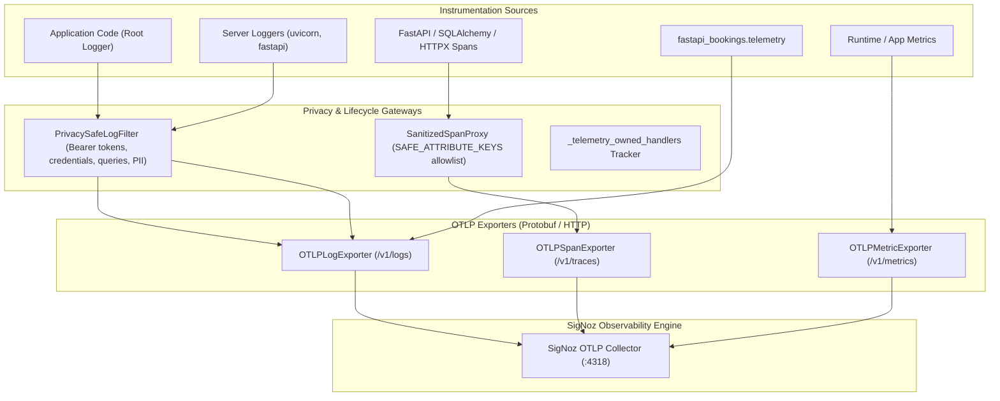

# Core Configuration, Security, Redis & Telemetry

## Purpose & Scope
The `app/core/` package encapsulates cross-cutting concerns for the application:
- Environment settings and secrets loading via Pydantic (`config.py`).
- Cryptographic password hashing, JWT access token generation, and role checks (`security.py`).
- Centralized, resilient Redis connection pooling, key namespacing, and health checks (`redis.py`).
- Finite state machines for appointment lifecycle transitions (`state_machine.py`).
- OpenTelemetry instrumentation, OTLP exporters, and PII redaction filters (`telemetry.py`).

---

## Architecture & Key Files

```
app/core/
├── config.py                 # Global Settings (DATABASE_URL, REDIS_URL, SECRET_KEY, CHATWOOT_BASE_URL, MAPBOX_ACCESS_TOKEN, …)
├── capability_validator.py   # Tenant → Provider → Service hierarchy & booking service-mode validators
├── redis.py                  # Sync & Async Redis connection pools, 'fb:' key formatting, ping healthcheck & fallback
├── security.py               # Passlib Argon2/Bcrypt hashing, JWT encode/decode routines
├── state_machine.py          # BookingStatus state machine (pending → confirmed → completed / cancelled)
└── telemetry.py              # OpenTelemetry TracerProvider, MeterProvider, and privacy span processor
```

---

## Setup, Configuration & Dependencies
Key environment variables in `.env`:
- `DATABASE_URL`: PostgreSQL connection string (cut over to dedicated instance on port 5433).
- `REDIS_URL`: Redis connection URL (default: `redis://127.0.0.1:6380/0`).
- `SECRET_KEY`: High-entropy key for JWT signature validation.
- `OPENAI_API_KEY`: API key for GPT-4o autonomous dialogue agent.
- `CALCOM_API_KEY`: Optional Cal.com API key for headless scheduling federation.
- `CHATWOOT_BASE_URL`: Chatwoot server URL (default: `http://localhost:4000`).
- `CHATWOOT_API_ACCESS_TOKEN`: Tenant-level Chatwoot API token.
- `CHATWOOT_PLATFORM_API_TOKEN`: Superadmin Platform API token for automated account/inbox provisioning.
- `CHATWOOT_AUTO_PROVISION`: Boolean flag to trigger automatic Chatwoot provisioning during tenant onboarding.
- `LOCAL_AUTH_BYPASS`: Boolean flag strictly for local development on localhost/127.0.0.1 (forbidden in production).
- `OTEL_EXPORTER_OTLP_ENDPOINT`: SigNoz or OpenTelemetry collector endpoint (e.g. `http://localhost:4318`).
- `MAPBOX_ACCESS_TOKEN`: Mapbox geocoding token — used server-side ONLY, never exposed in API responses or frontend config.

---

## Phase 5: Platform Owner Governance Layer

### 5.1 Chatwoot SuperAdmin Deep-Link Endpoint

**Route:** `GET /api/admin/governance/chatwoot-links`  
**Auth:** Requires authenticated admin user (via `get_current_admin` + `get_current_tenant`)  
**Location:** [`app/api/routers/general_systems.py`](file:///f:/Projects/fastapi_bookings/app/api/routers/general_systems.py#L152-L175)

Returns deep links for the platform owner:
```json
{
  "ok": true,
  "super_admin_url": "http://localhost:4000/super_admin",
  "account_url": "http://localhost:4000/app/accounts/42",
  "chatwoot_account_id": 42,
  "base_url": "http://localhost:4000"
}
```

The `account_url` is `null` when the tenant has not been provisioned with a Chatwoot account yet. `CHATWOOT_BASE_URL` is resolved from settings — never hardcoded.

**Frontend:** [`frontend/src/pages/admin/system.tsx`](file:///f:/Projects/fastapi_bookings/frontend/src/pages/admin/system.tsx) fetches this endpoint on mount and renders "Open SuperAdmin Console" and "Open Tenant Workspace" buttons using `window.open(..., '_blank')`. Both buttons link to the server-resolved URLs — no hardcoded frontend URLs.

---

### 5.2 RFC 6761 `*.localhost` Subdomain Gateway Routing

**Location:** [`app/api/deps.py`](file:///f:/Projects/fastapi_bookings/app/api/deps.py) — `_tenant_subdomain_from_host()` + `get_current_tenant()`

Subdomain resolution rules (in order of priority):

| Host Header | Extracted Subdomain |
|---|---|
| `simplydemo.localhost:8000` | `simplydemo` |
| `clinic.localhost:7070` | `clinic` |
| `clinic.localhost` | `clinic` |
| `simplydemo.bookopenapi.com` | `simplydemo` |
| `simplydemo.dev.localhost` | `simplydemo` |
| `localhost:8000` | *(none — falls back to X-Tenant)* |
| `www.example.com` | *(reserved — excluded)* |
| `myservice.run.app` | *(Cloud Run — excluded)* |

**RFC 6761 Compliance:** Port numbers are stripped before label parsing. Both `clinic.localhost` and `clinic.localhost:8000` are handled seamlessly without modifying `/etc/hosts`.

**Fallback chain:**
1. Host-header subdomain (from `Host` or `X-Forwarded-Host`).
2. `X-Tenant` request header (for API clients, curl, background workers, test fixtures).
3. `tenant` query parameter (legacy support).

**Error behaviour:**
- No tenant context → `HTTP 400 BAD_REQUEST`.
- Unknown subdomain → `HTTP 404 NOT_FOUND`.
- Host subdomain ≠ X-Tenant header → `HTTP 400 BAD_REQUEST` (prevents confusion).

---

### 5.3 SigNoz OpenTelemetry Observability Pipeline & Privacy Boundaries

**Location:** [`app/core/telemetry.py`](file:///f:/Projects/fastapi_bookings/app/core/telemetry.py)

FastAPI Bookings implements a centralized, privacy-safe OpenTelemetry pipeline delivering traces, metrics, and structured logs via OTLP HTTP to a SigNoz collector (configured via `OTEL_EXPORTER_OTLP_ENDPOINT`, default `http://localhost:4318` or `http://signoz-otel-collector:4318` in Docker).



#### 1. Logger Topology & Zero-Duplication Guarantee
To eliminate duplicate log lines in SigNoz without losing framework output:
- **Root Logger (`logging.getLogger()`):** Receives application events via normal Python logging propagation. An operational `LoggingHandler` equipped with `PrivacySafeLogFilter` is attached here.
- **Non-Propagating Framework Loggers (`uvicorn`, `uvicorn.error`, `uvicorn.access`, `fastapi`):** Because `setup_logging()` sets `propagate = False` on these loggers, the operational OTLP handler is attached directly to each. Because propagation is disabled, events are processed once and never double-exported to root.
- **Dedicated Structured Telemetry Logger (`fastapi_bookings.telemetry`):** Has `propagate = False` and handles structured domain events (`record_webhook_event`, `record_sms_event`, `record_ai_event`, `record_arrival_event`, `record_telemetry_log`) with strict allowlisting.
- **Handler Lifecycle Management:** All attached handlers are tracked in `_telemetry_owned_handlers`. Repeated `init_telemetry()` and `shutdown_telemetry()` cycles safely flush, close, and detach handlers without leaking memory or leaving zombie handlers.

#### 2. Strict Span Attribute Allowlisting (`SAFE_ATTRIBUTE_KEYS`)
Raw spans are scrubbed by `_FilteringSpanExporter` / `SanitizedSpanProxy`:
- **Allowlisted keys only:** `tenant_id`, `route`, `http.method`, `http.route`, `http.status_code`, `http.scheme`, `http.target`, `db.system`, `db.operation`, `error.type`, `exception.type`, `service.name`, `service.namespace`, `deployment.environment`, `frontend.*` (structural only), `event_code`, `status`, `job_type`, `operation`, `reason`, `account_id`.
- **All other attributes are dropped** to strictly enforce Rule 5 of `AGENTS.md`.

#### 3. Value-Level Sanitization & Privacy Redaction (`PrivacySafeLogFilter`)
- **Bearer Tokens & Credentials:** `Bearer [REDACTED]`, `password=[REDACTED]`, `api_key=[REDACTED]`, `secret=[REDACTED]`, `cookie=[REDACTED]`, `token=[REDACTED]`.
- **HTTP Access Queries & Generic URLs:** Strips query parameters from access lines (`GET /path?query=val` → `GET /path?[REDACTED]`) and arbitrary URLs (`https://api.domain.com/v1?token=xyz` → `https://api.domain.com/v1?[REDACTED]`).
- **Emails & PII:** Redacts email addresses (`[REDACTED_EMAIL]`) and phone numbers (8–16 digits matching Australian or international formats).
- **Dynamic URL Paths:** URL path dynamic segments (numeric IDs, UUIDs, hex tokens, long slugs) are normalized to `/{id}`.

#### 4. Diagnostics & Sentinel Probes
- `GET /api/admin/system/diagnostics/telemetry/status` calls `get_telemetry_status_data()` to safely report pipeline health (`telemetry_enabled`, `trace_exporter_active`, `metric_exporter_active`, `log_exporter_active`, `last_export_status`, `last_export_timestamp`) without leaking internal endpoints or tokens.
- `TelemetrySentinel` (`app/services/resident_agent/telemetry_sentinel.py`) inspects pipeline health, SMS outbox queues, retry backlogs, and Chatwoot binding health to compute an overall health score.

---

### 5.4 Mapbox Token Server-Side Isolation

`MAPBOX_ACCESS_TOKEN` is:
- Stored exclusively in server-side environment (`.env` / Docker secrets).
- Used server-side in `app/services/geocoding.py` (background geocoding of tenant addresses) and `app/services/routing/geocoding.py` (forward geocoding and address search fallback).
- **Never serialized** into API response bodies, production frontend configs (`frontend/`), or public endpoints.
- The geocoding services construct the Mapbox URL server-side; coordinates are returned via `tenant.latitude`/`tenant.longitude` or `AddressAutocompleteItem` — not the raw secret token.
- (Note: The separate legacy prototype client in `mapbox/` uses its own public `pk.*` token strictly for browser-side tile rendering).

---

### 5.5 Admin System Health Endpoint

The `GET /api/admin/system/health` endpoint (implemented in [`app/api/routers/system.py`](file:///f:/Projects/fastapi_bookings/app/api/routers/system.py)) uses two functions from `app/core/` to measure live service latency:

| Core Function | Used By | Purpose |
|---|---|---|
| `get_redis_client()` in `redis.py` | `_check_redis()` | Issue a real `PING` and measure round-trip ms |
| `get_neo4j_driver()` in `graphiti_client.py` | `_check_neo4j()` | Run `RETURN 1` and measure round-trip ms |

The health endpoint never crashes — each probe is wrapped in `try/except`. If Redis or Neo4j is unavailable the service is reported as `"down"` and `api_status` is set to `"degraded"`.

**Background workers:** No Celery/ARQ queue system is configured. The endpoint reports `background_workers` as `{ status: "ok", latency_ms: null, detail: "source=none; no distributed task queue is configured" }` rather than inventing a fake count.

---

## Redis Integration & Key Namespacing

- **Key Prefixing**: All Redis keys are strictly formatted via `format_key()` with the prefix `fb:` or `fb:{tenant_id}:...` ensuring strict multi-tenant isolation.
- **Connection Pools**: Thread-safe sync (`get_redis_client()`) and async (`get_async_redis_client()`) connection pools lazily initialized with reconnect handling and bounded connection counts.
- **Health Checks**: Synchronous `ping()` and asynchronous `async_ping()` methods for liveness/readiness probes.
- **Resilient Fallback**: Graceful local in-memory fallback mechanisms protect callers during transient Redis unavailability.

---

## Data Safety & Privacy
- **Redaction by Design**: `telemetry.py` strips all customer identities, phone numbers, emails, addresses, and query-string tokens from traces and logs before exporting.
- **Low-Cardinality Attributes Only**: Spans record structural data like HTTP method, route template, status code, and tenant hash.
- **Hashed Identifiers in Caches**: OTP cache keys hash phone numbers (`fb:otp:{tenant_id}:{sha256(phone)}`) so cleartext customer numbers are never stored in cache keys.
- **Mapbox Token Isolation**: The geocoding API token is server-side only; coordinates are what the API returns, not the token.

---

## Known Issues, Edge Cases & Outstanding Work

1. **External SigNoz Collector Prerequisite**: `docker-compose.prod.yml` and `docker-compose.yml` do NOT spin up a SigNoz collector container. The collector must be running independently on port 4318 or `OTEL_SDK_DISABLED=true` must be set to avoid connection warning logs.
2. **Local `signoz/` Folder**: A local directory `signoz/` exists at repository root containing upstream source files from prior research; it is ignored by Git and not used as a runtime dependency.
3. **`OTEL_SDK_DISABLED=true` in Pytest**: Enforced globally in `tests/conftest.py` to guarantee zero outbound network traffic during test execution.
4. **Third-Party Loggers**: Any newly introduced logger that sets `propagate = False` must be registered in `init_telemetry()` or its output will not reach OTLP log export.

---

## Verification & Testing Commands

Execute verified test commands against telemetry, security, and governance modules:
```powershell
# 1. Run telemetry pipeline and lifecycle tests
python -m pytest tests/test_telemetry_pipeline.py -v

# 2. Run telemetry privacy and attribute allowlist tests
python -m pytest tests/test_telemetry_privacy.py -v

# 3. Run telemetry redaction and PII filter tests
python -m pytest tests/test_telemetry_redaction.py -v

# 4. Run Phase 5 governance, tenant resolution, and security isolation suite
python -m pytest tests/test_tenant_resolution.py tests/test_security_isolation_remediation.py -v
```
