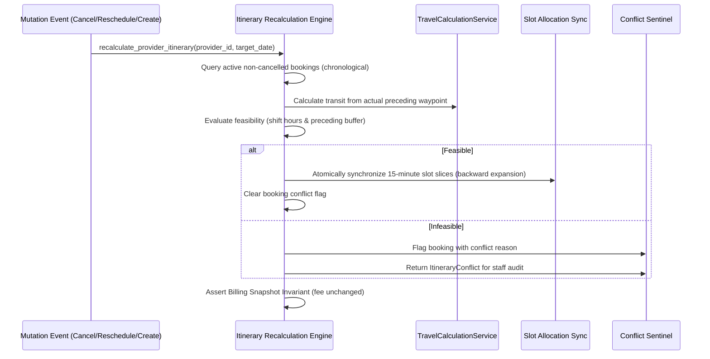

# Booking Domain Service & Dynamic Itinerary Engine

## 1. Purpose & Scope

The `app.services.booking` module is the authoritative domain engine for:
- **5-Segment Operational Window Engine**: Calculating exact operational boundaries for in-call and out-call appointments:
  `[Inbound Operational Travel] -> [Pre-Buffer] -> [Client Service] -> [Post-Buffer] -> [Onward Operational Travel]`
- **Backward-Chaining Availability Search**: Evaluating candidate time slots by working backward from requested appointment starts to ensure physical feasibility and prevent transit collisions.
- **Atomic Operational Slot Allocation**: Locking discrete 15-minute slot slices across SQLite and PostgreSQL to guarantee first-submit-wins concurrency for the full operational window while maintaining client-visible appointment times.
- **Canonical Travel Ownership**: Enforcing that the destination appointment owns its inbound transit leg (`Booking B` owns `A -> B`), eliminating double-counting.
- **Phase 4 Dynamic Itinerary Recalculation & Conflict Sentinel**: Automatically recomputing provider operational windows and synchronizing slot allocations whenever bookings change (cancellations, reschedules, address changes, insertions), detecting infeasible itinerary collisions, and flagging them for administrative intervention while strictly maintaining the client Billing Snapshot Invariant.

### What it Deliberately Avoids:
- Commercial travel pricing & fee calculation (owned by `app.services.routing.travel_service:calculate_chargeable_travel`).
- SMS messaging and AI conversations (owned by Assistant UI / `app.services.sms`).
- External payment gateway mutations (owned by `app.services.stripe_service`).

---

## 2. Architecture & Key Files

```
app/services/booking/
├── __init__.py                  # Unified package exports and backward-compatible shims
├── operational_window.py        # 5-segment operational window model & OperationalWindowCalculator
├── availability_service.py      # Backward-chaining availability search & out-call candidate evaluation
├── slot_allocation_service.py   # Discrete 15-minute slot generator, atomic DB locker, audit/repair
├── itinerary_service.py         # Dynamic itinerary recalculation engine & administrative conflict sentinel
└── README.md                    # Living architectural documentation
```

### Key Modules & Symbols:
- [`recalculate_provider_itinerary`](file:///f:/Projects/fastapi_bookings/app/services/booking/itinerary_service.py): Core entry point for daily provider itinerary recomputation. Rebuilds chronological legs, evaluates feasibility against provider shift hours and turnaround buffers, atomically expands/synchronizes slot slices, and flags conflicts.
- [`get_provider_itinerary_conflicts`](file:///f:/Projects/fastapi_bookings/app/services/booking/itinerary_service.py): Retrieves active flagged itinerary conflicts across provider schedules.
- [`OperationalWindow`](file:///f:/Projects/fastapi_bookings/app/services/booking/operational_window.py): Dataclass encapsulating the 5 chronological segments, operational boundaries, and JSON serialization.
- [`OperationalWindowCalculator`](file:///f:/Projects/fastapi_bookings/app/services/booking/operational_window.py): Domain service calculating transit durations, buffer intervals, and canonical ownership.
- [`get_available_slots`](file:///f:/Projects/fastapi_bookings/app/services/booking/availability_service.py): Primary availability entrypoint accepting `service_mode`, `client_suburb`, and `service_address`.
- [`evaluate_outcall_day_slots`](file:///f:/Projects/fastapi_bookings/app/services/booking/availability_service.py): High-performance slot evaluation engine with backward chaining and forward candidate shifting.
- [`create_allocations_for_booking`](file:///f:/Projects/fastapi_bookings/app/services/booking/slot_allocation_service.py): Atomically commits `BookingSlotAllocation` rows spanning the operational window.
- [`is_slot_allocation_conflict`](file:///f:/Projects/fastapi_bookings/app/services/booking/slot_allocation_service.py): Identifies PostgreSQL (`23505`) and SQLite unique constraint violations on `uq_provider_slot_allocation`.

---

## 3. Setup, Configuration & Dependencies

### Database Tables:
- `booking_slot_allocations`: Enforces `UniqueConstraint("provider_id", "slot_start", name="uq_provider_slot_allocation")`.
- `bookings`: Stores appointment record with visible `start_time`, `end_time`, `service_mode`, `client_suburb`, `service_address`, `has_itinerary_conflict`, and `itinerary_conflict`.
- `services`: Holds `duration`, `buffer_before`, `buffer_after`, `outcall_buffer_before`, `outcall_buffer_after`.
- `providers`: Holds `in_call_address`, `out_call_radius_km`, `allow_in_call`, `allow_out_call`.
- `provider_work_days` & `provider_special_days`: Provider working hours and override dates governing daily shift feasibility.

### Dependencies:
- Local Australian postcodes database (`app/services/routing/data/au_postcodes.db`): Sub-millisecond offline coordinate resolution.
- `TravelCalculationService` (`app/services/routing/travel_service.py`): Operational transit distance and duration calculation.

---

## 4. Core Workflows & Contracts

### 4.1 5-Segment Operational Window Breakdown


#### Formulas:
- **In-Call**:
  - `operational_window_start = client_start - buffer_before`
  - `operational_window_end = client_end + buffer_after`
- **Out-Call**:
  - `operational_window_start = client_start - outcall_buffer_before - inbound_travel_minutes`
  - `operational_window_end = client_end + outcall_buffer_after + outbound_travel_minutes`

### 4.2 Dynamic Itinerary Recalculation Flow (Phase 4)


### 4.3 Billing Snapshot Invariant
Under all circumstances during itinerary recalculation:
- `booking.chargeable_travel_fee` is strictly immutable.
- Operational leg modifications (such as backward expansion from 1 hour to 2 hours of transit due to cancellation of an intermediate booking) only adjust calendar blocking and operational allocations; client billing snapshots remain unchanged.

### 4.4 Backward-Chaining Slot Evaluation
To evaluate candidate start $T_{start}$:
1. Identify provider's latest preceding booking $B_{prev}$ on that date.
2. Calculate provider earliest free time: $T_{free} = B_{prev}.end + B_{prev}.post\_buffer$.
3. Compute required operational start: $T_{op\_start} = T_{start} - outcall\_buffer\_before - transit(Origin \rightarrow Client)$.
4. If $T_{op\_start} < T_{free}$:
   - Collision detected.
   - Forward shift candidate slot: $T_{next} = T_{free} + transit(Origin \rightarrow Client) + outcall\_buffer\_before$.
   - Align up to the next 15-minute boundary and continue scan.

---

## 5. Data Safety & Isolation

- **Multi-Tenant Isolation**: Every query filters by `tenant_id`. Slot allocations enforce `tenant_id` alignment.
- **Atomic Concurrency**: Concurrency conflicts raise `IntegrityError` on `uq_provider_slot_allocation`, mapped to HTTP 409 Conflict.
- **PII Protection**: Telemetry and audit logs record only aggregate operational metrics (zero client addresses, names, or phone numbers in logs).
- **Billing Snapshot Invariant**: The commercial fee agreed at checkout is strictly isolated from internal operational routing adjustments.

---

## 6. Known Issues, Edge Cases & Outstanding Work

- **Reschedule Slot Allocation Synchronization (Resolved - DEF-01)**: Previously, staging new slot allocations under `autoflush=False` in `reschedule_allocations_for_booking` masked them from `recalculate_provider_itinerary`, causing duplicate allocation creation and 409 conflict crashes. Explicit `db.flush()` was added after `create_allocations_for_booking` to ensure immediate queryability before subsequent recalculations.
- **Multi-day transit spans**: Out-call appointments are currently constrained to a single calendar working day.
- **Real-Time Traffic Updates**: Transit calculations currently use deterministic road graph metrics; live traffic streaming hooks will feed into the operational window calculator in future iterations.

---

## 7. Verification & Testing Commands

Run Phase 4 dynamic itinerary and conflict sentinel test suite:
```bash
py -3.11 -m pytest tests/test_dynamic_itinerary_phase4.py -v
```

Run full operational window and routing regression suite:
```bash
py -3.11 -m pytest tests/test_dynamic_itinerary_phase4.py tests/test_operational_window_phase3.py tests/test_travel_service_phase2.py -v
```
