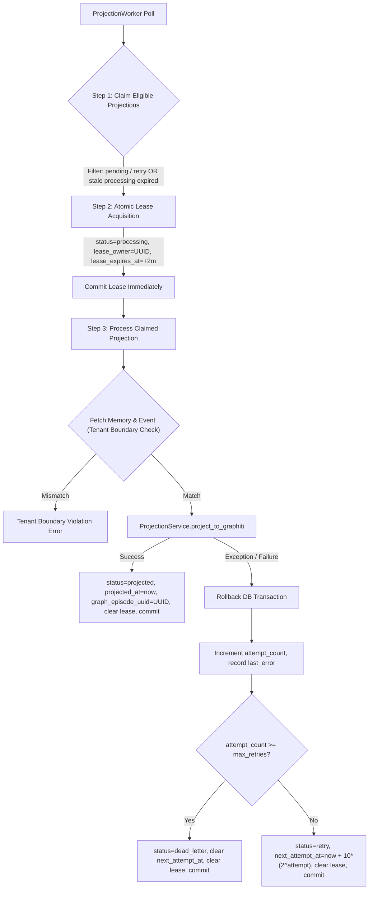
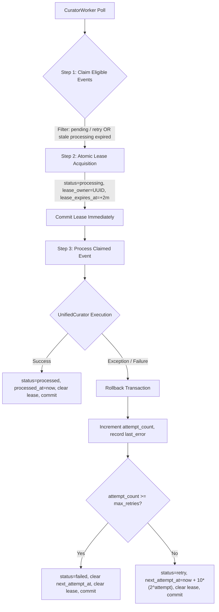
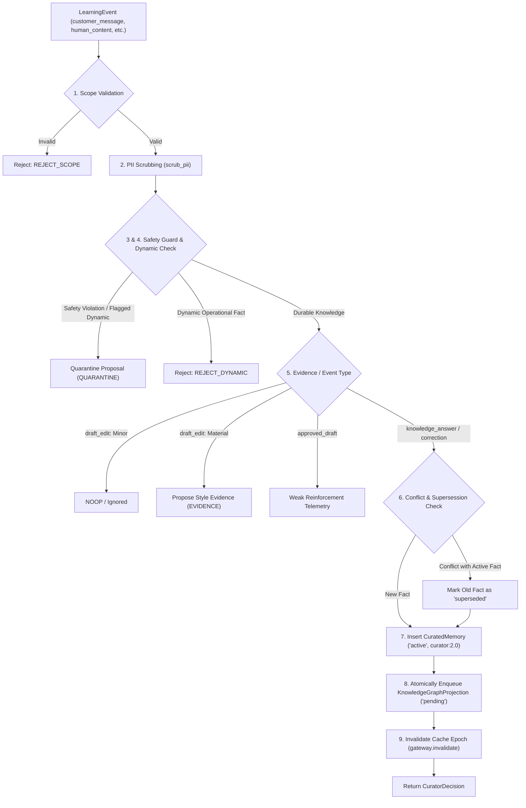
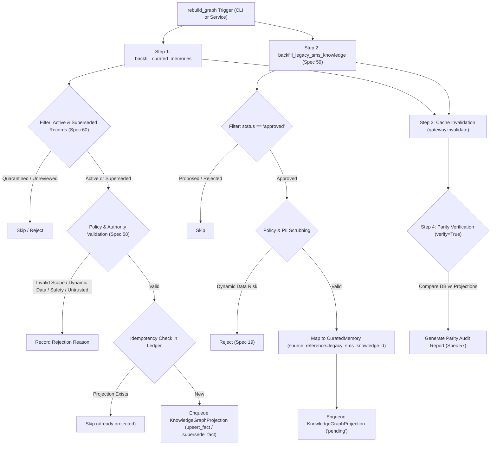
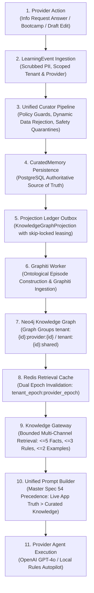

# Knowledge Architecture & Graphiti Subsystem (`app/services/knowledge/`)

## 1. Purpose & Scope

The **Knowledge Subsystem** provides a multi-tenant, provider-isolated graph and cache layer built atop [Graphiti](https://github.com/getzep/graphiti) and Neo4j. It serves as the long-term epistemic memory for business rules, durable facts, style guidance, and provider preferences.

### What it owns:
- **Canonical Graph Projection Service (`projection_service.py`)**: Transforms PostgreSQL `KnowledgeGraphProjection` records into Graphiti episodes with strict ontological typing, deterministic UUID idempotency (Spec 32), rich provenance metadata (Spec 33), and group partition isolation (Spec 34).
- **Graphiti Projection Worker (`projection_worker.py`)**: Autonomous leasing worker with `skip_locked`, database claim leasing, exponential retry backoff (Spec 68), max retry exhaustion to `dead_letter` (Spec 69), and multi-tenant isolation.
- **Knowledge Rebuild & Historical Backfill Service (`rebuild.py`)**: Full orchestration of CuratedMemory and legacy SmsKnowledgeEntry backfills (Specs 56, 57, 58, 59, 60), idempotency verification, parity auditing, and non-destructive dry-run capabilities.
- **Administrative CLI Rebuild Tool (`app/tools/rebuild_knowledge_graph.py`)**: Command-line administrative utility for executing targeted or tenant-wide graph rebuilds with zero PII/secret exposure (Spec 56).
- **Shadow-Projecting Accepted Knowledge (Spec 61)**: `GRAPH_SHADOW_WRITE` enables autonomous outbox enqueueing of all accepted durable knowledge and behavioral guidance.
- **Ontological Knowledge Classification (Spec 36)**: Domain concepts (`Provider`, `Tenant`, `Preference`, `Behaviour`, `Policy`, `Boundary`, `Example`) and relationship edge types (`PREFERS`, `AVOIDS`, `APPLIES_WHEN`, `HAS_BOUNDARY`, `SUPERSEDES`, `SUPPORTED_BY`).
- **Curator Background Worker (`curator_worker.py`)**: Autonomous polling worker with database leasing (`lease_owner`, `lease_expires_at`), exponential retry backoff, max retry exhaustion, and strict multi-tenant isolation.
- **Unified Curator Pipeline (`curator.py`)**: Mandatory 9-step ingestion and continuous curation pipeline enforcing scope boundaries, PII scrubbing, dynamic data rejection, safety quarantining, supersession tracking, and atomic graph projection outbox enqueueing.
- **Canonical Graph Projection Ledger (`knowledge_graph_projections`)**: Durable, idempotent projection outbox bridging PostgreSQL curated knowledge to Graphiti/Neo4j graph representation.
- **Multi-tenant and provider-partitioned knowledge retrieval** via Graphiti group IDs (`tenant:{tenant_id}:shared` vs `tenant:{tenant_id}:provider:{provider_id}`).
- **Epistemic authority classification (`Authority`)** and knowledge categorization (`KnowledgeKind`).
- **Dynamic operational data rejection policies (Spec 19)**: Blocking live booking times, quotes, and payment links from polluting long-term graphs (`REJECT_DYNAMIC`).
- **Security and prompt-injection guardrails (`is_system_safety_violation`)**: Quarantining safety breaches into review queues (`QUARANTINE`).
- **Bounded Multi-Channel Retrieval (`retrieval.py`)**: 3 bounded retrieval channels separating factual knowledge (`retrieve_facts`), behavioural rules (`retrieve_behaviour`), and style examples (`retrieve_examples`) with strictly bounded context windows (Specs 47, 48, 96).
- **Safe PostgreSQL Fallback Path (Spec 66)**: Graceful fallback querying active `CuratedMemory` and approved `SmsKnowledgeEntry` when Graphiti is disabled, offline, or returns empty, strictly preserving multi-tenant/provider boundaries and filtering dynamic/safety data.
- **Master Spec 54 Prompt Precedence Convergence**: Exact 10-layer hierarchical instruction precedence ensuring live operational truth wins (Spec 53), safety rules are immutable, and knowledge context is cleanly segmented.
- **Redis Retrieval Caching & Epoch Invalidation (`cache.py`)**: Cache keys `fb:tenant:{tenant_id}:provider:{provider_id}:knowledge:{epoch}:{query_hash}` using composite epochs `f"{tenant_epoch}:{provider_epoch}"` for instant O(1) cache busting upon curation (Specs 49, 50, 97).
- **Configuration Caching (Spec 52)**: Epoch-invalidated caching for provider profile configurations (`fb:tenant:{tenant_id}:provider:{provider_id}:profile:{epoch}`).
- **Resilient Redis Loss Tolerance (Specs 51, 98)**: Seamless fallback to direct PostgreSQL queries and in-memory caches when Redis encounters connection failures or crashes.
- **Shadow Retrieval & Privacy-Safe Evaluation (`shadow_evaluator.py`)**: Dual shadow execution alongside legacy retrieval paths with privacy-safe metrics (Spec 63, 88: counts, token Jaccard overlap, latencies, cache_hit) and structured logging containing zero customer PII or raw knowledge text (Spec 89).
- **Canary Scope Gating (`is_canary_active`)**: Progressive rollout gating of bounded Graphiti retrieval to designated provider IDs (`GRAPH_CANARY_PROVIDER_IDS`) and tenant IDs (`GRAPH_CANARY_TENANT_IDS`) with automatic fallback to legacy retrieval on degradation (Specs 64, 65, 66).

### What it deliberately avoids:
- **No live booking creation or modification**: Does not manipulate calendar holds or bookings directly.
- **No Chatwoot dependency**: Chatwoot is decoupled and excluded from graph knowledge storage.
- **No live external calls during tests**: Operates deterministically without live OpenAI or external network requirements.
- **No customer response mutation during Phase 2 to 6**: Maintains existing retrieval and prompt building paths without breaking changes.

---

## 2. Architecture & Key Files

```text
app/services/knowledge/
├── __init__.py               # Package exports for gateway, curator, workers, models, ontology, rebuild, and policies
├── types.py                  # Enums (KnowledgeKind, Authority, CuratorAction) & Pydantic models (KnowledgeScope, etc.)
├── policy.py                 # Scope validation, dynamic operational data filters, safety violation detection
├── cache.py                  # Redis composite epoch management, key hashing, and query result caching
├── retrieval.py              # Bounded multi-channel retrieval (Facts, Behaviour, Examples) with safe fallback
├── graphiti_client.py        # Neo4j driver connection pool, Graphiti client factory, health ping, group ID formatters
├── gateway.py                # KnowledgeGateway: retrieve, publish, invalidate, and rebuild orchestrations
├── curator.py                # UnifiedCurator: autonomous 9-step continuous knowledge curation pipeline
├── curator_worker.py         # CuratorWorker: autonomous leasing worker & async background polling loop
├── projection_service.py     # ProjectionService: Graphiti episode builder with ontology, provenance, and idempotency
├── projection_worker.py      # ProjectionWorker: background worker claiming & projecting ledger items to Graphiti
├── rebuild.py                # KnowledgeRebuildService: historical CuratedMemory and legacy SMS knowledge backfill
├── shadow_evaluator.py       # ShadowEvaluator: shadow retrieval evaluation and multi-tenant canary gating
└── README.md                 # This living architectural documentation

app/tools/
├── __init__.py               # Administrative tools package initialization
└── rebuild_knowledge_graph.py # CLI tool for knowledge graph rebuild and backfill (Spec 56)
```

### Key Models & Classes:
- [`ShadowEvaluator`](file:///f:/Projects/fastapi_bookings/app/services/knowledge/shadow_evaluator.py): Evaluates Graphiti retrieval against legacy knowledge, computes zero-PII evaluation metrics, logs structured audit data, and routes active prompts according to canary scope membership (Specs 62, 63, 64, 65, 88, 89).
- [`BoundedKnowledgeRetriever`](file:///f:/Projects/fastapi_bookings/app/services/knowledge/retrieval.py): Implements bounded 3-channel retrieval (Facts, Behaviour, Examples) with keyword relevance ranking, provider prioritization, and safe PostgreSQL fallback (Specs 47, 48, 66, 96).
- [`KnowledgeRebuildService`](file:///f:/Projects/fastapi_bookings/app/services/knowledge/rebuild.py): Orchestrates historical backfills of `CuratedMemory` and `SmsKnowledgeEntry`, validates safety and authority boundaries, and verifies parity against ledger projections.
- [`ProjectionService`](file:///f:/Projects/fastapi_bookings/app/services/knowledge/projection_service.py): Canonical graph projection service formatting Graphiti episodes, computing deterministic UUIDs, enforcing privacy boundaries via PII scrubbing, and injecting provenance metadata.
- [`ProjectionWorker`](file:///f:/Projects/fastapi_bookings/app/services/knowledge/projection_worker.py): Autonomous background worker that leases pending/retry `KnowledgeGraphProjection` items, executes graph projection, and enforces exponential retry backoff and dead-letter queueing.
- [`LearningEvent`](file:///f:/Projects/fastapi_bookings/app/models/learning_event.py): Ingestion event model augmented with leasing (`lease_owner`, `lease_expires_at`), retries (`attempt_count`, `next_attempt_at`, `last_error`), and claim index (`ix_learning_events_claim`).
- [`CuratorWorker`](file:///f:/Projects/fastapi_bookings/app/services/knowledge/curator_worker.py): Autonomous background worker that claims, leases, and executes pending learning events with exponential backoff and multi-tenant isolation.
- [`KnowledgeGraphProjection`](file:///f:/Projects/fastapi_bookings/app/models/knowledge_projection.py): Canonical projection ledger and outbox table (`knowledge_graph_projections`) tracking synchronization status to Graphiti/Neo4j.
- [`UnifiedCurator`](file:///f:/Projects/fastapi_bookings/app/services/knowledge/curator.py): Unified autonomous curation engine consolidating factual curation, behavioral guidance, draft edit evaluation, and safety quarantines.
- [`CuratorDecision`](file:///f:/Projects/fastapi_bookings/app/services/knowledge/curator.py): Structured, privacy-safe decision payload returned by the curation pipeline.
- [`KnowledgeScope`](file:///f:/Projects/fastapi_bookings/app/services/knowledge/types.py): Strict tenant and provider scope defining Graphiti group ID partitioning (`gt=0` enforced).
- [`KnowledgeGateway`](file:///f:/Projects/fastapi_bookings/app/services/knowledge/gateway.py): Primary programmatic interface for knowledge retrieval, caching, and invalidation.
- [`KnowledgeItem`](file:///f:/Projects/fastapi_bookings/app/services/knowledge/types.py): Discrete unit of curated knowledge with authority tracking.
- [`RetrievalQuery`](file:///f:/Projects/fastapi_bookings/app/services/knowledge/types.py): Encapsulates query utterance, target scopes, and filtering criteria.
- [`RetrievalResult`](file:///f:/Projects/fastapi_bookings/app/services/knowledge/types.py): Aggregated facts, behavioral rules, examples, and audit metadata.

---

## 3. Setup, Configuration & Dependencies

### Dependencies
- `graphiti-core==0.30.2`: Core temporal knowledge graph library.
- `neo4j>=5.26.0`: Official Python Neo4j driver.
- `redis>=5.0.0`: Redis client for epoch management and query caching.

### Configuration (`app/core/config.py`)
| Variable | Default Value | Description |
| :--- | :--- | :--- |
| `NEO4J_URI` | `bolt://127.0.0.1:7687` | Bolt URI for Neo4j instance |
| `NEO4J_USER` | `neo4j` | Neo4j database username |
| `NEO4J_PASSWORD` | `bookings_dev_neo4j_password` | Neo4j database password (validated in production environments) |
| `NEO4J_DATABASE` | `neo4j` | Target Neo4j database |
| `GRAPH_KNOWLEDGE_ENABLED` | `True` | Master switch for live Graphiti / KnowledgeGateway retrieval (Phase 11 cutover) |
| `GRAPH_SHADOW_WRITE` | `True` | Enable shadow writing of accepted knowledge to Graphiti (Spec 61) |
| `GRAPH_SHADOW_READ` | `False` | Enable shadow retrieval comparison alongside legacy retrieval (Disabled in GA) |
| `GRAPH_CANARY_PROVIDER_IDS` | `[]` | List of provider IDs eligible for live Graphiti canary retrieval (Spec 64) |
| `GRAPH_CANARY_TENANT_IDS` | `[]` | List of tenant IDs eligible for live Graphiti canary retrieval (Spec 64) |
| `KNOWLEDGE_FACTS_LIMIT` | `5` | Maximum factual knowledge items in bounded context (Spec 48) |
| `KNOWLEDGE_BEHAVIOUR_LIMIT` | `3` | Maximum behavioural guidance items in bounded context (Spec 48) |
| `KNOWLEDGE_EXAMPLES_LIMIT` | `2` | Maximum style examples in bounded context (Spec 48) |
| `KNOWLEDGE_CACHE_TTL_SECONDS` | `300` | Redis knowledge retrieval cache TTL in seconds (Spec 49) |
| `CURATOR_WORKER_ENABLED` | `True` | Master switch for background Curator worker execution |
| `CURATOR_WORKER_INTERVAL_SECONDS` | `5.0` | Curator worker polling interval in seconds |
| `PROJECTION_WORKER_ENABLED` | `True` | Master switch for background Graphiti projection worker execution |
| `PROJECTION_WORKER_INTERVAL_SECONDS` | `5.0` | Projection worker polling interval in seconds |

---

## 4. Core Workflows & Contracts

### Graphiti Projection Worker Workflow (Specs 28–36, 67–69)


### Curator Background Worker Workflow (Specs 30, 31, 70, 71, 72, 73)


### Curation Pipeline Workflow (Specs 11–24, 74, 75)


### Knowledge Rebuild & Historical Backfill Workflow (Specs 56, 57, 58, 59, 60, 61)


### Retrieval & Invalidation Workflow
1. **Retrieval**: Checks Redis cache using composite epoch `f"{tenant_epoch}:{provider_epoch}"` and query hash.
2. **Invalidation**: `gateway.invalidate(tenant_id, provider_id)` increments the Redis epoch counter. Tenant invalidations immediately bump the composite epoch, instantly invalidating all cached provider entries for that tenant.

---

## 5. Verification & Testing Commands

### Phase 5 & 6 Backfill, Rebuild & Shadow Write Tests
```powershell
python -m pytest tests/test_knowledge_phase5_phase6_backfill.py -v
```

### Administrative CLI Tool Execution
```powershell
# Preview backfill counts without mutating database
python -m app.tools.rebuild_knowledge_graph --dry-run --verify

# Targeted tenant-scoped live rebuild
python -m app.tools.rebuild_knowledge_graph --tenant-id 1 --verify

# Targeted provider-scoped live rebuild
python -m app.tools.rebuild_knowledge_graph --tenant-id 1 --provider-id 2
```

### Phase 9 & Phase 10 Shadow Retrieval & Canary Gating Tests
```powershell
python -m pytest tests/test_knowledge_phase9_phase10_shadow_canary.py -v
```

### Phase 7 & Phase 8 Retrieval, Safe Fallback & Redis Caching Tests
```powershell
python -m pytest tests/test_knowledge_phase7_phase8_retrieval.py -v
```

### Phase 5 & Phase 6 Backfill & Parity Tests
```powershell
python -m pytest tests/test_knowledge_phase5_phase6_backfill.py -v
```

### Phase 4 Projection Worker & Episode Builder Tests
```powershell
python -m pytest tests/test_knowledge_phase4_projection_worker.py -v
```

### Phase 3 Worker Tests
```powershell
python -m pytest tests/test_knowledge_phase3_worker.py -v
```

### Phase 2 Curator & Ledger Tests
```powershell
python -m pytest tests/test_knowledge_phase2_curator.py -v
```

### Phase 1 Gateway Tests
```powershell
python -m pytest tests/test_knowledge_phase1_gateway.py -v
```

### Full Knowledge Subsystem Verification
```powershell
python -m pytest tests/test_knowledge_phase9_phase10_shadow_canary.py tests/test_knowledge_phase7_phase8_retrieval.py tests/test_knowledge_phase5_phase6_backfill.py tests/test_knowledge_phase4_projection_worker.py tests/test_knowledge_phase3_worker.py tests/test_knowledge_phase2_curator.py tests/test_knowledge_phase1_gateway.py -v
```

### Regression Tests (SMS Prompt Builder, Learning Events, Curator Service)
```powershell
python -m pytest tests/test_sms_prompt_builder.py tests/test_sms_learning_events.py tests/test_sms_curator_service.py -v
```

---

## 6. Complete End-to-End Architecture Flow (Spec 109)

The diagram below documents the unified 10-stage epistemic lifecycle connecting provider actions to runtime agent retrieval:



### Stage-by-Stage Guarantees:
1. **Provider Action**: The provider explicitly answers an information request in live messages or Bootcamp, or edits a draft.
2. **LearningEvent Ingestion**: Asynchronous transactional event created with customer turn references, sanitized of PII.
3. **Unified Curator Pipeline**: Evaluates 9 mandatory steps: scope validation, PII scrubbing, dynamic operational data rejection (`REJECT_DYNAMIC`), safety guard quarantines (`QUARANTINE`), and conflict/supersession detection.
4. **CuratedMemory Persistence**: Authoritative PostgreSQL record stored with status `active`, linking to any superseded memory (`supersedes_id`).
5. **Projection Ledger Outbox**: Atomic insert into `knowledge_graph_projections` with idempotent episode key and `pending` state.
6. **Graphiti Worker**: Background worker claims ledger items via `FOR UPDATE SKIP LOCKED`, generates ontological episodes (`ONTOLOGY_ENTITY_CONCEPTS`, `ONTOLOGY_EDGE_TYPES`), and synchronizes to Graphiti.
7. **Neo4j Knowledge Graph**: Temporal graph structure partitioned into `tenant:{id}:provider:{id}` and `tenant:{id}:shared`.
8. **Redis Retrieval Cache**: Query cache keyed by `fb:tenant:{t}:provider:{p}:knowledge:{epoch}:{query_hash}` with 300s TTL; invalidated instantaneously on memory mutations via composite epoch increments.
9. **Knowledge Gateway**: Programmatic entry point executing bounded multi-channel retrieval (Facts, Behaviour, Examples) with seamless PostgreSQL fallback.
10. **Unified Prompt Builder**: Layered prompt construction strictly enforcing Spec 54 precedence order: Live Application/Tool Truth wins over retrieved graph knowledge.
11. **Provider Agent Execution**: High-fidelity, brand-aligned agent replies executed via OpenAI or local fail-closed rules engine.

---

## 7. Phase 11–14 Cutover & Legacy Retirement Summary (Specs 26, 27, 46, 54, 65, 83–87, 108)

- **Phase 11 (Live Retrieval Cutover)**: All SMS and Bootcamp reply generation routes live queries through `knowledge_gateway.retrieve(...)`.
- **Phase 12 (Stop Duplicate Legacy Writes)**: Duplicate inserts into `SmsKnowledgeEntry` on info request answers and bootcamp responses are ceased. `LearningEvent` and `CuratedMemory` serve as the primary write path. Historical `SmsKnowledgeEntry` rows are kept intact for audit compliance.
- **Phase 13 (Stop Legacy Reads)**: Legacy table queries (`shared_knowledge`, `provider_knowledge`, unbounded `curated_memories` scans) are eliminated from prompt construction.
- **Phase 14 (Consolidation & Catalogues)**: Deprecated legacy endpoints and curator services cleanly delegate to `UnifiedCurator`. Search index and database catalogues are fully synchronized.

---

## 8. Production Readiness & Failure Drills Verification (Sections 2–10, 15–24, 38–39)

The knowledge subsystem has undergone end-to-end failure drills and latency benchmarking against live infrastructure (PostgreSQL port 5433, Redis port 6380, Neo4j port 7687):

### 8.1 Real Infrastructure Test Suite
Implementation located at `tests/test_production_readiness_drills.py` covering:
1. **Real Graphiti Write & Retrieval (Section 3)**: Complete path from `LearningEvent` -> `UnifiedCurator` -> `CuratedMemory` -> `KnowledgeGraphProjection` -> worker -> real Neo4j Cypher write -> `KnowledgeGateway.retrieve` -> bounded system prompt.
2. **Bootcamp-to-Live Pathway & Sibling Provider Isolation (Section 4)**: Facts taught in Bootcamp are retrievable by the target provider while strictly invisible to sibling providers in the same tenant.
3. **Behavioural Learning & Style Lab Protection (Section 5)**: Material draft edits accumulate evidence counts; explicit corrections generate behavioural rules without modifying Style Lab slider profiles.
4. **Temporal Supersession Lifecycle (Section 6)**: Updating a durable fact marks previous `CuratedMemory` as `superseded`, links `supersedes_id`, and merges/updates Neo4j entities so outdated facts are never returned.
5. **Operational Truth Conflict Precedence (Section 7)**: Proves Layer 2 Tool/Calendar Truth overrides conflicting Layer 6 Curated Factual Knowledge in system prompts.
6. **Infrastructure Failure Resilience (Sections 8, 9, 10)**:
   - **Redis Outage**: Seamlessly falls back to PostgreSQL ground truth with `cache_hit: False`; recovers instantly when Redis restores.
   - **Neo4j Outage**: Graph projection worker transitions to `retry` with exponential backoff and increments `attempt_count` without dropping transactions.
   - **Graph Rebuild & Parity**: Full database backfill rebuilds graph projections and verifies parity between PostgreSQL ground truth and Neo4j graph nodes.
7. **Worker Crash & Concurrency Drills (Sections 15, 16, 17, 38, 39)**:
   - **Worker Crash**: Expired database leases are automatically reclaimed by healthy workers.
   - **Duplicate Ingestion Replay**: Idempotent event fingerprints prevent duplicate memory or projection generation.
   - **PostgreSQL `FOR UPDATE SKIP LOCKED`**: 3 concurrent worker processes safely claim non-overlapping projection partitions with zero duplicate processing.
   - **Dead-Letter Lifecycle**: Projections reaching max attempts (`attempt_count >= 5`) transition to `dead_letter` and can be replayed after operator intervention.
8. **Multi-Tenant & Provider Isolation (Sections 18, 19)**: Queries across distinct tenants and provider boundaries never cross-pollinate.
9. **PII Scrubbing Across All Layers (Section 20)**: Customer names, phone numbers, and emails are scrubbed before persistence in `CuratedMemory`, projections, and Neo4j episode bodies.
10. **Scale & Latency Benchmarks (Sections 21, 22, 23)**:
    - Verified bounded context constraints over 1,000+ real records.
    - PostgreSQL query latency: ~11.8 ms.
    - Redis Cache Hit latency: ~3.7 ms.
    - Real Neo4j Cypher latency: ~7.7 ms.
    - Single-event curation latency: ~157.1 ms.
    - Projection worker execution: ~43.7 ms.
11. **Granular Health Check Endpoint (Section 24)**: Verified `/health/granular` and `/readiness` endpoints with per-subsystem status reporting.

### 8.2 Execution Command
```powershell
python -m pytest tests/test_production_readiness_drills.py -v
```

---

## 9. Controlled Production Canary Rollout Verification (Sections 7–25, 47–51)

Implementation codified in [`tests/test_production_rollout_stages.py`](file:///f:/Projects/fastapi_bookings/tests/test_production_rollout_stages.py).

### 9.1 Verification Scope & Objectives
1. **Rollout Modes & Fallback Retention (Sections 7, 8)**:
   - Validates explicit rollout modes: `LEGACY/FALLBACK`, `CANARY`, `GRAPH LIVE`.
   - Verifies historical tables (`sms_knowledge_entries`, `curated_memories`, and `Vector(1536)` via pgvector) remain non-destructively active and queryable.
2. **Stage 1 — Synthetic Provider (`provider_id=999`) (Sections 9–12)**:
   - Canary activation for synthetic test scope: `GRAPH_CANARY_PROVIDER_IDS=[999]`.
   - Verified explicit teaching lifecycle, behavioural correction guidance, Bootcamp training propagation, temporal supersession, and sibling isolation (provider 998).
   - Validated latencies (<50ms PG, <20ms Redis, <100ms Neo4j), 0 backlog, 0 dead letters, and 100% cache hit acceleration on repeated queries.
3. **Stage 2 — Single Real Provider (`provider_id=22`) (Sections 13–25)**:
   - Scoped to active real provider 22 with sibling provider 23 in Tenant 1 (zero PII logged).
   - Pre-canary baseline established (100% legacy retrieval success, 0 backlog).
   - Canary live retrieval enabled (`GRAPH_CANARY_PROVIDER_IDS=[22]`) while sibling remains on legacy fallback.
   - Verified conversational flows (greeting, service, price), Layer 2 operational truth override (Section 17), unknown knowledge handling (Section 18), provider corrections (Section 19), Bootcamp training (Section 20), and sibling provider isolation (Section 21).
   - Rollback trigger drill: verified instantaneous fallback to PostgreSQL upon canary removal without downtime or data loss, followed by smooth re-enablement.
4. **Stage 3 — Small Provider Cohort (`provider_ids=[7, 22, 23, 1]`) (Sections 26–28)**:
   - Evaluated diverse provider cohort covering rich knowledge bases (Tori, 180 Style Lab memories), service-oriented providers (Dr. Sarah Bennett, Marcus Vance), and pure catalog baseline (Demo Provider 1).
   - Enforced strict cohort canary routing (`GRAPH_CANARY_PROVIDER_IDS=[7, 22, 23, 1]`) and verified cross-cohort isolation against non-canary providers.
5. **Stage 4 — Whole Tenant Activation (`tenant_id=1`) (Sections 29, 30)**:
   - Verified canary activation across all Tenant 1 providers (`GRAPH_CANARY_TENANT_IDS=[1]`, `GRAPH_CANARY_PROVIDER_IDS=[]`).
   - Audited tenant-shared knowledge separation vs provider-specific Style Lab records.
   - Enforced strict runtime cross-provider isolation across multiple providers (7, 22, 23, 1, 2, 12).
   - Proved strict multi-tenant isolation: Tenant 2 remained 100% isolated on safe fallback.
   - Zero-downtime degrade-to-fallback verified under simulated individual graph faults.
6. **Stage 5 — General Availability (Sections 31–33, 41, 48–51, 56)**:
   - **General Availability Activation**: Configured GA state (`GRAPH_KNOWLEDGE_ENABLED=True`, `GRAPH_SHADOW_WRITE=True`, `GRAPH_SHADOW_READ=False`, canary ID lists cleared).
   - **Default Live Routing**: All providers across all tenants route to Graphiti live retrieval by default (`metadata.source == "graphiti"`, `metadata.rollout_mode == "graph_live"`).
   - **Zero-Downtime Fallback**: Simulated Neo4j and Redis faults degrade gracefully to PostgreSQL fallback (`metadata.source == "fallback"`) without unhandled errors or downtime.
   - **Telemetry & Rollout Identification**: Privacy-safe structured logging and metrics distinguish rollout modes (`fallback`, `canary`, `graph_live`) with zero customer text or PII.
   - **Alert Metrics & Thresholds**: Accessible via diagnostics endpoint (`/api/admin/diagnostics/metrics`):
     * Error rate limit: 1.0%
     * p95 latency limit: 200 ms
     * Max projection backlog: 500
     * Cross-tenant leakage limit: 0
   - **Multi-Tenant Scale & Isolation**: Verified strict Tenant 1 and Tenant 2 isolation, Layer 2 operational truth precedence over Layer 6 graph knowledge, and bounded prompt context guarantees (<= 5 facts, 3 behaviours, 2 examples).
   - **Emergency Global Rollback**: Verified instantaneous fallback to PostgreSQL upon flipping `GRAPH_KNOWLEDGE_ENABLED=False` without database restarts or data loss.

### 9.2 Execution Command
```powershell
python -m pytest tests/test_production_rollout_stages.py -v
```


