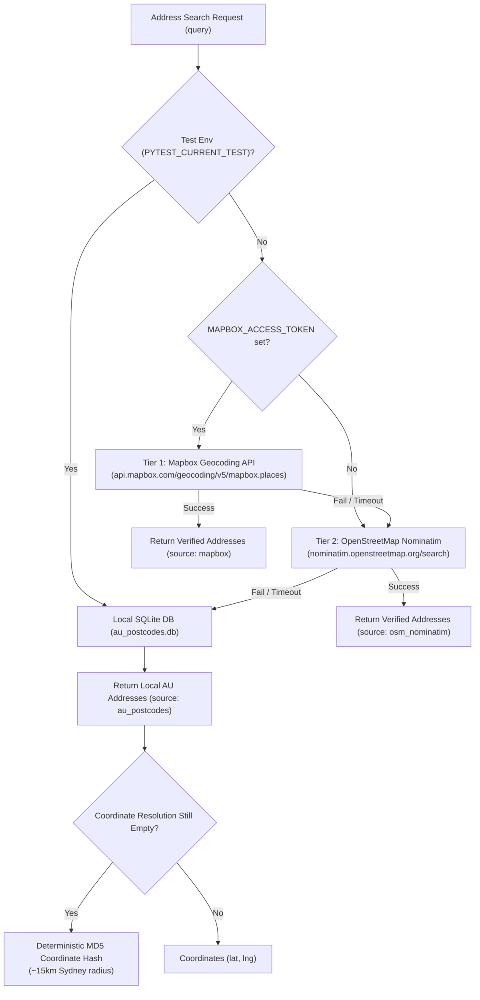
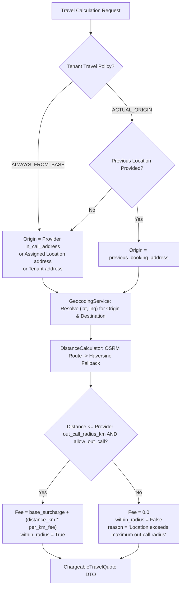

# Routing & Geospatial Services (`app/services/routing`)

## 1. Purpose & Scope

The **Routing & Geospatial Services** subsystem provides decoupled dual-route calculations, geographic coordinate resolution, and address standardization for FastAPI Bookings:
- **Commercial Travel Calculation (Chargeable Travel)**: Determines what the client pays for an out-call booking based on tenant policy (`ALWAYS_FROM_BASE` vs. `ACTUAL_ORIGIN`), provider base out-call surcharge, per-kilometer fee, and out-call radius bounds.
- **Physical Transit Calculation (Operational Travel)**: Calculates physical driving duration (minutes) and distance (km) between itinerary waypoints to schedule provider arrival times, dispatch, and calendar turnaround buffers.
- **Multi-Tier Geocoding & Centroid Estimation**: Resolves exact addresses or suburb/postcode centroids into geographic coordinates using a high-performance local SQLite dataset of Australian postcodes (<1ms lookup), with external Mapbox Places API, OpenStreetMap Nominatim, and deterministic offline fallback protection.
- **In-Memory TTL Caching & Rate Limiting**: Caches outbound Mapbox forward geocoding results in an in-memory TTL cache (1-hour TTL, keyed by normalized query strings) and enforces token-bucket rate limiting (10 req/s, burst capacity 10) to safeguard against duplicate network calls and 429 rate limit errors.
- **Standardized Address Autocomplete**: Powers real-time address search (`GET /api/public/travel/addresses`) and suburb typeahead (`GET /api/public/travel/suburbs`) for client booking forms and administrative location editors.
- **Canonical Travel Ownership**: Guarantees that the destination appointment owns its inbound travel leg; creating or shifting subsequent bookings does not alter preceding booking charges or allocated inbound travel buffers.

### Deliberate Non-Goals & Boundaries
- **No Direct Booking Table Mutation**: Calculation services return pure immutable DTOs (`ChargeableTravelQuote`, `OperationalTravelSegment`) rather than writing directly to `bookings` tables.
- **Routing Engine Boundary**: Mapbox is used **strictly for geocoding and address search**. Mapbox Directions/Matrix APIs are not used; driving route distance and duration calculations are delegated to OSRM (`router.project-osrm.org`) with Haversine formula fallback.

---

## 2. Architecture & Key Files

```
app/
├── schemas/
│   └── travel.py                   # Pydantic DTOs (ChargeableTravelQuote, OperationalTravelSegment, SuburbAutocompleteItem, Requests)
├── services/
│   ├── geocoding.py                # Standalone background task geocoding tenant physical addresses with TTL cache & rate limiting
│   └── routing/
│       ├── __init__.py             # Public exports for routing module
│       ├── data/
│       │   └── au_postcodes.db     # Indexed local SQLite database of 15,500+ Australian suburbs & postcodes
│       ├── distance_calculator.py  # OSRM HTTP client & Haversine distance calculator with road winding factor
│       ├── distance.py             # Re-export compatibility shim
│       ├── geocoding.py            # GeocodingService with multi-tier resolution, GeocodingTTLCache, and AsyncRateLimiter
│       ├── travel_service.py       # TravelCalculationService (Dual-Route commercial & operational calculation engine)
│       └── README.md               # Living module documentation
└── api/
    └── routers/
        ├── travel.py               # REST API endpoints for quotes, estimates, transit, and address autocomplete
        ├── discovery.py            # Multi-tenant map pins (GET /api/discovery/map) and manual geocode trigger
        └── locations.py            # Admin CRUD for physical branch locations
```

### Primary Service Classes:
- **`TravelCalculationService`** ([`travel_service.py`](file:///f:/Projects/fastapi_bookings/app/services/routing/travel_service.py)):
  - `calculate_chargeable_travel(tenant, provider, client_destination, is_estimate, previous_location)`: Resolves base origin vs actual previous booking origin, checks provider `allow_out_call` and `out_call_radius_km`, calculates commercial travel fee.
  - `calculate_operational_travel(origin_waypoint, destination_waypoint)`: Calculates physical transit duration (minutes) and distance (km) using OSRM or Haversine fallback.
  - `estimate_suburb_travel(tenant, provider, suburb, postcode)`: Computes an estimated quote using suburb/postcode centroid coordinates with `is_estimate=True` and client-facing disclaimer.
  - `verify_canonical_travel_ownership(destination_address, quote)`: Verifies destination ownership of inbound transit buffer.
- **`GeocodingService` & Search Functions** ([`routing/geocoding.py`](file:///f:/Projects/fastapi_bookings/app/services/routing/geocoding.py)):
  - `GeocodingTTLCache`: In-memory TTL cache (default 3600s TTL, max 1000 entries) preventing duplicate outbound Mapbox network calls.
  - `AsyncRateLimiter`: Token bucket rate limiter (10 req/s, 10 burst tokens) protecting against 429 errors under rapid typing.
  - `lookup_au_postcode(suburb, postcode)`: Fast-path local indexed lookup against `data/au_postcodes.db` (<1ms execution).
  - `search_au_suburbs(query, limit)`: Instant prefix search for suburb names or postcode numbers.
  - `search_addresses(query, limit, client)`: Multi-tier address search (Mapbox Places -> OSM Nominatim -> local AU postcodes).
  - `resolve_coordinates(location_query)`: Resolves literals, runtime test overrides, local DB, known centroids, Mapbox API, or deterministic hash.
  - `estimate_suburb_centroid(suburb, postcode)`: Fast centroid lookup using the local database.
- **`DistanceCalculator`** ([`distance_calculator.py`](file:///f:/Projects/fastapi_bookings/app/services/routing/distance_calculator.py)):
  - `calculate_distance(origin_lat, origin_lng, dest_lat, dest_lng)`: Calls OSRM `/route/v1/driving/` with 5.0s timeout, gracefully falling back to Haversine.
  - `haversine_distance(...)`: Great-circle computation applying a 1.25x road-winding multiplier and 50 km/h assumed driving speed.
  - `calculate_outcall_fee(distance_km, base_surcharge, per_km_fee, max_radius_km)`: Boundary-checked commercial travel fee logic.
- **`geocode_tenant_address`** ([`app/services/geocoding.py`](file:///f:/Projects/fastapi_bookings/app/services/geocoding.py)):
  - Standalone background task that queries `api.mapbox.com/geocoding/v5/mapbox.places/` and updates `Tenant.latitude` and `Tenant.longitude`.

---

## 3. Setup, Configuration & Dependencies

### Environment Variables & Settings (`app/core/config.py`)
| Variable | Type | Default | Description |
| :--- | :--- | :--- | :--- |
| `MAPBOX_ACCESS_TOKEN` | `str` | `""` | Server-side Mapbox access token for forward geocoding & address search. If empty, falls back gracefully to OSM / local database. |
| `OSRM_BASE_URL` | `str` | `https://router.project-osrm.org` | Base URL for driving distance/duration calculation. |

### Database & Model Dependencies
- **`tenants` table**:
  - `travel_charge_origin`: String enum (`ALWAYS_FROM_BASE`, `ACTUAL_ORIGIN`).
  - `address`, `latitude`, `longitude`: Business location and pre-geocoded coordinates for map discovery.
  - `allow_in_call`, `allow_out_call`: Global capability flags.
- **`providers` table**:
  - `in_call_address`: Physical service base address on provider profile.
  - `allow_out_call`: Provider-level out-call capability flag.
  - `out_call_radius_km`: Maximum serviceable radius (default: 25.0 km).
  - `base_outcall_surcharge`: Flat fee component (Numeric).
  - `per_km_fee`: Distance rate per km (Numeric).
  - `travel_fee_mode`: Travel fee calculation mode (`per_km`, `fixed`, `tiered`, `uber_pass_through`).
  - `fixed_travel_fee`: Fixed travel fee amount (Numeric).
  - `travel_distance_tiers`: JSON array of distance tiers `[{"up_to_km": float, "fee": float}]`.
  - `turnaround_buffer_mins`: Buffer minutes between appointments (default: 15 mins).
- **`locations` table**:
  - `address`: Physical branch/studio address. Note: `Location` models do not have dedicated `latitude`/`longitude` columns in the database.
- **`data/au_postcodes.db`**: Local SQLite database derived from the open-source Australian Postcodes dataset (`schappim/australian-postcodes`), indexing 15,500+ records.

---

## 4. Core Workflows & Contracts

### 4.1 Address Resolution Multi-Tier Fallback Hierarchy


### 4.2 Inbound Leg Calculation Flow


### 4.3 API Contracts
- `GET /api/public/travel/addresses?q=...&limit=10`:
  - Output: `List[AddressAutocompleteItem]` (`formatted_address`, `street_address`, `suburb`, `state`, `postcode`, `country`, `latitude`, `longitude`, `source`, `is_verified`).
- `GET /api/public/travel/suburbs?q=...&limit=10`:
  - Output: `List[SuburbAutocompleteItem]` (`suburb`, `postcode`, `state`, `latitude`, `longitude`).
- `POST /api/public/travel/estimate`:
  - Input: `{"provider_id": 1, "suburb": "Bondi", "postcode": "2026"}`
  - Output: `ChargeableTravelQuote` (`is_estimate: true`, `within_radius: true`, `distance_km`, `travel_fee`, `base_surcharge`, `distance_fee`, `disclaimer`).
- `POST /api/public/travel/quote`:
  - Input: `{"provider_id": 1, "service_address": "123 Ocean St, Bondi", "previous_booking_address": null}`
  - Output: `ChargeableTravelQuote` (`is_estimate: false`, exact calculation details).
- `POST /api/public/travel/transit`:
  - Input: `{"origin": "Sydney CBD", "destination": "Bondi Beach"}`
  - Output: `OperationalTravelSegment` (`duration_minutes`, `distance_km`, `method`).

---

## 5. Data Safety & Isolation

- **Tenant Scoping**: All public and admin endpoints enforce tenant isolation. Provider queries require `Provider.tenant_id == active_tenant.id`.
- **Server-Side Token Isolation**: `MAPBOX_ACCESS_TOKEN` is used server-side only in HTTP calls executed by the backend. It is never returned in API responses or public configuration endpoints.
- **Fail-Closed Out-Call Enforcement**: If a provider has `allow_out_call=False`, or destination exceeds `out_call_radius_km`, fees are strictly zeroed and `within_radius` is set to `False`.
- **In-Memory TTL Caching & Rate Limiting**: All outbound Mapbox forward geocoding requests pass through `GeocodingTTLCache` (1-hour TTL keyed by normalized query strings) and `AsyncRateLimiter` (10 req/s token bucket). Redundant queries are fulfilled from memory with zero network latency, and rapid queries are throttled cleanly to prevent 429 rate limit errors.
- **Offline / Guarded Execution**: Outbound network requests are guarded. The primary fast-path operates 100% locally from `au_postcodes.db` without network calls. In automated test environments (`PYTEST_CURRENT_TEST`), mock transports ensure tests never open unpermitted sockets or hang on external API latency.

---

## 6. Known Issues, Edge Cases & Outstanding Work (Audited Shortcomings)

> [!WARNING]
> The following gaps and technical debt items were identified during the systems audit:

1. **[RESOLVED - Work Package 4] In-Memory TTL Caching & Rate Limiting for Geocoding**:
   - Outbound forward geocoding calls to `api.mapbox.com` in `app/services/routing/geocoding.py` (`_query_mapbox`, `search_addresses_mapbox`) and `app/services/geocoding.py` (`geocode_tenant_address`) previously executed direct HTTP requests on every call.
   - **Resolution**: Implemented `GeocodingTTLCache` (1-hour TTL, max 1000 entries) and `AsyncRateLimiter` (10 req/s replenishment rate with 10 token burst capacity). Redundant queries resolve from cache without network traffic, rapid keystrokes are throttled smoothly, and 429 status codes are handled gracefully with warnings rather than unhandled crashes.
2. **Missing `latitude` and `longitude` Columns on `Location` Model**:
   - `Location` ([`app/models/location.py`](file:///f:/Projects/fastapi_bookings/app/models/location.py)) stores an `address` string, but lacks `latitude` and `longitude` columns.
   - Creating or updating a `Location` does not trigger a background geocoding task (unlike `Tenant` addresses).
   - Coordinates for locations must be re-resolved dynamically on each travel calculation.
3. **Dual Mapbox Token Usage Documentation Divergence**:
   - Historic documentation claimed `MAPBOX_ACCESS_TOKEN` was used *only* in `app/services/geocoding.py`. In reality, it is also actively used in `app/services/routing/geocoding.py`.
4. **Deterministic Hash Fallback for Non-Australian Locations**:
   - When an unlisted international address or unrecognized query is submitted without an active Mapbox token or OSM connectivity, `_deterministic_fallback_coords` generates synthetic coordinates near Sydney CBD (-33.8688, 151.2093). While helpful for deterministic testing, in production this could produce misleading distances for overseas or unresolvable addresses.
5. **Haversine Island/Water Separation Underestimation**:
   - Haversine fallback calculates great-circle distance with a fixed 1.25x road-winding factor, which underestimates driving distance when bodies of water or mountain passes require circuitous detours.

---

## 7. Verification & Testing Commands

Run the routing and distance calculator test suite using the project virtual environment:

```powershell
# Run distance calculator and outcall fee tests
python -m pytest tests/test_distance_calculator.py -v

# Run Phase 2 Dual-Route Travel tests (including local AU postcodes fast-path & autocomplete)
python -m pytest tests/test_travel_service_phase2.py -v

# Run geocoding TTL caching and rate limiting tests
python -m pytest tests/test_geocoding_cache.py -v
```
