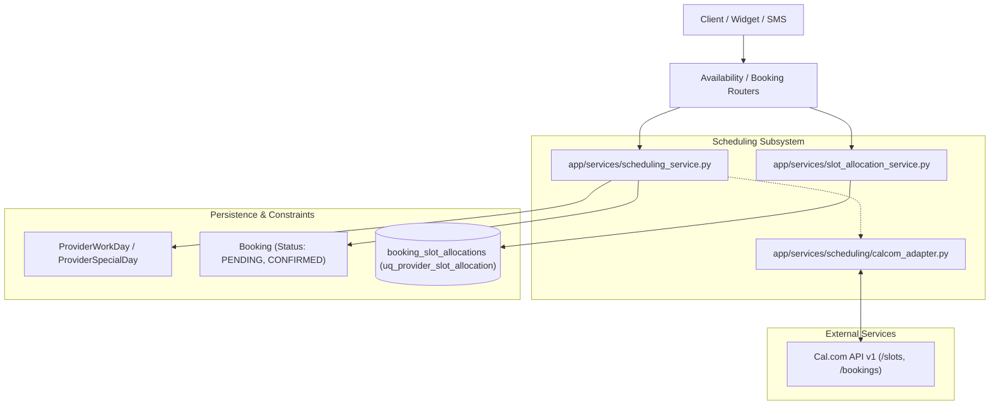
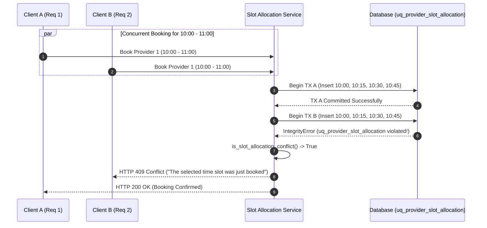

# Scheduling Engine & Cal.com Adapter (`app/services/scheduling`)

This module defines the calendar calculation engine, provider availability matrix, discrete 15-minute slot allocation mechanism, double-booking collision prevention, and the headless Cal.com integration adapter for **FastAPI Bookings**.

---

## 1. Purpose & Scope

The Scheduling Engine owns:
- Computation of available appointment windows based on provider working hours, shift schedules, custom breaks, and blackout dates.
- Service buffer calculation (minimum buffer before and after appointments).
- Discrete 15-minute slot decomposition and database-level unique constraint collision enforcement (`uq_provider_slot_allocation`).
- Cal.com headless API federation via [calcom_adapter.py](file:///F:/Projects/fastapi_bookings/app/services/scheduling/calcom_adapter.py).
- Concurrency conflict resolution ensuring a deterministic "first-submit-wins" guarantee.

This module avoids holding long-lived in-memory locks or thread sleep pauses; all concurrency safety is anchored directly in database transaction isolation.

---

## 2. Architecture & Key Files



### Key Files
- [calcom_adapter.py](file:///F:/Projects/fastapi_bookings/app/services/scheduling/calcom_adapter.py): Headless client connecting to Cal.com API with timeout management, slot retrieval, and booking hold fallbacks.
- [slot_allocation_service.py](file:///F:/Projects/fastapi_bookings/app/services/slot_allocation_service.py): Generator for 15-minute slot intervals, collision detection helper (`is_slot_allocation_conflict`), and audit/repair routines.
- [scheduling_service.py](file:///F:/Projects/fastapi_bookings/app/services/scheduling_service.py): Provider schedule calculator intersecting working days, blocked times, and active bookings.
- [app/models/booking_slot_allocation.py](file:///F:/Projects/fastapi_bookings/app/models/booking_slot_allocation.py): SQLAlchemy model enforcing the unique constraint `(provider_id, slot_start)`.

---

## 3. Setup, Configuration & Dependencies

### Environment Variables
Configured in [app/core/config.py](file:///F:/Projects/fastapi_bookings/app/core/config.py):
```dotenv
CALCOM_API_KEY=cal_live_xxxxxxxx
CALCOM_BASE_URL=https://api.cal.com/v1
```

### Database Schema
- `provider_work_days`: Weekly operating hours (day of week 0-6, start/end times).
- `provider_special_days`: Date-specific overrides (holidays, special shifts).
- `blocked_times`: Manually blocked vacation or unavailability blocks.
- `booking_slot_allocations`: Durable 15-minute time slices. Unique index:
  ```sql
  CREATE UNIQUE INDEX uq_provider_slot_allocation ON booking_slot_allocations (provider_id, slot_start);
  ```

---

## 4. Core Workflows & Contracts

### 4.1 15-Minute Discrete Slot Allocation
Rather than storing appointments as floating start/end times that require expensive range overlap queries, appointments are sliced into 15-minute granules:
1. An appointment for Provider 1 from `10:00` to `11:00` (60 minutes) generates four discrete slots:
   - `10:00:00`
   - `10:15:00`
   - `10:30:00`
   - `10:45:00`
2. If buffers are configured (e.g., 15 minutes before or after), additional buffer slots are inserted.
3. Each slice is written to `booking_slot_allocations`.



### 4.2 Cal.com Headless Integration Adapter
`CalComAdapter` exposes an asynchronous interface:
- `get_available_slots(event_type_id, start_time, end_time, time_zone)`: Retrieves available slots from Cal.com. If Cal.com times out or returns an error, the adapter logs the incident and returns an empty list gracefully.
- `create_booking(...)`: Posts confirmed bookings to the external Cal.com schedule.
- Supports external `httpx.AsyncClient` injection for connection reuse.

---

## 5. Data Safety, Multi-Tenancy & PII Isolation

- **Tenant and Provider Scoping**: Work schedules and slot allocations are strictly scoped to the active `tenant_id` and `provider_id`. Slot conflicts cannot leak across providers or tenants.
- **UTC Time Normalization**: All timestamps are normalized to UTC via `normalize_to_utc()` before insertion into `booking_slot_allocations`, eliminating timezone drift and daylight savings boundary bugs.
- **Privacy in Concurrency Collisions**: When a conflict occurs, error details do not reveal the identity, phone number, or notes of the client who won the slot; only generic collision feedback is returned.

---

## 6. Known Issues, Edge Cases & Outstanding Work

- **Historical Booking Migration**: Existing bookings created before discrete slot allocations must be backfilled using the slot audit/repair facility (`SlotAllocationAuditResult`).
- **Distributed Clocks**: Cal.com integration depends on accurate clock synchronization (NTP) to ensure timezone conversions align with local clinic hours.

---

## 7. Verification & Testing Commands

Execute scheduling and concurrency test suites:
```powershell
# 1. Run First-Submit-Wins concurrency and race-condition tests
pytest tests/test_concurrency.py -v

# 2. Test scheduling intervals and service buffers
pytest tests/test_scheduling_intervals.py -v

# 3. Test scheduling edge cases and boundary conditions
pytest tests/test_scheduling_edge_cases.py -v

# 4. Test Cal.com headless adapter and mock routes
pytest tests/test_calcom_adapter.py tests/test_calcom_router.py -v

# 5. Test slot allocation repair and backfill audit
pytest tests/test_slot_allocation_repair.py -v
```
