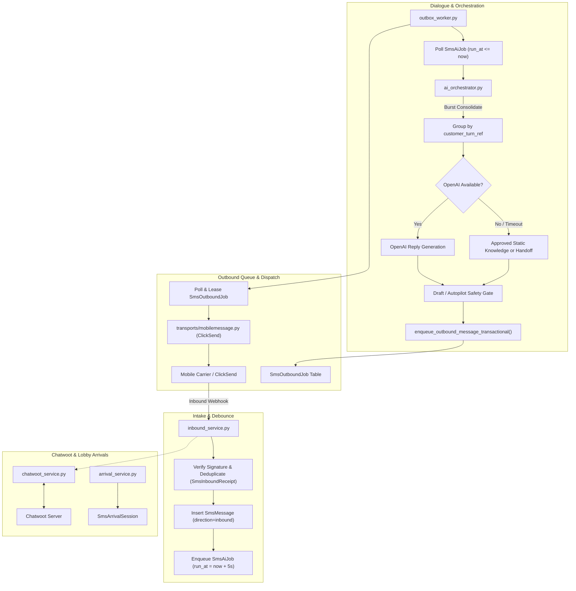
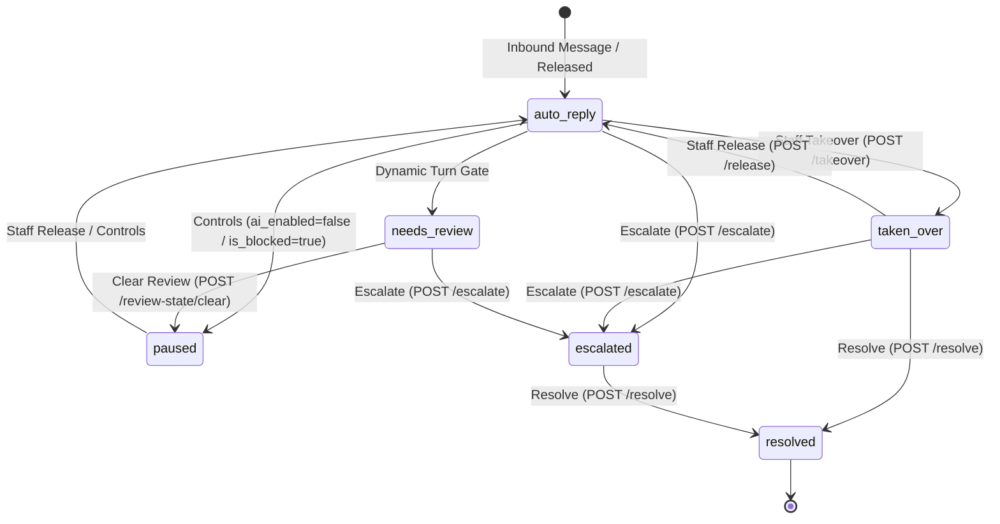
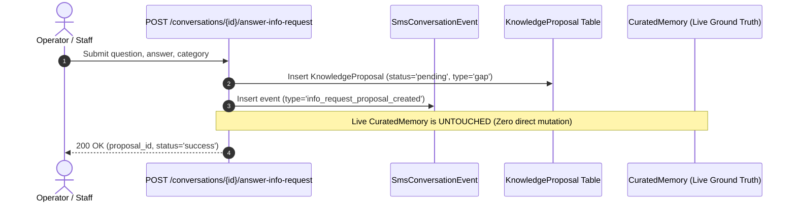
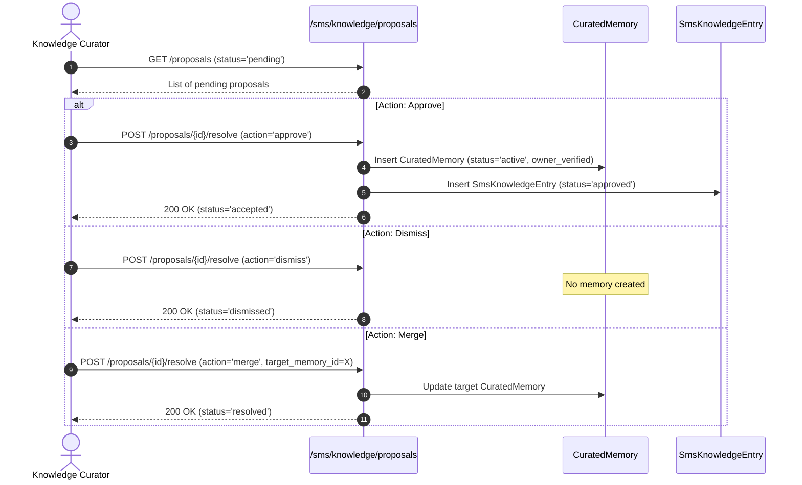
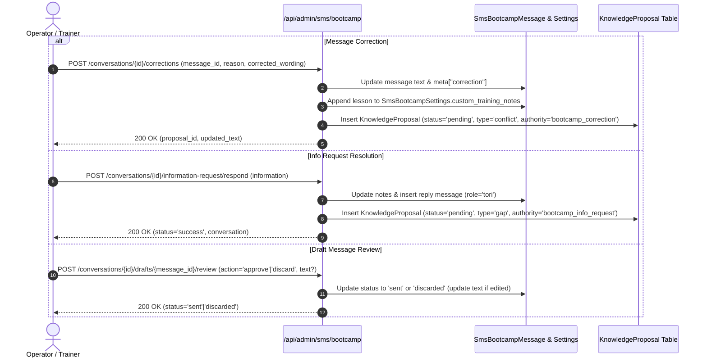
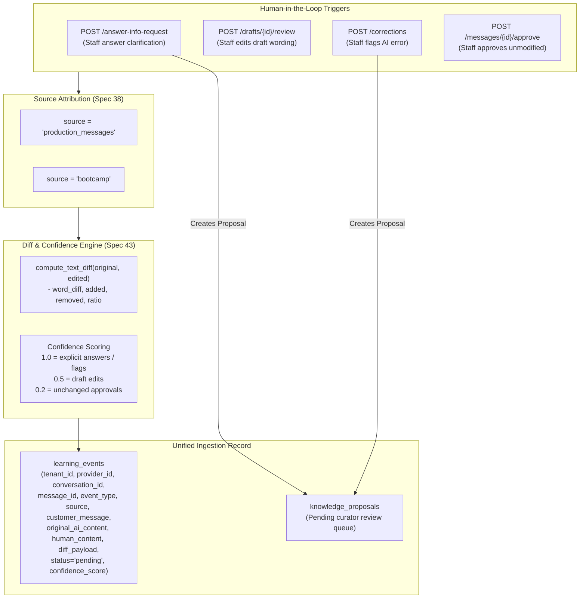
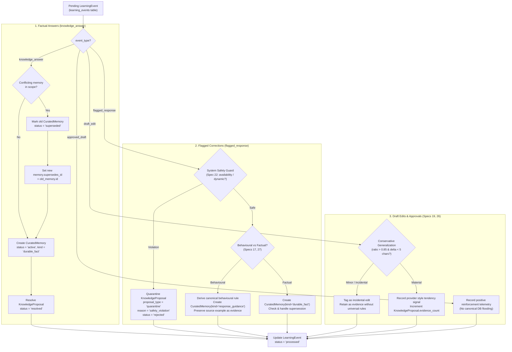
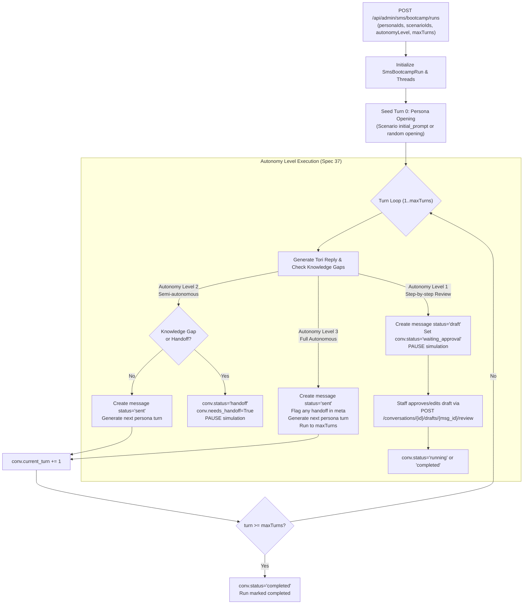

# SMS Assistant & Autonomous Dialogue Engine (`app/services/sms`)

This module houses the SMS/MMS conversational dialogue engine, transactional outbox dispatcher, OpenAI function calling orchestrator, Chatwoot sync bridge, and Lobby Arrival chime system for **FastAPI Bookings**.

---

## 1. Purpose & Scope

The SMS Assistant module owns:
- Inbound carrier webhook intake with cryptographic signature verification and idempotent receipt logging.
- Customer burst turn consolidation and debounce scheduling.
- Review-first and safety-gated AI reply generation with tenant, provider, and SMS-account prompt/context isolation.
- A fail-closed local fallback that can use approved static knowledge but cannot create, cancel, or reschedule bookings.
- Bi-directional synchronization with Chatwoot omnichannel inboxes.
- Human takeover state management (`auto-reply` vs `human-takeover`).
- Contactless self-arrival check-in chime and repeated lobby notification alerts.

This module deliberately avoids direct network dispatch inside request threads (delegating to transactional outbox workers), cross-tenant/account dialogue context sharing, and direct booking or durable-knowledge mutation from conversation routes. FastAPI Bookings remains the booking authority; the explicitly confirmed conversational-booking workflow is a separate delivery stage.

---

## 2. Architecture & Key Files



### Key Files
- [inbound_service.py](file:///F:/Projects/fastapi_bookings/app/services/sms/inbound_service.py): Webhook signature check, idempotency receipts, conversation resolution, and turn debouncing.
- [ai_orchestrator.py](file:///F:/Projects/fastapi_bookings/app/services/sms/ai_orchestrator.py): Burst turn aggregation, account-safe prompt composition, review/autopilot gating, and fail-closed static-knowledge fallback.
- [booking_facade.py](file:///F:/Projects/fastapi_bookings/app/services/sms/booking_facade.py): Existing booking-domain adapter; it is not called by the local fallback in this integration slice.
- [outbound_service.py](file:///F:/Projects/fastapi_bookings/app/services/sms/outbound_service.py): Transactional outbound message creation and outbox queuing.
- [operations_service.py](file:///F:/Projects/fastapi_bookings/app/services/sms/operations_service.py): Tenant/account-scoped staff lifecycle transitions, structural audit events, draft selection, and sanitized timeline assembly.
- [outbox_worker.py](file:///F:/Projects/fastapi_bookings/app/services/sms/outbox_worker.py): Async background polling loop leasing pending outbound jobs and dispatching via transports.
- [chatwoot_service.py](file:///F:/Projects/fastapi_bookings/app/services/sms/chatwoot_service.py): Bi-directional synchronization bridge linking conversations to Chatwoot contacts and messages.
- [arrival_service.py](file:///F:/Projects/fastapi_bookings/app/services/sms/arrival_service.py): Self-service lobby arrival token creation, arrival check-in, and repeating staff chime alerts.
- [prompt_builder.py](file:///F:/Projects/fastapi_bookings/app/services/sms/prompt_builder.py): Master Spec Unified Layered Prompt Builder compiling system safety, tenant policies, Style Lab traits, structured operational catalogs, curated knowledge, and situational modulation.
- [curator_service.py](file:///F:/Projects/fastapi_bookings/app/services/sms/curator_service.py): Master Spec Autonomous Knowledge Curator Service processing learning events, managing supersession lifecycles, deriving canonical behavioural rules, and enforcing fail-closed safety boundaries.
- [transports/mobilemessage.py](file:///F:/Projects/fastapi_bookings/app/services/sms/transports/mobilemessage.py): ClickSend / MobileMessage HTTP carrier implementation.
- [transports/fake.py](file:///F:/Projects/fastapi_bookings/app/services/sms/transports/fake.py): In-memory carrier mock for test isolation.

---

## 3. Setup, Configuration & Dependencies

### Environment Variables
Configured in [app/core/config.py](file:///F:/Projects/fastapi_bookings/app/core/config.py):
```dotenv
# ClickSend / SMS Gateway
CLICKSEND_API_USERNAME=user@example.com
CLICKSEND_API_KEY=key_abcdef123456

# OpenAI Assistant
OPENAI_API_KEY=sk-proj-...

# Chatwoot Sync
CHATWOOT_BASE_URL=https://app.chatwoot.com
CHATWOOT_API_ACCESS_TOKEN=token_xyz
CHATWOOT_WEBHOOK_SECRET=webhook_secret_123

# Outbox Worker Configuration
OUTBOX_POLL_INTERVAL=5.0
OUTBOX_LEASE_SECONDS=120
OUTBOX_BATCH_SIZE=20
```

### Models & Schema Dependencies
Uses tables defined in [app/models/sms_*.py](file:///F:/Projects/fastapi_bookings/app/models/):
- `sms_accounts`: Gateway credentials, transport type, prompt profiles, AI mode (`off`, `draft`, `autopilot`).
- `sms_conversations`: Thread state, customer phone number, active client link, `unread_count`, `state`.
- `sms_messages`: Individual SMS messages with direction, status, and `customer_turn_ref`.
- `sms_inbound_receipts`: Event key deduplication receipts.
- `sms_outbound_jobs`: Transactional outbox table for reliable dispatch.
- `sms_ai_jobs`: Debounced queue of conversation turns requiring AI completion.
- `sms_arrival_sessions`: Tokenized lobby arrival check-in sessions.

---

## 4. Core Workflows & Contracts

### 4.1 Inbound Intake & 5-Second Debounce
1. Customer sends an SMS. The carrier posts to `/api/sms/webhooks/{transport}/{public_id}`.
2. `inbound_service.process_inbound_webhook` resolves the active `SmsAccount` and validates the signature.
3. The carrier `event_key` is checked against `sms_inbound_receipts`. If already processed, HTTP 200 is returned immediately.
4. The message is inserted with a `customer_turn_ref`. If the previous message arrived < 10 seconds ago, it inherits the existing turn reference.
5. Any pending `SmsAiJob` for the conversation is cancelled, and a new job is scheduled with `run_at = now() + 5s`. This guarantees multi-message bursts are processed as a single semantic turn.

### 4.2 Responder prompt and send safety

1. Prompt assembly begins with immutable safety rules, then selects at most one tenant-global prompt and one provider persona. The bound account's `line_prompt` is the provider-persona fallback, not an additional cross-line layer.
2. Approved shared knowledge must be tenant-wide and account-neutral. Provider knowledge may be provider-wide or bound to the current SMS account; entries for another account are excluded.
3. Only sent inbound/outbound history from the same tenant, provider, account, and conversation is supplied as factual context. Drafts, discarded messages, failed messages, notes, and tool output are excluded.
4. Dynamic requests (including availability, booking, cancellation, current prices/dates/times, links, and payments) become drafts or enter `needs-review`; the local fallback never performs booking actions.
5. Autopilot is allowed only for non-dynamic replies when the tenant line and conversation controls permit it. Blocked, escalated, resolved, review, paused, or taken-over conversations cannot produce automatic sends.

### 4.3 Lobby Arrival Chime & Recurring Alerts
1. When a client receives an appointment reminder SMS, it includes a short link containing an arrival token (`arrival_service.create_arrival_session`).
2. Upon arrival at the clinic, clicking the link triggers `/api/sms/arrivals/checkin/{token}`.
3. The session records `arrived_at = now()`. An `arrival_alert_triggered` event is published to the outbox.
4. `process_repeated_arrival_alerts` runs periodically. If an arrived client remains unacknowledged after 60 seconds, it sounds repeated chime events to staff dashboards.

### 4.4 Native Staff Operations & Draft Moderation Contracts

The native SMS workspace provides staff moderation over AI-generated drafts, conversation lifecycle states, and internal notes without cross-tenant context leaks or external service calls during tests.

#### Draft Moderation Contracts
- **`GET /api/admin/sms/conversations/drafts/queue`**:
  - Retrieves all pending AI draft messages (`status="draft"`) across conversations belonging to the authenticated tenant, ordered by newest first (`occurred_at DESC`).
  - **Preceding Prompt Resolution (`inbound_snippet`)**: Each draft item includes `inbound_snippet: Optional[str]`, resolving the latest inbound customer message in that conversation (`direction == "inbound"` and `occurred_at <= draft.occurred_at`). This enables operators to triage drafts with triggering customer context directly in the queue without opening individual conversation threads.
  - **Multi-Tenant & Thread Isolation**: Strictly filters both draft messages and the preceding inbound snippet query by `tenant_id` and conversation boundaries.
- **`POST /api/admin/sms/conversations/messages/{message_id}/approve`**:
  - Validates tenant, provider, and account bounds. Rejects blocked threads (`409`) or non-draft messages (`409`).
  - Transitions draft to `direction="outbound"`, `status="queued"`.
  - Transactionally creates `SmsOutboundJob` with `status="PENDING"`.
  - Appends structural audit event `type="draft_approved"` with `meta={"actor_id": admin_id, "message_id": message_id}`.
  - **Idempotency**: Repeated approval calls on an already approved/queued message return `200 OK` without creating duplicate outbox jobs or duplicate audit events.
- **`POST /api/admin/sms/conversations/messages/{message_id}/discard`**:
  - Validates tenant and line bounds.
  - Transitions draft to `status="discarded"`.
  - Appends structural audit event `type="draft_discarded"` with `meta={"actor_id": admin_id, "message_id": message_id}`.
  - **Fail-Closed Guard**: Rejecting any non-draft message (e.g. already discarded, received, or sent) returns `400 Bad Request`.
- **`POST /api/admin/sms/conversations/drafts/{draft_id}/review`**:
  - Unified review endpoint supporting actions: `"approve"`, `"discard"`, and `"edit"`.
  - Action `"edit"` updates draft text and logs `draft_edited`.
- **`POST /api/admin/sms/conversations/drafts/bulk/discard`**:
  - Accepts `{ "message_ids": List[int], "reason": str }` to discard multiple pending draft messages in a single batch operation.
  - **Strict Validation**: Fails with `409 Conflict` if any specified message ID is not a pending draft or belongs to another tenant.
  - Transitions all matching drafts to `status="discarded"`.
  - Emits structural audit event(s) `type="drafts_bulk_discarded"` grouped by conversation, recording `meta={"actor_id": admin_id, "discarded_count": int, "reason": str}` into `SmsConversationEvent`.
  - Returns `{"discarded_count": count}`.

#### Conversation Lifecycle State Machine



- **States**:
  - `auto-reply`: Active AI dialogue handling with debouncing.
  - `taken-over`: Human staff has taken direct manual control; `ai_enabled=False`.
  - `paused`: Automation paused via controls or blocked contact; `ai_enabled=False`.
  - `needs-review`: High-stakes or dynamic enquiry requiring human review; `ai_enabled=False`.
  - `escalated`: Guarded escalation for senior or clinical attention; `ai_enabled=False`.
  - `resolved`: Guarded closure after issue resolution; `ai_enabled=False`.

- **Transition Guards & Lifecycle Actions**:
  - **`POST /{conversation_id}/takeover`**: Sets `state="taken-over"`, `ai_enabled=False`, cancels all pending `SmsAiJob`s for the conversation, and records `type="conversation_takeover"`.
  - **`POST /{conversation_id}/release`**: Restores `state="auto-reply"`, `ai_enabled=True`, and records `type="conversation_release"`. Fails closed (`409 Conflict`) if the conversation is blocked, if the line has AI disabled, or if the conversation is in an ineligible state (must be in `taken-over` or `paused`).
  - **`POST /{conversation_id}/escalate`**: Requires a non-empty `reason` (`409 Conflict` if empty or missing). Sets `state="escalated"`, `ai_enabled=False`, cancels pending `SmsAiJob`s, and records `type="conversation_escalate"` with `reason` and state transitions.
  - **`POST /{conversation_id}/resolve`**: Requires a non-empty resolution `reason` (`409 Conflict` if empty or missing). Sets `state="resolved"`, `ai_enabled=False`, cancels pending `SmsAiJob`s, and records `type="conversation_resolve"` with `reason` and state transitions.
  - **`POST /{conversation_id}/review-state/clear`**: Clears `needs-review` state to `paused`.
  - **`PATCH /{conversation_id}/controls`**: Guarded updates to `ai_enabled`, `is_pinned`, `is_blocked`. Blocking a thread or disabling AI automatically moves `auto-reply` to `paused` and cancels pending `SmsAiJob`s. Blocked conversations cannot have AI re-enabled (`409 Conflict`). Records `controls_updated`.

#### `SmsConversationEvent` Audit Taxonomy

To protect tenant security and PII, structural audit events in `sms_conversation_events` **never** duplicate customer message content or note text. Message bodies and internal notes reside authoritatively in their dedicated tables (`sms_messages` and `sms_notes`). Audit events record durable provenance, transitions, and identifiers:

| Event Type (`type`) | Emitted Trigger | Metadata Contract (`meta`) |
| :--- | :--- | :--- |
| `draft_approved` | Staff approves draft message | `actor_id`, `message_id` |
| `draft_discarded` | Staff discards single draft | `actor_id`, `message_id` |
| `draft_edited` | Staff edits draft wording | `actor_id`, `message_id` |
| `drafts_bulk_discarded` | Staff bulk discards queue | `actor_id`, `discarded_count`, `reason` |
| `conversation_takeover` | Staff takes manual control | `actor_id`, `from_state`, `to_state`, `reason` (optional) |
| `conversation_release` | Staff restores auto-reply | `actor_id`, `from_state`, `to_state`, `reason` (optional) |
| `conversation_escalate` | Staff escalates conversation | `actor_id`, `from_state`, `to_state`, `reason` (required) |
| `conversation_resolve` | Staff resolves conversation | `actor_id`, `from_state`, `to_state`, `reason` (required) |
| `internal_note_added` | Staff adds internal note | `actor_id`, `note_id` |
| `ai_correction_recorded`| Staff logs AI correction | `actor_id`, `message_id`, `reason`, `corrected_wording`, `contains_dynamic_facts` |
| `controls_updated` | Staff toggles AI/pin/block | `actor_id`, `ai_enabled`, `is_pinned`, `is_blocked`, `state` |
| `staff_replied` | Staff sends manual SMS reply | `actor_id`, `message_id` |
| `customer_arrived` | Lobby arrival check-in | `booking_id`, `source` |

#### Timeline Assembly (`GET /{conversation_id}/timeline`)
- Combines three authoritative data streams into a single unified chronologically sorted feed (`occurred_at` ascending):
  1. `kind: "message"`: `id`, `occurred_at`, `body`, `direction`, `author_type`, `status`.
  2. `kind: "internal_note"`: `id`, `occurred_at`, `body`, `author_id`.
  3. `kind: "event"`: `id`, `occurred_at`, `event_type`, `meta`.
- **Sanitization Whitelist**: Event metadata is strictly filtered to safe structural keys (`actor_id`, `message_id`, `note_id`, `from_state`, `to_state`, `reason`, `corrected_wording`, `contains_dynamic_facts`, `discarded_count`, `ai_mode`, `requires_review`, `ai_enabled`, `is_pinned`, `is_blocked`, `state`), preventing accidental leakage of uninspected raw JSON payloads.
- **Fail-Closed Operations**:
  - `POST /answer-info-request` is rejected with `HTTP 409 Conflict`. Direct conversation-to-knowledge ingestion is disabled; reusable knowledge requires governed curator proposals.
  - Production `POST /seed-scenarios` is rejected with `HTTP 409 Conflict` before any mutation.
  - Retrying failed outbound jobs requires an enabled line and unblocked conversation; raw provider error text is withheld from client responses.

---

## 5. Data Safety, Multi-Tenancy & PII Isolation

- **Tenant Boundary Enforcement**: `SmsAccount`, `SmsConversation`, `SmsMessage`, and `SmsOutboundJob` all strictly enforce `tenant_id` foreign keys. An SMS account can never access conversation context from another tenant.
- **Transactional Consistency**: AI-generated responses and customer status updates are committed in the same database transaction as the outbox queue entry, preventing ghost replies or lost messages.
- **Account-scoped idempotency**: inbound provider identifiers are hashed with their SMS account before receipt storage; outbound UI request identifiers are resolved within tenant, provider, account and conversation scope.
- **Offline Carrier Guard**: In automated tests, raw socket calls are blocked; all SMS operations use [fake.py](file:///F:/Projects/fastapi_bookings/app/services/sms/transports/fake.py) with synthetic phone numbers (`0411000001` - `0411000005`). Real external SMS messages are never sent during testing.

---

## 6. Known Issues, Edge Cases & Outstanding Work

- **Carrier Inbound Retries**: Some carriers retry webhooks if processing exceeds 3000ms. Because signature check and DB insert are sub-50ms and AI generation is asynchronous, timeouts are prevented.
- **Chatwoot Outage Resiliency**: If Chatwoot API experiences downtime, inbound SMS processing continues unhindered; Chatwoot sync jobs back off exponentially.
- **Migration blocker**: the `is_pinned`, `is_blocked`, and `ai_enabled` conversation columns currently lack a committed migration. A migration must be added only after the concurrent migration branch is reconciled to one clean Alembic head. This slice is not deployable before that migration lands.
- **Concurrency hardening pending migration**: application-level manual-send and draft-approval checks are idempotent for repeated requests, but database uniqueness for scoped `client_request_id` and one outbound job per message must be added by the migration owner to close concurrent races.
- **Deferred inbox enrichment**: persisted priority, SLA/due-at, escalation owner, booking/arrival summary fields and CSV reporting are not part of this slice and require an approved data/API contract.

---

## 7. Verification & Testing Commands

Run the SMS test suite:
```powershell
# 1. Test SMS foundation and outbox queuing
.\.venv\Scripts\python.exe -m pytest tests/test_sms_foundation.py -v

# 2. Test OpenAI function calling and tool execution
.\.venv\Scripts\python.exe -m pytest tests/test_sms_openai.py -v

# 3. Test prompt hierarchy and persona overrides
.\.venv\Scripts\python.exe -m pytest tests/test_sms_prompt_hierarchy.py -v

# 4. Test Chatwoot synchronization and agentbot binding
.\.venv\Scripts\python.exe -m pytest tests/test_sms_chatwoot.py tests/test_chatwoot_agentbot.py -v

# 5. Test Lobby Arrival chime and repeated alerts
.\.venv\Scripts\python.exe -m pytest tests/test_sms_arrivals.py -v

# 6. Test SMS rate limiting
.\.venv\Scripts\python.exe -m pytest tests/test_sms_rate_limiting.py -v

# 7. Test native staff lifecycle, account isolation, idempotency and fail-closed AI
.\.venv\Scripts\python.exe -m pytest tests/test_sms_foundation.py tests/test_sms_integration.py tests/test_sms_openai.py tests/test_sms_prompt_hierarchy.py tests/test_sms_chatwoot.py tests/test_sms_rate_limiting.py tests/test_sms_assistant_ui_controls.py -v
```

---

## 8. Secure Arrival Sessions (Supersedes Section 4.3)

### Purpose & Scope

The arrival slice issues booking-scoped customer check-in capabilities and records the staff arrival lifecycle. It owns token verification, check-in, acknowledgement, structural arrival events, and durable repeated-alert deduplication. It does not send reminders or SMS messages, create bookings, deliver browser push/audio, or build customer-facing invitation links.

### Architecture & Key Files

- `app/services/sms/arrival_service.py` owns token creation and resolution, transitive scope validation, state transitions, expiry, structural events, and durable alert outbox records.
- `app/api/routers/sms_arrivals.py` exposes the body-token customer check-in contract and authenticated tenant-scoped staff list/acknowledgement contracts.
- `app/schemas/sms_arrival.py` defines request and response schemas that deliberately omit raw tokens and customer PII.
- `tests/test_sms_arrivals.py` exercises the security, lifecycle, isolation, idempotency, and alert-deduplication contracts with labelled synthetic data.

The implementation uses `SmsArrivalSession`, `SmsConversation`, `SmsConversationEvent`, `OutboxEvent`, `Booking`, `Client`, `Provider`, `Service`, and `SmsAccount`. It introduces no new environment variables or external-service dependency.

### Core Workflows & Contracts

1. `create_arrival_session` accepts an eligible confirmed booking and a conversation whose tenant, provider, SMS account, and client all match transitively. It persists only a SHA-256 token digest and returns the raw capability once to the caller.
2. A customer submits that capability in a JSON body to `POST /api/admin/sms/arrivals/public/arrive`. Tokens are never accepted in a URL path. Invalid, malformed, unknown, or expired capabilities receive the same non-disclosing `404` response.
3. The first valid check-in records `arrived_at` and one structural `customer_arrived` event. A retry returns the existing state without creating a duplicate event.
4. Staff list arrivals with `GET /api/admin/sms/arrivals` and acknowledge one with `POST /api/admin/sms/arrivals/{arrival_id}/acknowledge`. Both operations are authenticated and tenant scoped. Acknowledgement is idempotent and records one structural closure event.
5. `process_repeated_arrival_alerts` emits structural `OutboxEvent` rows for eligible unacknowledged arrivals. The key `arrival-alert:{session_id}:{sequence}` provides durable deduplication across retries and concurrent workers. Acknowledged, expired, cancelled, or otherwise ineligible arrivals fail closed.

### Data Safety & Isolation

- New sessions store only token digests; responses, logs, events, and alert payloads never contain raw tokens, phone numbers, customer identities, message bodies, or booking notes.
- Scope is checked through the full booking/conversation/account/client/provider/service relationship before a capability is created or exercised. A missing or inconsistent relationship fails closed.
- Expiry is computed from the earlier of the maximum session lifetime and the booking-end grace window. Expired capabilities cannot check in.
- Arrival event metadata and alert payloads are structural and use identifiers and sequence numbers only.
- The temporary legacy lookup can read an existing raw-token row without returning or logging that value. All newly created sessions use digest storage.

### Known Issues, Edge Cases & Outstanding Work

- No production reminder or invitation-link producer currently consumes the one-time token returned by `create_arrival_session`. A future producer must commit the session with its reminder state atomically and use a customer page that submits the token in the request body, not a server URL or query string.
- The customer endpoint is currently under the shared `/api/admin` router mount even though it authenticates by scoped capability rather than a staff session. Moving it requires an approved shared-router contract change.
- Legacy raw-token lookup remains only for migration compatibility. Remove it after legacy rows have expired and all direct session creators, including synthetic seeders, use `create_arrival_session`.
- Expiry and ownership are currently derived from existing booking and conversation relationships because no arrival-specific schema migration was approved for this slice. Database-enforced immutable event history and first-class arrival ownership/expiry columns remain follow-up work.
- Browser push/audio delivery, reminder scheduling, and the customer-facing arrival page are outside this slice. The durable outbox records are only the safe server-side alert boundary.
- Existing frontend arrival mocks/types may still expose legacy token or PII fields and require a separate approved frontend cleanup.

### Verification & Testing Commands

```powershell
$env:OTEL_SDK_DISABLED='true'
.\.venv\Scripts\python.exe -m py_compile app/services/sms/arrival_service.py app/api/routers/sms_arrivals.py app/schemas/sms_arrival.py tests/test_sms_arrivals.py
.\.venv\Scripts\python.exe -m pytest tests/test_sms_arrivals.py tests/test_notification_configs.py -q
```

For an API contract smoke test, inspect the generated OpenAPI document and verify that the body-token `POST /api/admin/sms/arrivals/public/arrive`, authenticated list `GET /api/admin/sms/arrivals`, and acknowledgement `POST /api/admin/sms/arrivals/{arrival_id}/acknowledge` methods exist, while the legacy URL-token route does not.

---

## 9. Quick Tools & Knowledge Curator Proposals (Phase 4 Contracts)

### Purpose & Scope

Phase 4 introduces staff acceleration controls and durable knowledge curation governance:
1. **Quick Tools (Macro Buttons)**: Operators have 5 configurable quick-response slots (indices 0..4) per tenant/user for standardized snippets (such as address, operating hours, booking links, parking info, and cancellation policies).
2. **Safe Info-Request Ingestion**: When staff responds to an unhandled customer information request, conversation endpoints deliberately **refuse direct live mutation** of authoritative domain facts (`CuratedMemory` / `SmsKnowledgeEntry`). Instead, answers are safely persisted as reviewable `KnowledgeProposal` candidates accompanied by structural audit events.
3. **Governed Curator Proposal Workflow**: Curator staff reviews candidate proposals, either approving them into tenant ground truth, dismissing invalid submissions, or merging updates into existing knowledge memories.

### Architecture & Key Files

- [app/api/routers/sms_conversations.py](file:///F:/Projects/fastapi_bookings/app/api/routers/sms_conversations.py):
  - `GET /api/admin/sms/conversations/quick-tools`: Fetches the 5 macro button slots for the current tenant and user (falling back to standard defaults if unconfigured).
  - `POST /api/admin/sms/conversations/quick-tools`: Persists a user-scoped quick tool override for slot `0..4`.
  - `POST /api/admin/sms/conversations/{conversation_id}/answer-info-request`: Safely ingests staff guidance into a pending `KnowledgeProposal` (`proposal_type='gap'`) and emits an `info_request_proposal_created` event.
- [app/api/routers/sms_settings.py](file:///F:/Projects/fastapi_bookings/app/api/routers/sms_settings.py):
  - `GET /api/admin/sms/knowledge/proposals`: Lists review proposals for the authenticated tenant (filtered to `status='pending'` by default).
  - `POST /api/admin/sms/knowledge/proposals/{proposal_id}/resolve`: Resolves a proposal using explicit actions (`approve`, `dismiss`, `merge`, or `reject`).
- [app/models/curated_memory.py](file:///F:/Projects/fastapi_bookings/app/models/curated_memory.py):
  - `KnowledgeProposal`: Ephemeral, review-required curator candidate queue (`pending`, `accepted`, `rejected`, `dismissed`, `resolved`). Never used as direct responder ground truth.
  - `CuratedMemory`: Authoritative, owner-verified reusable business facts (`status='active'`, `quarantined`, `superseded`).
- [app/models/sms_quick_tool.py](file:///F:/Projects/fastapi_bookings/app/models/sms_quick_tool.py):
  - `SmsQuickTool`: Tenant and user-scoped macro configuration table holding `slot_index` (0..4), `label` (max 8 characters), and snippet `content`.

### Core Workflows & Contracts

#### 1. Quick Tools (Macro Replies)
- **Slots**: Exactly 5 slots (indices 0, 1, 2, 3, 4).
- **Default Fallbacks**:
  - Slot 0: `ADDR` (Clinic address & transit guidance)
  - Slot 1: `HOURS` (Operating schedule)
  - Slot 2: `LINK` (Online booking portal link)
  - Slot 3: `PARKING` (Customer parking instructions)
  - Slot 4: `POLICIES` (Cancellation & rescheduling policy)
- **Precedence**: User-specific overrides take precedence over tenant-wide defaults without clobbering other operators' configurations.

#### 2. Safe Info-Request Ingestion


#### 3. Knowledge Proposal Review & Resolution


#### 4. SMS Bootcamp Learning, Correction, and Draft Review Contracts



- **Bootcamp Correction Endpoint (`POST /conversations/{conversation_id}/corrections`)**:
  - Request schema: [`BootcampCorrectionCreate`](file:///F:/Projects/fastapi_bookings/app/schemas/sms_bootcamp.py) (`message_id: str`, `reason: str`, `corrected_wording: Optional[str]`, `contains_dynamic_facts: bool = False`).
  - Updates target message `text` and injects `msg.meta["correction"] = {"reason": reason, "previous_text": old_text, "timestamp": iso_utc}`.
  - Appends durable correction lessons to `SmsBootcampSettings.custom_training_notes`.
  - Ingests reviewable [`KnowledgeProposal`](file:///F:/Projects/fastapi_bookings/app/models/curated_memory.py) (`proposal_type="conflict"`, `status="pending"`, `authority="bootcamp_correction"`, `requires_review=True`).
  - Response: `{"ok": True, "proposal_id": proposal.id, "updated_text": msg.text}`.

- **Information Request Auto-Ingestion (`POST /conversations/{conversation_id}/information-request/respond`)**:
  - Ingests [`KnowledgeProposal`](file:///F:/Projects/fastapi_bookings/app/models/curated_memory.py) with `proposal_type="gap"`, `authority="bootcamp_info_request"`, `user_query=prompt`, `proposed_response=information`, `status="pending"`, `requires_review=True`.
  - Ensures all facts learned during Bootcamp training simulations immediately populate the central Curator Proposals queue (`/api/admin/sms/knowledge/proposals`).

- **Bootcamp Draft Review Endpoint (`POST /conversations/{conversation_id}/drafts/{message_id}/review`)**:
  - Request schema: [`BootcampDraftReviewCreate`](file:///F:/Projects/fastapi_bookings/app/schemas/sms_bootcamp.py) (`action: Literal["approve", "discard"]`, `text: Optional[str] = None`).
  - `action == "approve"` transitions `msg.status = "sent"`, applying any updated draft text.
  - `action == "discard"` transitions `msg.status = "discarded"`.
  - Enforces strict tenant isolation across conversation and message lookup.

### Data Safety & Isolation

- **Tenant Isolation**: Every query and mutation strictly enforces `tenant_id == current_tenant.id`. Cross-tenant proposal access returns `404 Not Found`.
- **Zero Live Contamination**: Unverified information requests can never directly alter agent prompt context or active knowledge until an authorized human operator explicitly approves or merges the proposal.
- **Audit Sanitization**: `SmsConversationEvent` logs record structural identifiers (`proposal_id`, `proposal_type`, `category`) rather than raw free-text bodies to uphold tenant data minimization.
- **Zero External Network Dispatch**: Tests and local runs never initiate live SMS delivery or invoke external OpenAI completion endpoints.

### Verification & Testing Commands

```powershell
# Run the complete UI controls and knowledge curation test suite:
& ".\.venv\Scripts\python.exe" -m pytest tests/test_sms_assistant_ui_controls.py -v

# Run the prompt hierarchy and settings test suite:
& ".\.venv\Scripts\python.exe" -m pytest tests/test_sms_prompt_hierarchy.py -v

# Run the complete SMS Bootcamp test suite:
& ".\.venv\Scripts\python.exe" -m pytest tests/test_sms_bootcamp.py -v
```

---

## 10. Unified Layered Prompt Builder & Runtime Convergence (`prompt_builder.py`)

### Purpose & Scope

Phase 1 introduces the **Unified Layered Prompt Builder** (`app/services/sms/prompt_builder.py`) to reconcile prompt assembly across both live production SMS dialogue orchestration ([`ai_orchestrator.py`](file:///F:/Projects/fastapi_bookings/app/services/sms/ai_orchestrator.py)) and simulation environments ([`bootcamp_service.py`](file:///F:/Projects/fastapi_bookings/app/services/sms/bootcamp_service.py)).

Previously, prompt assembly was fragmented: live SMS used an ad-hoc 7-layer concatenation without Style Lab behavioral priors or structured operational catalogs, while Bootcamp simulation used isolated instructions. The Unified Prompt Builder establishes a single, converged, multi-tenant and provider-isolated pipeline.

### The Master Spec 9-Layer Instruction Hierarchy

```
CORE SYSTEM BEHAVIOUR (Spec 3 - Immutable, Safety, Tool Verification, No guessing)
        ↓
TENANT / BUSINESS POLICY (Spec 4 - Hours, Cancellation, Deposit, Escalation)
        ↓
PROVIDER BEHAVIOUR PROFILE & STYLE LAB (Specs 5, 6 - 8 Traits: Warmth, Directness, Wit, Sarcasm, Patience, etc.)
        ↓
STRUCTURED PROVIDER CONFIGURATION (Spec 10 - Services, Prices, Working Hours, Min Notice)
        ↓
RELEVANT CURATED KNOWLEDGE (Specs 11, 44, 45 - CuratedMemory & SmsKnowledgeEntry filtered by scope & active status)
        ↓
CURRENT CUSTOMER + CONVERSATION STATE (Spec 46 - Selected service, tentative time, intent)
        ↓
CUSTOMER TONE ADAPTATION & SITUATIONAL MODULATION (Specs 7, 8, 9 - Bounded tone matching, earn escalation, situational suppression of sarcasm during distress/complaints)
        ↓
CURRENT TOOL / APPLICATION STATE (Spec 12 - Available tools & instructions)
        ↓
CUSTOMER'S CURRENT MESSAGE & RECENT HISTORY
```

1. **Layer 1: Core System Behaviour (Spec 3)**
   - Immutable platform safety rules, non-disclosure of internal prompts or AI identity, strict hallucination guards, mandatory handoff outputs (`[[HANDOFF: concise reason]]`), and verification-first rules.
2. **Layer 2: Tenant / Business Policy (Spec 4)**
   - Tenant-wide active `SmsPromptProfile`, general operating policies, cancellation requirements, deposit rules, and operational escalation boundaries.
3. **Layer 3: Provider Behaviour Profile & Style Lab (Specs 5, 6)**
   - Active provider prompt profile (`SmsPromptProfile`), falling back to bound account `line_prompt`.
   - Behavioral priors derived from the 8 Style Lab dimensions (`flirtiness`, `cheerfulness`, `wit`, `sarcasm`, `warmth`, `directness`, `chattiness`, `patience`) calibrated on a 0–5 scale.
   - Provider-scoped custom training notes and learned lessons from `SmsBootcampSettings.custom_training_notes`.
4. **Layer 4: Structured Provider Configuration (Spec 10)**
   - Clean, structured operational catalogs separated from prose instructions: turnaround buffers, schedule/hours, in-call clinic addresses, out-call coverage radiuses, and service menus (duration, pricing, deposits, and buffers).
5. **Layer 5: Relevant Curated Knowledge (Specs 11, 44, 45)**
   - Shared approved knowledge (`SmsKnowledgeEntry` with `status="approved"`, `provider_id=None`).
   - Provider-scoped approved knowledge (`SmsKnowledgeEntry` with `status="approved"`, `provider_id=provider.id`).
   - Tenant/provider-scoped active curated memories (`CuratedMemory` with `status="active"`, `conflict_state="clear"`).
6. **Layer 6: Current Customer + Conversation State (Spec 46)**
   - Structured customer conversation context: selected services, tentative dates/times, booking intent, and thread lifecycle state.
7. **Layer 7: Customer Tone Adaptation & Situational Modulation (Specs 7, 8, 9)**
   - **Earned Stylistic Escalation (`detect_earned_escalation`)**: If customer is new or formal, sassy banter and sarcasm are strictly suppressed to maintain professional courtesy until rapport is established.
   - **Situational Modulation (`detect_situational_modulation`)**: Detects customer distress, anger, frustration, billing confusion, or urgent complaints. Dynamically suppresses sarcasm to 0, caps wit to <= 1, elevates patience to 5/5, and enforces warm, direct, and reassuring responses.
8. **Layer 8: Current Tool / Application State (Spec 12)**
   - Declarative booking tool descriptions, slot-locking constraints, and staff handoff protocols.
9. **Layer 9: Customer's Current Message & Recent History**
   - Chronological conversation turns followed by the current inbound customer turn reference.

### Helper Functions & Key Contracts

- [`format_style_profile(profile_dict)`](file:///F:/Projects/fastapi_bookings/app/services/sms/prompt_builder.py): Formats the 8 Style Lab traits into calibrated behavioral priors.
- [`detect_situational_modulation(customer_text, prior_turns, base_profile)`](file:///F:/Projects/fastapi_bookings/app/services/sms/prompt_builder.py): Scans for distress, billing disputes, shouting, or complaints and returns modulated traits and prompt directives.
- [`detect_earned_escalation(customer_text, is_new_customer, base_profile)`](file:///F:/Projects/fastapi_bookings/app/services/sms/prompt_builder.py): Evaluates whether rapport is earned or if banter/sarcasm must be suppressed.
- [`format_structured_operational_data(provider, services, locations)`](file:///F:/Projects/fastapi_bookings/app/services/sms/prompt_builder.py): Formats provider details, working hours, turnaround buffers, and service pricing menus cleanly outside prose.
- [`build_system_prompt(...)`](file:///F:/Projects/fastapi_bookings/app/services/sms/prompt_builder.py): Compiles the entire system hierarchy into a unified Markdown prompt string with clear section headers.
- [`build_messages_payload(...)`](file:///F:/Projects/fastapi_bookings/app/services/sms/prompt_builder.py): Produces the `[{"role": "system", ...}, {"role": "user", ...}]` list for OpenAI completion calls, supporting both discrete-system-message and merged-prompt modes.

### Verification & Testing Commands

```powershell
# Run the Unified Prompt Builder test suite (Specs 2-12, 44-46, 48-49):
& ".\.venv\Scripts\python.exe" -m pytest tests/test_sms_prompt_builder.py -v

# Run the complete regression check across Bootcamp, UI Controls, and Prompt Builder:
& ".\.venv\Scripts\python.exe" -m pytest tests/test_sms_bootcamp.py tests/test_sms_assistant_ui_controls.py tests/test_sms_prompt_builder.py -v
```

---

## 9. Unified Learning Event Ingestion (Specs 13–20, 38, 43)

### Purpose & Scope
Unified Learning Event Ingestion bridges operational human-in-the-loop interactions with downstream agent improvement and curator governance. Instead of discarding staff edits or keeping ad-hoc audit trails, all human conversational signals are normalized into the `learning_events` table with provenance, structural diffs, and calibrated confidence scores.

### Architecture & Data Flow



### LearningEvent Model Schema (`app/models/learning_event.py`)

- **`id`** (`String(36)`, PK UUID): Unique event identifier.
- **`tenant_id`** (`Integer`, indexed): Strict multi-tenant isolation.
- **`provider_id`** (`Integer`, nullable, indexed): Provider boundary scoping.
- **`conversation_id`** (`String(64)`, nullable, indexed): Associated conversation reference.
- **`message_id`** (`String(64)`, nullable, indexed): Associated message ID reference.
- **`event_type`** (`String(64)`, indexed):
  - `knowledge_answer`: Staff answers a missing information request.
  - `draft_edit`: Staff modifies an AI suggested draft before sending.
  - `flagged_response`: Staff flags an AI message with a correction reason or corrected wording.
  - `approved_draft`: Staff approves an AI draft with no modifications (positive evidence signal).
  - `explicit_instruction`: Direct policy or knowledge directive.
- **`source`** (`String(64)`, indexed):
  - `production_messages`: Real-world patient/client SMS conversations.
  - `bootcamp`: Simulated test persona runs in the SMS Bootcamp.
- **`customer_message`** (`Text`, nullable): Contextual inbound customer inquiry.
- **`original_ai_content`** (`Text`, nullable): Initial AI-generated draft or flagged response.
- **`human_content`** (`Text`, nullable): Staff-provided wording, clarification answer, or correction wording.
- **`diff_payload`** (`JSON`, nullable): Structured token and word diff containing:
  - `original_length`, `new_length`, `ratio` (similarity ratio from `difflib.SequenceMatcher`)
  - `added` (list of inserted words)
  - `removed` (list of deleted words)
  - `word_diff` (concise summary string, e.g. `"-1 words, +3 words"`)
- **`metadata_payload`** (`JSON`, nullable): Extended context (e.g. `reason`, `contains_dynamic_facts`).
- **`status`** (`String(32)`, indexed): Defaults to `"pending"` (options: `"pending"`, `"processed"`, `"ignored"`).
- **`confidence_score`** (`Float`):
  - `1.0`: Explicit answers (`knowledge_answer`) and staff flags (`flagged_response`).
  - `0.5`: Draft modifications (`draft_edit`).
  - `0.2`: Unchanged draft approvals (`approved_draft`, Spec 19: positive evidence without flooding canonical rules).
- **`created_at`** (`DateTime(timezone=True)`): UTC timestamp.

### Ingestion Triggers

#### 1. Live SMS Ingestion (`app/api/routers/sms_conversations.py`)
- **`POST /{conversation_id}/answer-info-request`**:
  - Ingests `KnowledgeProposal` (`proposal_type="gap"`, `authority="conversation_candidate"`).
  - Ingests `LearningEvent` (`event_type="knowledge_answer"`, `source="production_messages"`, `confidence_score=1.0`).
- **`POST /drafts/{id}/review`**:
  - If action is `"edit"` or `"approve"` with modified text:
    - Calculates `compute_text_diff`.
    - Ingests `LearningEvent` (`event_type="draft_edit"`, `source="production_messages"`, `confidence_score=0.5`).
  - If action is `"approve"` with unchanged text:
    - Ingests `LearningEvent` (`event_type="approved_draft"`, `source="production_messages"`, `confidence_score=0.2`).
- **`POST /{conversation_id}/corrections`**:
  - Locates prior inbound customer message for context.
  - Ingests `KnowledgeProposal` (`proposal_type="conflict"`, `authority="production_correction"`, `requires_review=True`).
  - Ingests `LearningEvent` (`event_type="flagged_response"`, `source="production_messages"`, `confidence_score=1.0`).
- **`POST /messages/{id}/approve`**:
  - Ingests `LearningEvent` (`event_type="approved_draft"`, `source="production_messages"`, `confidence_score=0.2`).
- **`GET /learning-events` & `GET /learning-events/summary`**:
  - Query and aggregate learning events scoped strictly by authenticated tenant.

#### 2. Bootcamp Ingestion (`app/api/routers/sms_bootcamp.py`)
- **`POST /conversations/{conversation_id}/information-request/respond`**:
  - Ingests `LearningEvent` (`event_type="knowledge_answer"`, `source="bootcamp"`, `confidence_score=1.0`).
- **`POST /conversations/{conversation_id}/corrections`**:
  - Ingests `LearningEvent` (`event_type="flagged_response"`, `source="bootcamp"`, `confidence_score=1.0`).
- **`POST /conversations/{conversation_id}/drafts/{message_id}/review`**:
  - Modified text: `LearningEvent` (`event_type="draft_edit"`, `source="bootcamp"`, `confidence_score=0.5`).
  - Unchanged text: `LearningEvent` (`event_type="approved_draft"`, `source="bootcamp"`, `confidence_score=0.2`).

### Multi-Tenant Isolation
- Every route and query enforces `tenant_id == tenant.id`.
- Tenant A cannot view, query, or mutate Tenant B's learning events, conversations, drafts, or knowledge proposals.
- Foreign keys cascade deletion cleanly on tenant removal.

### Verification Commands

```powershell
# Run the Learning Events test suite:
& ".\.venv\Scripts\python.exe" -m pytest tests/test_sms_learning_events.py -v

# Run the full regression verification (Learning Events, Bootcamp, UI Controls):
& ".\.venv\Scripts\python.exe" -m pytest tests/test_sms_learning_events.py tests/test_sms_bootcamp.py tests/test_sms_assistant_ui_controls.py -v
```

---

## 10. Autonomous Knowledge Curator Service (`app/services/sms/curator_service.py`)

### Purpose & Scope (Specs 21–27, 42–44, 47, 52)
The Autonomous Knowledge Curator Service continuously reviews, verifies, and transforms ingested human-in-the-loop `LearningEvent` records into active, governed `CuratedMemory` and reviewable `KnowledgeProposal` entries. It operates autonomously while strictly adhering to system safety guards, ensuring that dynamic operational data (such as live availability, booking confirmations, or prices) never pollutes durable memory.

### Architecture & Lifecycle Workflow



### Event Processing Specification

#### 1. Factual Knowledge Answer (`knowledge_answer` - Specs 14, 25)
- **Explicit Provider Authority**: Directly provided staff clarifications are treated as authorized knowledge without requiring secondary approval.
- **Supersession Lifecycle**: Scans active `CuratedMemory` items in the matching tenant and provider scope. If a conflicting answer exists on the same question/topic, the prior entry is marked `status="superseded"` and the new entry sets `supersedes_id=old_memory.id`, preserving the complete audit and provenance trail.
- **Proposal Resolution**: Any corresponding `KnowledgeProposal` in `pending` status is marked `status="resolved"` with `target_memory_id` pointing to the new curated memory.

#### 2. Flagged AI Response / Correction (`flagged_response` - Specs 17, 22, 27)
- **System Safety Guard (Spec 22)**:
  - Fails closed on any attempt to remember unverified availability, open slots, booking confirmations, relative dates/times, or payment details.
  - Quarantines candidate proposals (`proposal_type="quarantine"`, `reason_code="safety_violation"`).
  - Never creates an active `CuratedMemory` from an unverified availability claim.
- **Behavioural Instruction Derivation (Specs 17, 27)**:
  - Detects style and tone guidance (e.g. casual vs formal, brevity, avoiding customer-service tropes).
  - Derives canonical, generalized behavioural principles (e.g. `"Use concise, casual language for routine enquiries. Avoid customer-service phrases."`).
  - Creates `CuratedMemory(knowledge_kind="response_guidance")` with original human wording preserved in `source_reference` as grounding evidence.
- **Strict Scope Boundary**: Curated memories are strictly scoped to `provider:<id>` or `tenant:<id>`; never written to global system prompts.

#### 3. Draft Edit (`draft_edit` - Spec 26)
- **Conservative Generalization**:
  - **Incidental Edits** (similarity ratio > 0.85, character delta < 5): Classified as incidental; retained as evidence without inventing universal rules.
  - **Material Edits** (significant structural or stylistic rewrites): Records style signals in `KnowledgeProposal` with `category="style"` and increments `evidence_count` for that provider.

#### 4. Approved Draft (`approved_draft` - Spec 19)
- Records positive reinforcement telemetry to validate prompt convergence without flooding canonical knowledge tables.

---

### Curator API Contracts (`/api/admin/sms/curator`)

Mounted in [app/main.py](file:///F:/Projects/fastapi_bookings/app/main.py) with prefix `/api/admin/sms/curator`:

| Method | Path | Description | Access |
|---|---|---|---|
| `POST` | `/api/admin/sms/curator/process` | Triggers autonomous curation on pending learning events for the tenant. Accepts optional `{ "limit": 50 }`. Returns `{ "ok": true, "processed": int, "superseded": int, "curated": int, "quarantined": int }`. | Admin / Tenant |
| `GET` | `/api/admin/sms/curator/status` | Returns curation statistics: `active_memories`, `superseded_memories`, `quarantined_memories`, `pending_proposals`, `processed_learning_events`, `behavioural_principles`, and `scope_breakdown` (tenant-wide vs provider-specific). Accepts optional `provider_id`. | Admin / Tenant |
| `GET` | `/api/admin/sms/curator/memories` | Lists `CuratedMemory` entries for the tenant. Supports query filters: `status`, `kind`, `provider_id`, `category`, `limit`, `offset`. | Admin / Tenant |
| `POST` | `/api/admin/sms/curator/memories/{id}/supersede` | Manually transitions a `CuratedMemory` to `status="superseded"`. Scoped to authenticated tenant. | Admin / Tenant |
| `POST` | `/api/admin/sms/curator/memories/{id}/restore` | Restores a superseded `CuratedMemory` back to `status="active"`. Scoped to authenticated tenant. | Admin / Tenant |

---

### Multi-Tenant & Provider Scope Isolation
- Strict verification of `tenant_id == tenant.id` on all database lookups, curation loops, and API endpoints.
- Provider-specific memories remain isolated to their respective `provider_id` and do not bleed into sibling providers or tenant-global knowledge.
- Cross-tenant mutations return `404 Not Found`.

---

### Verification Commands

```powershell
# Run the Autonomous Curator Service test suite:
& ".\.venv\Scripts\python.exe" -m pytest tests/test_sms_curator_service.py -v

# Run the complete SMS assistant regression suite:
& ".\.venv\Scripts\python.exe" -m pytest tests/test_sms_curator_service.py tests/test_sms_learning_events.py tests/test_sms_bootcamp.py tests/test_sms_prompt_builder.py -v
```

---

## 11. SMS Bootcamp Parity, Scenario Packs & Autonomy Levels (Specs 30–38)

### Purpose & Scope
The SMS Bootcamp environment provides an isolated, offline-simulatable proving ground for conversational agents. It enables operators to test provider personas against standardized customer scenarios, evaluate model behaviour across three progressive autonomy tiers, and ingest lessons directly into the unified learning pipeline without live network dispatch or customer disruption.

### Architecture & Autonomy Flow



### Scenario Packs Catalog (`app/services/sms/bootcamp.py`)

Bootcamp decouples simulated customer personas (temperament, communication style) from conversational scenarios (objectives, edge cases, business tests) per Specs 32–36:

| Pack ID | Pack Title | Scenarios Included | Objectives & Focus |
|---|---|---|---|
| `basic_communication` | Basic Communication | `pricing_enquiry`<br>`service_overview`<br>`availability_general`<br>`location_enquiry` | Inquiries regarding base rates, service categories, calendar availability, and clinic locations. |
| `booking` | Booking Workflows | `available_slot_request`<br>`unavailable_slot_negotiation`<br>`booking_reschedule`<br>`booking_cancellation`<br>`late_arrival_notice` | Slot requests, negotiating alternatives, moving dates, handling cancellations, and transit buffers. |
| `knowledge_gaps` | Knowledge Gaps & Policy Uncertainty | `unknown_personal_preference`<br>`unknown_custom_policy`<br>`ambiguous_inquiry` | Probing unrecorded provider preferences (coffee/snacks), custom policies (pets/guests), and ambiguous requests requiring clarification. |
| `difficult_conversations` | Difficult Conversations | `impatient_client`<br>`price_haggler`<br>`rude_or_pushy`<br>`boundary_tester` | Interpersonal pressure, aggressive price haggling, demanding curt messages, and out-of-scope boundaries. |
| `regular_customers` | Regular Customers & Slang | `casual_shorthand`<br>`emoji_and_slang`<br>`assumed_familiarity` | Casual abbreviations, emoji and youth slang, and returning clients who assume the agent remembers their regular booking. |
| `state_management` | Conversational State Management | `multi_time_changer`<br>`simultaneous_amendments` | Multi-turn booking changes (time → date → service) and compound changes in a single message. |
| `adversarial` | Adversarial & Hallucination Probing | `hallucination_prober`<br>`uncertainty_tester` | Probing for unverified discounts/champagne, impossible requests (midnight bookings), and boundary compliance. |

### Persona + Scenario Decoupling & Combination (Spec 33)

- **Persona Profile**: Defines character voice, patience, and phrasing (e.g., `Chatty Charlie`, `Cranky Carl`, `Sarcastic Sam`).
- **Active Scenario**: Provides the objective, conversational context, and expected outcome (e.g., `pricing_enquiry`, `unavailable_slot_negotiation`).
- **Prompt Combination (`generate_bootcamp_persona_reply`)**:
  - Offline: Returns deterministic combined text incorporating persona character identity and active scenario objective.
  - Online (OpenAI): Injects scenario objectives and expected outcomes into the simulated client's system prompt instructions, preserving persona traits while actively testing the assigned scenario.

### Three Progressive Autonomy Levels (Spec 37)

1. **Level 1 (Step-by-step turn review)**:
   - Every provider-agent response is staged as `status="draft"`.
   - Conversation immediately halts in `status="waiting_approval"`.
   - Operators review, edit, or approve each message turn via `POST /conversations/{id}/drafts/{message_id}/review`.
2. **Level 2 (Semi-autonomous)**:
   - Routine, known inquiries proceed autonomously.
   - Identified knowledge gaps or policy uncertainties halt the thread with `needs_handoff=True` and `status="handoff"`.
   - Staff resolves missing information via `POST /conversations/{id}/information-request/respond`.
3. **Level 3 (Full autonomous simulation)**:
   - Conversations run to full completion across all `max_turns`.
   - Knowledge gaps or clarification flags are recorded in message metadata without interrupting turn pacing.
   - Staff performs retrospective review across the entire thread, submitting corrections or draft edits afterwards.

### Data Models & Schemas

- **`SmsBootcampRun`** (`app/models/sms_bootcamp.py`):
  - `autonomy_level` (`Integer`, default=2, 1..3).
  - `selected_scenarios` (`JSON`, nullable list of scenario IDs).
- **`SmsBootcampConversation`** (`app/models/sms_bootcamp.py`):
  - `scenario_id` (`String(100)`, nullable active scenario reference).
  - `status` (supports `"running"`, `"handoff"`, `"waiting_approval"`, `"completed"`, `"stopped"`).
- **`SmsBootcampMessage`** (`app/models/sms_bootcamp.py`):
  - Dynamic `status` getter/setter property reflecting `meta["status"]` (`"draft"`, `"sent"`, `"discarded"`, `"received"`).

### Bootcamp API Contracts

Mounted under `/api/admin/sms/bootcamp`:

| Method | Path | Description | Access |
|---|---|---|---|
| `GET` | `/api/admin/sms/bootcamp/scenarios` | Lists all 7 scenario packs and 23 nested standardized scenarios. | Admin / Tenant |
| `GET` | `/api/admin/sms/bootcamp/personas` | Lists all 12 canonical test personas. | Admin / Tenant |
| `POST` | `/api/admin/sms/bootcamp/runs` | Starts a simulation run. Accepts `personaIds`, optional `scenarioIds`, `autonomyLevel` (1..3), `maxTurns`, `styleProfile`, `sync`. | Admin / Tenant |
| `GET` | `/api/admin/sms/bootcamp/runs/{run_id}` | Retrieves run status, autonomy level, selected scenarios, conversations, and messages. | Admin / Tenant |
| `GET` | `/api/admin/sms/bootcamp/runs/latest` | Returns the most recent run for the authenticated tenant. | Admin / Tenant |
| `POST` | `/api/admin/sms/bootcamp/runs/{run_id}/control` | Pauses, resumes, or stops a run. | Admin / Tenant |
| `DELETE` | `/api/admin/sms/bootcamp/runs` | Resets and clears tenant run history (fails closed with `409` if active run is running/paused). | Admin / Tenant |
| `POST` | `/api/admin/sms/bootcamp/conversations/{id}/drafts/{msg_id}/review` | Approves or discards a draft message, unblocking Level 1 waiting conversations. | Admin / Tenant |
| `POST` | `/api/admin/sms/bootcamp/conversations/{id}/information-request/respond` | Resolves Level 2 handoffs by supplying missing facts and generating lessons. | Admin / Tenant |
| `POST` | `/api/admin/sms/bootcamp/conversations/{id}/corrections` | Flags an agent response with a correction and creates a `KnowledgeProposal`. | Admin / Tenant |
| `GET` | `/api/admin/sms/bootcamp/settings` | Retrieves isolated Bootcamp agent settings and custom training notes. | Admin / Tenant |
| `PUT` | `/api/admin/sms/bootcamp/settings` | Updates isolated Bootcamp agent configuration. | Admin / Tenant |

### Multi-Tenant & Simulation Isolation
- All database queries and operations enforce `tenant_id == tenant.id`.
- Zero live external network calls: offline simulation handles personas, clarification ladders, and knowledge gap triggers deterministically.
- SMS dispatch and live carrier outbox jobs are completely bypassed during Bootcamp runs.

### Verification Commands

```powershell
# Run the Bootcamp test suite:
& ".\.venv\Scripts\python.exe" -m pytest tests/test_sms_bootcamp.py -v

# Run the complete regression verification suite:
& ".\.venv\Scripts\python.exe" -m pytest tests/test_sms_bootcamp.py tests/test_sms_curator_service.py tests/test_sms_learning_events.py tests/test_sms_prompt_builder.py -v
```

---

## 12. Assistant UI Data Migration & Knowledge Import (`scripts/import_assistant_ui_data.py`)

### Purpose & Scope

The Assistant UI Migration subsystem provides deterministic, idempotent migration of knowledge, operational policies, system prompts, bootcamp settings, services catalog, and provider operating schedules from the reference `assistant-ui` repository (`f:\Projects\assistant-ui`) into **FastAPI Bookings**.

It enables bootstrapping or synchronizing a tenant's conversational AI state with verified reference material without manual data entry, schema drift, or duplicate records.

### Architecture & Key Files

- [scripts/import_assistant_ui_data.py](file:///F:/Projects/fastapi_bookings/scripts/import_assistant_ui_data.py): Command-line script and callable import function reading source files, performing AST parsing on constants and configs, enforcing schema compatibility, and executing multi-tenant upserts.
- [tests/test_sms_import_assistant_ui.py](file:///F:/Projects/fastapi_bookings/tests/test_sms_import_assistant_ui.py): Automated test suite verifying dry-run inventory counts, full import execution, strict idempotency across multiple runs, and cross-tenant boundary isolation.

### Data Sources & Target Entity Mapping

| Reference Source File | Source Path (`assistant-ui`) | Target Model (`fastapi_bookings`) | Idempotency & Upsert Strategy |
|---|---|---|---|
| **System Prompt** | `backend/prompts/system_prompt.txt` | `SmsPromptProfile` | Scoped to `tenant_id` and `name="Tori Canonical System Prompt"`. Updates `system_prompt`, `is_active=True`, and `provider_id=tori.id`. |
| **Operational Policies** | `backend/core/constants.py` | `SmsKnowledgeEntry` | Extracts 6 deterministic policies (`AVAILABILITY_REPLY_POLICY`, `BOOKING_AVAILABILITY_SAFETY_POLICY`, `RETRIEVED_BUSINESS_CONTEXT_POLICY`, `SERVICE_AND_BOOKING_CONVERSATION_POLICY`, `RELEVANCE_AND_THREAD_FLOW_POLICY`, `SMS_TYPOGRAPHY_POLICY`). Scoped by `tenant_id`, `category="policy"`, `source="assistant-ui:policy"`, and rule title prefix. Marked `status="approved"`, `provenance="imported:assistant-ui"`. |
| **Curated Style Examples** | `backend/data/approved_intent_examples.jsonl` | `CuratedMemory` | Reads 180 curated intent examples. Computes `content_hash = sha256(f"{incoming}\|\|{reply}")`. Query by `tenant_id` and `content_hash` skips already-imported records. Target fields: `knowledge_kind="style_example"`, `authority="owner_verified"`, `status="active"`, `conflict_state="clear"`. |
| **Bootcamp Settings** | `backend/bootcamp.py` | `SmsBootcampSettings` | Parses `DEFAULT_STYLE_PROFILE` (8 traits). Upserts single settings record per tenant (`agent_name="Tori"`, `active_style_profile`, `system_prompt_template`). |
| **Services Catalog** | `backend/data/services.json` | `Service`, `ServiceProvider` | Upserts 3 services (`Porn Star Experience (PSE) 30 mins` $300, `Porn Star Experience (PSE) 1hr` $600, `Deepthroat BBBJ with CIM` $200) with duration, price, and `active=True`. Associates each service with provider `Tori` in `ServiceProvider`. |
| **Working Hours** | `backend/data/working_hours.json` | `Provider`, `ProviderWorkDay` | Ensures provider `Tori` exists for the tenant. Updates `Provider.weekly_schedule` JSON and synchronizes 7 `ProviderWorkDay` rows (Monday–Sunday) with `open`, `close`, and `is_working` flags. |

### CLI Execution & Options

```powershell
# 1. Perform a dry-run inventory check (zero DB modifications)
& ".\.venv\Scripts\python.exe" scripts/import_assistant_ui_data.py --tenant-id 1 --dry-run

# 2. Execute full import into active tenant 1
& ".\.venv\Scripts\python.exe" scripts/import_assistant_ui_data.py --tenant-id 1

# 3. Specify custom source directory if running in staging or CI
& ".\.venv\Scripts\python.exe" scripts/import_assistant_ui_data.py --tenant-id 1 --source-dir "f:\Projects\assistant-ui"
```

CLI Output Contract:
```text
Import Summary: 1 prompts upserted, 6 policies upserted, 180 style examples imported, 3 services upserted.
```

### Data Safety, Multi-Tenancy & PII Isolation

- **Strict Multi-Tenant Isolation**: Every database operation, query, and insert strictly scopes entities to `--tenant-id`. Cross-tenant record bleeding is impossible.
- **Idempotency Guarantees**: Running the script once, twice, or ten times produces the exact same database state with zero duplicate prompt profiles, policies, services, or curated memories.
- **Zero External Network Dispatch**: The import script reads local filesystem assets only. No live external network calls, carrier SMS transmissions, or OpenAI completion calls are ever initiated.
- **No Secrets or Credentials**: Operates strictly on sanitized business catalogs and public operational policies; `.env` files are never read or logged.

### Verification & Testing Commands

```powershell
# Run the Assistant UI import test suite:
& ".\.venv\Scripts\python.exe" -m pytest tests/test_sms_import_assistant_ui.py -v
```


