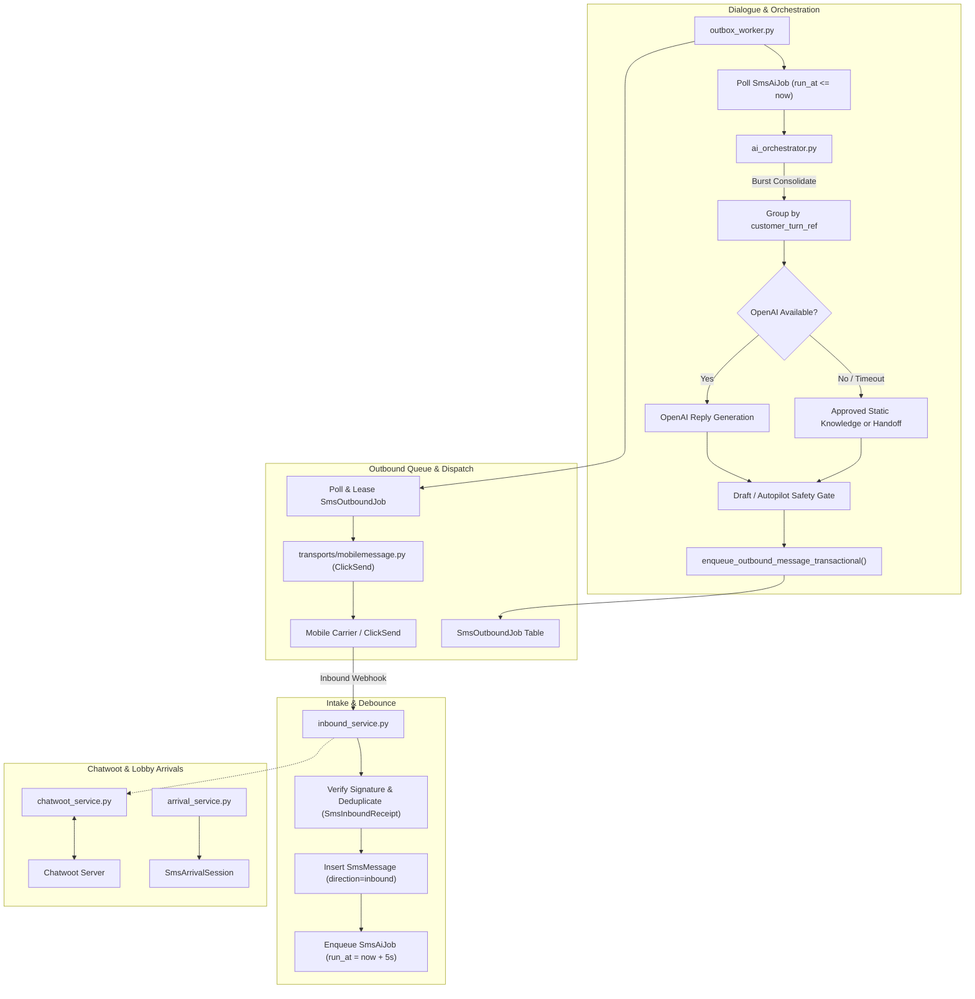

# SMS Assistant & Autonomous Dialogue Engine (`app/services/sms`)

This module houses the SMS/MMS conversational dialogue engine, transactional outbox dispatcher, AI response orchestrator, Chatwoot sync bridge, and Lobby Arrival chime system for **FastAPI Bookings**.

---

## 1. Purpose & Scope

The SMS Assistant module owns:
- Inbound carrier webhook intake with adapter-specific authentication and idempotent receipt logging.
- Customer burst turn consolidation and debounce scheduling.
- Review-first and safety-gated AI reply generation with tenant, provider, and SMS-account prompt/context isolation.
- A fail-closed local fallback that can use approved static knowledge but cannot create, cancel, or reschedule bookings.
- Bi-directional synchronization with Chatwoot omnichannel inboxes.
- Human takeover state management (`auto-reply` vs `taken-over`) plus protected review, escalation, pause, and resolution states.
- Contactless self-arrival check-in chime and repeated lobby notification alerts.

This module deliberately avoids direct network dispatch inside request threads (delegating to transactional outbox workers), cross-tenant/account dialogue context sharing, and direct booking or durable-knowledge mutation from conversation routes. FastAPI Bookings remains the booking authority; the explicitly confirmed conversational-booking workflow is a separate delivery stage.

---

## 2. Architecture & Key Files


```mermaid
flowchart TD
    Carrier["Mobile Carrier / ClickSend"] -->|Inbound Webhook| InboundSvc["inbound_service.py"]

    subgraph Intake["Intake & Debounce"]
        InboundSvc --> VerifySig["Verify Signature & Deduplicate (SmsInboundReceipt)"]
        VerifySig --> MsgTable["Insert SmsMessage (direction=inbound)"]
        MsgTable --> DebounceJob["Enqueue SmsAiJob (run_at = now + 5s)"]
    end

    subgraph AIWorker["Dialogue & Orchestration"]
        OutboxWorker["outbox_worker.py"] --> PollJobs["Poll SmsAiJob (run_at <= now)"]
        PollJobs --> Orchestrator["ai_orchestrator.py"]
        Orchestrator -->|Burst Consolidate| History["Group by customer_turn_ref"]
        History --> Decision{"OpenAI Available?"}
        Decision -->|Yes| OpenAIReply["OpenAI Reply Generation"]
        Decision -->|No / Timeout| LocalRules["Approved Static Knowledge or Handoff"]
        OpenAIReply & LocalRules --> SafetyGate["Draft / Autopilot Safety Gate"]
        SafetyGate --> OutboundMsg["enqueue_outbound_message_transactional()"]
    end

    subgraph OutboxQueue["Outbound Queue & Dispatch"]
        OutboundMsg --> OutboxTable["SmsOutboundJob Table"]
        OutboxWorker --> PollOutbox["Poll & Lease SmsOutboundJob"]
        PollOutbox --> Transports["transports/mobilemessage.py (ClickSend)"]
        Transports --> Carrier
    end

    subgraph Integrations["Chatwoot & Lobby Arrivals"]
        InboundSvc -.-> ChatwootBridge["chatwoot_service.py"]
        ChatwootBridge <--> ChatwootAPI["Chatwoot Server"]
        ArrivalSvc["arrival_service.py"] --> ArrivalTable["SmsArrivalSession"]
    end
```

### Key Files
- [inbound_service.py](file:///F:/Projects/fastapi_bookings/app/services/sms/inbound_service.py): Webhook signature check, idempotency receipts, conversation resolution, and turn debouncing.
- [ai_orchestrator.py](file:///F:/Projects/fastapi_bookings/app/services/sms/ai_orchestrator.py): Burst turn aggregation, account-safe prompt composition, review/autopilot gating, and fail-closed static-knowledge fallback.
- [booking_facade.py](file:///F:/Projects/fastapi_bookings/app/services/sms/booking_facade.py): Existing booking-domain adapter; it is not called by the local fallback in this integration slice.
- [outbound_service.py](file:///F:/Projects/fastapi_bookings/app/services/sms/outbound_service.py): Transactional outbound message creation and outbox queuing.
- [operations_service.py](file:///F:/Projects/fastapi_bookings/app/services/sms/operations_service.py): Tenant/account-scoped staff lifecycle transitions, structural audit events, draft selection, and sanitized timeline assembly.
- [outbox_worker.py](file:///F:/Projects/fastapi_bookings/app/services/sms/outbox_worker.py): Async background polling loop leasing pending outbound jobs and dispatching via transports.
- [chatwoot_service.py](file:///F:/Projects/fastapi_bookings/app/services/sms/chatwoot_service.py): Bi-directional synchronization bridge linking conversations to Chatwoot contacts and messages.
- [arrival_service.py](file:///F:/Projects/fastapi_bookings/app/services/sms/arrival_service.py): Self-service lobby arrival token creation, arrival check-in, and repeating staff chime alerts.
- [transports/mobilemessage.py](file:///F:/Projects/fastapi_bookings/app/services/sms/transports/mobilemessage.py): ClickSend / MobileMessage HTTP carrier implementation.
- [transports/fake.py](file:///F:/Projects/fastapi_bookings/app/services/sms/transports/fake.py): In-memory carrier mock for test isolation.

---

## 3. Setup, Configuration & Dependencies

### Environment Variables
Configured in [app/core/config.py](file:///F:/Projects/fastapi_bookings/app/core/config.py):
```dotenv
# MobileMessage gateway credentials are encrypted per SMS account rather than
# exposed through frontend configuration or documented here as plaintext.

# OpenAI Assistant (loaded by server-side settings; an account-scoped
# encrypted `api_key` may override it for an independently configured line)
OPENAI_API_KEY=sk-proj-...

# Chatwoot Sync
CHATWOOT_BASE_URL=https://app.chatwoot.com
CHATWOOT_API_ACCESS_TOKEN=token_xyz
CHATWOOT_WEBHOOK_SECRET=webhook_secret_123

# Outbox Worker Configuration
OUTBOX_POLL_INTERVAL=5.0
OUTBOX_LEASE_SECONDS=120
OUTBOX_BATCH_SIZE=20
```

### Models & Schema Dependencies
Uses tables defined in [app/models/sms_*.py](file:///F:/Projects/fastapi_bookings/app/models/):
- `sms_accounts`: Gateway credentials, transport type, prompt profiles, AI mode (`off`, `draft`, `autopilot`).
- `sms_conversations`: Thread state, customer phone number, active client link, `unread_count`, `state`.
- `sms_messages`: Individual SMS messages with direction, status, and `customer_turn_ref`.
- `sms_inbound_receipts`: Event key deduplication receipts.
- `sms_outbound_jobs`: Transactional outbox table for reliable dispatch.
- `sms_ai_jobs`: Debounced queue of conversation turns requiring AI completion.
- `sms_arrival_sessions`: Tokenized lobby arrival check-in sessions.

---

## 4. Core Workflows & Contracts

### 4.1 Inbound Intake & 5-Second Debounce
1. Customer sends an SMS. The carrier posts to `/api/sms/webhooks/{transport}/{public_id}`.
2. `inbound_service.process_inbound_webhook` resolves the active `SmsAccount` and validates the signature.
3. A digest of the account identifier and carrier `event_key` is checked against `sms_inbound_receipts`. If already processed, HTTP 200 is returned immediately. A uniqueness collision during receipt insertion is treated as a duplicate only when the winning row matches the exact account and digest.
4. The message is inserted with a `customer_turn_ref`. If the previous message arrived < 10 seconds ago, it inherits the existing turn reference.
5. Any pending `SmsAiJob` for the conversation is cancelled, and a new job is scheduled with `run_at = now() + 5s`. This coalesces ordinary bursts, but durable single-job concurrency still depends on the pending AI lease/uniqueness schema work.

### 4.2 Responder prompt and send safety

1. Prompt assembly begins with immutable safety rules, then selects at most one tenant-global prompt and one provider persona. The bound account's `line_prompt` is the provider-persona fallback, not an additional cross-line layer.
2. Approved shared knowledge must be tenant-wide and account-neutral. Provider knowledge may be provider-wide or bound to the current SMS account; entries for another account are excluded.
3. AI jobs use `PENDING -> PROCESSING -> PROCESSED | FAILED | CANCELLED`. Claiming is conditional, and successful completion commits the generated message, outbox decision, structural event, and job completion together.
4. Static, fact-free model replies may use autopilot only when line and conversation controls permit it. Uncertain or dynamic replies, and replies that rely on legacy knowledge, are review-only. Static autopilot prompts omit legacy knowledge and conversation history; other history is exact-scope, limited to received inbound and sent/delivered outbound messages, latest 40.
5. Unsafe model output is replaced by a generic withheld draft, creates no delivery job, and moves the conversation to `needs-review`. The local fallback never performs booking actions.
6. A hard worker crash can leave a `PROCESSING` job without durable retry metadata because the current model has no AI lease/attempt columns. Durable AI retry must not be assumed until that schema work is approved.

### 4.3 Lobby Arrival Chime & Recurring Alerts
The authoritative arrival contract is documented in Section 8. It accepts a bounded JSON body at `POST /api/admin/sms/arrivals/public/arrive`; capabilities are never accepted in paths or query strings. The service creates structural alert outbox records but does not itself deliver browser push or audio.

### 4.4 Native staff operations workspace

- Conversation actions are tenant scoped and validate that the bound SMS account belongs to the same tenant and provider.
- Historical null-account conversations remain readable when their tenant/provider/inbox resolve to one structurally owned Chatwoot binding, even if delivery is disabled. Sending requires exactly one enabled binding with usable server-side credentials; ambiguous bindings fail closed.
- Lifecycle changes follow an explicit transition matrix. `needs-review` must be cleared, `resolved` must be reopened with a reason, and only `taken-over` can be released to automation. Manual staff replies do not erase review or escalation state.
- Takeover, release, escalation, resolution, blocking, responder controls, internal notes, corrections, draft edits/approval/discard and explicit bulk draft discard append structural `SmsConversationEvent` records.
- Corrections remain audit evidence only and never write reusable knowledge. Dynamic-fact corrections are explicitly labelled.
- Manual sends require a client idempotency key. Blocked contacts and disabled/mismatched lines fail closed.
- Failed outbound jobs may be retried only when their outbound message shape, lifecycle, channel and current conversation controls still permit delivery. AI and fixed-responder jobs additionally require `auto-reply`, conversation AI enablement, and the corresponding enabled line mode. Raw provider error text is not returned by the operations API.
- The worker revalidates message direction/status and automation controls immediately before dispatch. Invalid jobs are terminally quarantined with structural audit evidence; discarded drafts cannot be sent by a stale job.
- Chatwoot webhook identifiers are positive integers, message bodies/source identifiers are bounded, source echoes are matched to the exact inbox and conversation, and phone fallback adopts only one wholly unbound local conversation.
- The staff timeline merges messages, notes and allowlisted audit metadata. It does not return duplicate message bodies stored inside legacy event metadata.
- Dynamic booking, price, date, time, availability, link and payment enquiries never fall back to direct local booking actions. They enter `needs-review` unless a verified authoritative path supplies the answer.
- `POST /answer-info-request` is intentionally rejected with HTTP 409. Corrections are retained as evidence and reusable knowledge enters only through the governed curator proposal/review workflow.
- Production `POST /seed-scenarios` is intentionally rejected with HTTP 409 before any mutation. Synthetic training data belongs in the isolated simulator.

---

## 5. Data Safety, Multi-Tenancy & PII Isolation

- **Tenant Boundary Enforcement**: `SmsAccount`, `SmsConversation`, and `SmsMessage` carry tenant ownership. `SmsOutboundJob` has no direct tenant column, so every operation derives and validates tenant/provider/account ownership transitively through its message and conversation before use.
- **Transactional Consistency**: reviewed enqueue and draft-approval paths commit message state, structural events, and an applicable channel-neutral outbox job together. Final delivery applies an independent fail-closed lifecycle and scope gate.
- **Account-scoped idempotency**: inbound provider identifiers are hashed with their SMS account before receipt storage; outbound UI request identifiers are resolved within tenant, provider, account and conversation scope. Application recovery verifies the exact winning scope after an integrity collision, but concurrent uniqueness still depends on the pending migration.
- **Offline Carrier Guard**: In automated tests, raw socket calls are blocked; all SMS operations use [fake.py](file:///F:/Projects/fastapi_bookings/app/services/sms/transports/fake.py) with synthetic phone numbers (`0411000001` - `0411000005`). Real external SMS messages are never sent during testing.

---

## 6. Known Issues, Edge Cases & Outstanding Work

- **Carrier Inbound Retries**: duplicate delivery is handled by a persisted account-scoped receipt digest. No latency or carrier retry-window guarantee has been established.
- **Chatwoot Outages**: outbound failures remain in the shared outbox retry lifecycle, but exponential backoff and a delivery-time guarantee have not been established.
- **Stack dependency**: the responder safety behavior documented in Section 4.2 requires AI commits through `185d9f4519abef48cd03dd5b594b767fdf943ca7`; the strengthened arrival behavior documented in Section 8 requires arrival commit `43542034f3308b1bd3790f88f580a40d5d56b84c`. They are not contained in this operations branch and must be deliberately stacked and jointly verified.
- **Migration blocker**: the `is_pinned`, `is_blocked`, and `ai_enabled` conversation columns currently lack a committed migration. A migration must be added only after the concurrent migration branch is reconciled to one clean Alembic head. This slice is not deployable before that migration lands.
- **Concurrency hardening pending migration**: PostgreSQL row locks serialize scoped lifecycle, controls, manual-send and draft winner decisions, but database uniqueness is still required for scoped `client_request_id`, one outbound job per message, one Chatwoot binding per tenant/provider/inbox, and one inbound Chatwoot message identity. SQLite ignores `FOR UPDATE`; the synthetic suite verifies state gates but is not a PostgreSQL concurrency proof.
- **Deferred inbox enrichment**: persisted priority, SLA/due-at, escalation owner, booking/arrival summary fields and CSV reporting are not part of this slice and require an approved data/API contract.

---

## 7. Verification & Testing Commands

Run the SMS test suite:
```powershell
# 1. Test SMS foundation and outbox queuing
.\.venv\Scripts\python.exe -m pytest tests/test_sms_foundation.py -v

# 2. Test AI response integration and safety behavior
.\.venv\Scripts\python.exe -m pytest tests/test_sms_openai.py -v

# 2a. Test AI job lifecycle, prompt/history isolation, and unsafe-output handling
.\.venv\Scripts\python.exe -m pytest tests/test_sms_ai_safety.py -v

# 3. Test prompt hierarchy and persona overrides
.\.venv\Scripts\python.exe -m pytest tests/test_sms_prompt_hierarchy.py -v

# 4. Test Chatwoot synchronization and agentbot binding
.\.venv\Scripts\python.exe -m pytest tests/test_sms_chatwoot.py tests/test_chatwoot_agentbot.py -v

# 5. Test Lobby Arrival chime and repeated alerts
.\.venv\Scripts\python.exe -m pytest tests/test_sms_arrivals.py -v

# 6. Test SMS rate limiting
.\.venv\Scripts\python.exe -m pytest tests/test_sms_rate_limiting.py -v

# 7. Test native staff lifecycle, account isolation, idempotency and fail-closed AI
.\.venv\Scripts\python.exe -m pytest tests/test_sms_foundation.py tests/test_sms_integration.py tests/test_sms_openai.py tests/test_sms_prompt_hierarchy.py tests/test_sms_chatwoot.py tests/test_sms_rate_limiting.py -v

# 8. Test operations lifecycle, Chatwoot-only scope, safety and API contracts
.\.venv\Scripts\python.exe -m pytest tests/test_sms_operations_safety.py -v
```

---

## 8. Secure Arrival Sessions (Supersedes Section 4.3)

### Purpose & Scope

The arrival slice issues booking-scoped customer check-in capabilities and records the staff arrival lifecycle. It owns token verification, check-in, acknowledgement, structural arrival events, and durable repeated-alert deduplication. It does not send reminders or SMS messages, create bookings, deliver browser push/audio, or build customer-facing invitation links.

### Architecture & Key Files

- `app/services/sms/arrival_service.py` owns token creation and resolution, transitive scope validation, state transitions, expiry, structural events, and durable alert outbox records.
- `app/api/routers/sms_arrivals.py` exposes the body-token customer check-in contract and authenticated tenant-scoped staff list/acknowledgement contracts.
- `app/schemas/sms_arrival.py` defines request and response schemas that deliberately omit raw tokens and customer PII.
- `tests/test_sms_arrivals.py` exercises the security, lifecycle, isolation, idempotency, and alert-deduplication contracts with labelled synthetic data.

The implementation uses `SmsArrivalSession`, `SmsConversation`, `SmsConversationEvent`, `OutboxEvent`, `Booking`, `Client`, `Provider`, `Service`, and `SmsAccount`. It introduces no new environment variables or external-service dependency.

### Core Workflows & Contracts

1. `create_arrival_session` accepts an eligible confirmed booking and a conversation whose tenant, provider, SMS account, client, service, booking location, and booking all match transitively. It persists only a SHA-256 token digest, records a structural `arrival_invitation_issued` event, and returns the raw capability once. A database uniqueness race becomes a stable domain conflict.
2. A customer submits that capability in a JSON body to `POST /api/admin/sms/arrivals/public/arrive`. The route reads at most 1 KiB and accepts only one string `token` field. Missing, null, wrong-type, nested, oversized, malformed, unknown, and expired capabilities receive the same non-disclosing `404` contract.
3. Resolution queries the digest first. A legacy plaintext lookup occurs only after a digest miss, and a successful legacy match is rewritten to its digest. The first valid check-in uses a locked row plus a conditional update to record `arrived_at` and exactly one structural `customer_arrived` event.
4. Staff list arrivals with `GET /api/admin/sms/arrivals` and acknowledge one with `POST /api/admin/sms/arrivals/{arrival_id}/acknowledge`. Both operations are authenticated and tenant scoped. Acknowledgement uses the same locked/conditional winner pattern. Arrivals whose booking later becomes ineligible remain closable by staff.
5. `process_repeated_arrival_alerts` locks and processes a deterministic batch of at most 100 eligible unacknowledged arrivals. The key `arrival-alert:{session_id}:{sequence}` provides durable deduplication. Acknowledgement and later alert passes terminally quarantine still-unleased `PENDING`/`RETRY` alerts for ineligible sessions.

### Data Safety & Isolation

- New sessions store only token digests; the one-time token is excluded from object representations, and responses, logs, events, and alert payloads never contain raw tokens, phone numbers, customer identities, message bodies, or booking notes.
- Scope is checked through the full booking/conversation/account/client/provider/service/location relationship before a capability is created or exercised. A missing or inconsistent relationship fails closed.
- Expiry is computed from the earlier of the maximum session lifetime and the booking-end grace window. Expired capabilities cannot check in.
- Arrival event metadata and alert payloads are structural and use identifiers and sequence numbers only.
- PostgreSQL row locks serialize arrive, acknowledge, alert eligibility, and cancellation cleanup. Conditional updates ensure only the lifecycle winner writes its timestamp/event. SQLite ignores `FOR UPDATE`; synthetic tests are not a substitute for a PostgreSQL concurrency test.
- Pending/retry alert suppression shares the lifecycle transaction. An alert already leased as `PROCESSING` cannot be recalled here; the future delivery consumer must re-check eligibility immediately before visible delivery.

### Known Issues, Edge Cases & Outstanding Work

- No production reminder or invitation-link producer currently consumes the one-time token returned by `create_arrival_session`. A future producer must commit the session with its reminder state atomically and use a customer page that submits the token in the request body, not a server URL or query string.
- The customer endpoint is currently under the shared `/api/admin` router mount even though it authenticates by scoped capability rather than a staff session. Its OpenAPI security inheritance and eventual public remount require an approved shared-router contract change.
- Legacy raw-token lookup remains only for bounded migration compatibility. Successful use rehashes the row, but a deliberate removal plan remains required.
- Expiry and ownership are derived from existing relationships because no arrival-specific migration was approved. Database-enforced event immutability/uniqueness and first-class arrival ownership/expiry columns remain follow-up work.
- There is deliberately no early-arrival business window. A confirmed, unexpired invitation can check in before its computed expiry until product owners approve another rule.
- The admin list is privacy-minimized but fixed at 50 newest records; alert processing is bounded to 100 deterministic candidates per pass.
- Capability attempts have bounded request bodies but no dedicated distributed rate limit. Alert delivery leases and final pre-delivery eligibility checks remain consumer responsibilities.
- Browser push/audio delivery, reminder scheduling, and the customer-facing arrival page are outside this slice. The durable outbox records are only the safe server-side alert boundary.
- Existing frontend arrival mocks/types may still expose legacy token or PII fields and require a separate approved frontend cleanup.

### Verification & Testing Commands

```powershell
$env:OTEL_SDK_DISABLED='true'
.\.venv\Scripts\python.exe -m py_compile app/services/sms/arrival_service.py app/api/routers/sms_arrivals.py app/schemas/sms_arrival.py tests/test_sms_arrivals.py
.\.venv\Scripts\python.exe -m pytest tests/test_sms_arrivals.py tests/test_notification_configs.py -q
```

For an API contract smoke test, inspect the generated OpenAPI document and verify that the body-token `POST /api/admin/sms/arrivals/public/arrive`, authenticated list `GET /api/admin/sms/arrivals`, and acknowledgement `POST /api/admin/sms/arrivals/{arrival_id}/acknowledge` methods exist, while the legacy URL-token route does not.
