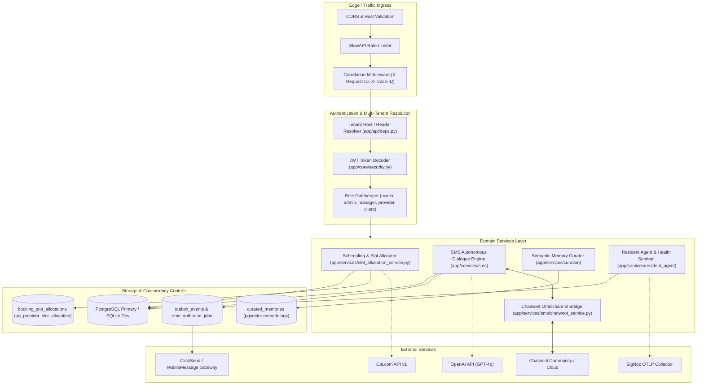
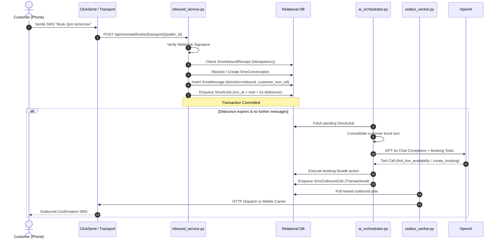
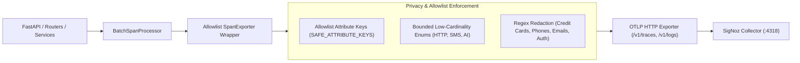
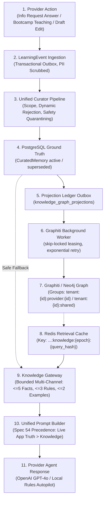

# FastAPI Bookings — Deep System Architecture

This document specifies the technical architecture, domain models, concurrency guarantees, integration boundaries, and security invariants governing **FastAPI Bookings**.

---

## 1. High-Level Architectural Topology

FastAPI Bookings is structured around an event-driven, multi-tenant backend built on FastAPI and SQLAlchemy, integrating transactional outbox workers, autonomous dialogue agents, and real-time frontend consumers.



---

## 2. Multi-Tenancy Architecture

FastAPI Bookings employs a shared-database, tenant-column partitioned architecture governed by [app/models/tenant.py](file:///F:/Projects/fastapi_bookings/app/models/tenant.py) and enforced in [app/api/deps.py](file:///F:/Projects/fastapi_bookings/app/api/deps.py).

### 2.1 Subdomain Resolution Strategy
Every inbound HTTP request undergoes tenant scoping before routing:
1. **Hostname Subdomain Inspection**:
   - For local development: `[subdomain].localhost` is extracted directly (e.g. `simplydemo.localhost:8000`).
   - For deployed environments: The first label of a qualified 3+ label hostname is extracted (e.g. `simplydemo.bookopenapi.com`). Platform domains (such as `.run.app` or bare `localhost`) are excluded.
2. **Proxy Fallback**:
   - For internal tests, API tests, and developer scripts where custom hostnames are impractical, the dependency inspects the `X-Tenant` header or the `tenant` query parameter.
3. **Collision Rejection**:
   - If both a host subdomain and an explicit `X-Tenant` header are provided, they must match exactly; otherwise, an `HTTP 400 Bad Request` is raised (`Tenant host and supplied tenant context do not match.`).
4. **Tenant Scoping on Queries**:
   - All domain entities (`User`, `Client`, `Provider`, `Service`, `Booking`, `SmsAccount`, `SmsConversation`) require a foreign key to `tenants.id`.
   - All router endpoints inject `tenant: Tenant = Depends(get_current_tenant)` and append `.filter(Model.tenant_id == tenant.id)` to every SQL query.

---

## 3. Database Layer & Concurrency Model

### 3.1 ORM & Migration Strategy
- **Engine**: SQLAlchemy 2.0 ORM with asynchronous capabilities (`async_database_url` via `asyncpg` / `aiosqlite`).
- **Migrations**: Alembic manages 100% of database schema changes (`alembic/versions/`). Runtime table creation (`create_all`) is strictly disabled in production.
- **Dialect Handling**: Works seamlessly with SQLite 3.38+ for developer testing and PostgreSQL 15+ for production Cloud Run deployments.

### 3.2 Integer Bounds & Identifier Safety
To prevent integer overflow vulnerabilities across 32-bit and 64-bit boundaries, database IDs are constrained in [app/api/deps.py](file:///F:/Projects/fastapi_bookings/app/api/deps.py):
- `MAX_DATABASE_ID = 9_223_372_036_854_775_807` (signed 64-bit BIGINT max).
- Path parameters utilize the `DatabaseId` annotation:
  ```python
  DatabaseId = Annotated[int, Path(ge=1, le=MAX_DATABASE_ID, description="Unique positive database identifier")]
  ```
- Any identifier out of bounds immediately fails validation with HTTP 422.

### 3.3 First-Submit-Wins Concurrency & Slot Allocation
Double-booking prevention is enforced at the database level rather than using brittle in-memory locks:
1. **Discrete 15-Minute Slot Slices**:
   - Appointments are decomposed into 15-minute discrete time buckets spanning the service duration plus buffers (e.g., a 60-minute appointment generates four 15-minute slices: `09:00`, `09:15`, `09:30`, `09:45`).
2. **Atomic Unique Constraints**:
   - Model [BookingSlotAllocation](file:///F:/Projects/fastapi_bookings/app/models/booking_slot_allocation.py) enforces a composite unique constraint:
     ```sql
     CONSTRAINT uq_provider_slot_allocation UNIQUE (provider_id, slot_start)
     ```
3. **Collision Detection (`is_slot_allocation_conflict`)**:
   - When concurrent requests attempt to book overlapping intervals for the same provider, the second transaction violates `uq_provider_slot_allocation`.
   - [app/services/slot_allocation_service.py](file:///F:/Projects/fastapi_bookings/app/services/slot_allocation_service.py) intercepts the `IntegrityError` (matching PostgreSQL error code `23505` and SQLite failure messages) and cleanly translates it to an `HTTP 409 Conflict` (`The selected time slot was just booked by another client.`).

---

## 4. SMS Assistant & Autonomous Dialogue Engine

The SMS engine ([app/services/sms/](file:///F:/Projects/fastapi_bookings/app/services/sms/)) delivers a conversational booking assistant over SMS/MMS.



### 4.1 Inbound Receipts & Burst Debouncing
- **Deduplication**: Inbound webhooks insert an `SmsInboundReceipt` keyed by `(sms_account_id, event_key)`. Duplicate vendor deliveries are acknowledged and dropped.
- **Turn Ref Debounce**: Inbound messages from the same customer within 10 seconds share the same `customer_turn_ref`.
- **Pending Job Cancellation**: Each new message in a burst cancels prior un-executed `SmsAiJob` rows and sets a 5-second debounce window (`run_at = now() + 5s`).

### 4.2 OpenAI Function Calling & Local Rule Engine Fallback
- When `OPENAI_API_KEY` is present, [app/services/sms/ai_orchestrator.py](file:///F:/Projects/fastapi_bookings/app/services/sms/ai_orchestrator.py) uses OpenAI Tool Calling with:
  - `list_provider_services`
  - `find_live_availability`
  - `create_booking`
  - `cancel_booking`
- If OpenAI is unavailable, timed out, or unconfigured, the system automatically falls back to `run_local_rules_engine()`, ensuring zero customer abandonment.

### 4.3 Human Takeover & State Machine
- Conversations feature an explicit state toggle: `auto-reply` vs `human-takeover`.
- When an operator replies in Chatwoot or the admin dashboard, the conversation switches to `human-takeover`, disabling autonomous AI responses until explicitly restored.

---

## 5. Chatwoot Omnichannel Synchronization

FastAPI Bookings maintains a bi-directional synchronization bridge with Chatwoot ([app/services/sms/chatwoot_service.py](file:///F:/Projects/fastapi_bookings/app/services/sms/chatwoot_service.py)):
- **SmsChatwootBinding**: Links an internal `SmsConversation` to a Chatwoot `conversation_id`, `contact_id`, and `inbox_id`.
- **Inbound Mirroring**: When an SMS is received, it is immediately posted to Chatwoot as an incoming message via Chatwoot's API.
- **Outbound Agent Sync**: When a human agent types a reply in Chatwoot, Chatwoot triggers a webhook (`app/api/routers/chatwoot_agentbot.py`), which converts the staff message into a transactional `SmsOutboundJob`.

---

## 6. Cal.com Headless Integration Adapter

The system integrates with Cal.com via [app/services/scheduling/calcom_adapter.py](file:///F:/Projects/fastapi_bookings/app/services/scheduling/calcom_adapter.py):
- Acts as an asynchronous headless client using `httpx.AsyncClient`.
- Maps external Cal.com event types to internal provider services.
- Queries external availability via `/slots` with configurable network timeouts and error fallbacks.
- Provides fallback to the local scheduling engine when Cal.com is unreachable.

---

## 7. OpenTelemetry Pipeline & Privacy Controls

Telemetry architecture is defined in [app/core/telemetry.py](file:///F:/Projects/fastapi_bookings/app/core/telemetry.py):



### 7.1 Strict Attribute Allowlisting
Raw spans are scrubbed by `_FilteringSpanExporter`:
- Only keys in `SAFE_ATTRIBUTE_KEYS` (e.g. `http.method`, `http.route`, `http.status_code`, `service.name`, `db.system`) are forwarded.
- Query parameters, phone numbers, customer names, SMS message text, and tokens are completely stripped.

### 7.2 Log Privacy Redaction
General logs exported to SigNoz pass through `PrivacyRedactingFilter`:
- Credit card numbers (Visa, Mastercard, Amex via Luhn regex).
- Phone numbers (Australian E.164, mobile, landline formats).
- Email addresses.
- Bearer tokens, passwords, and API keys.

---

## 8. Role-Based Access Control (RBAC) & Security Boundaries

Authentication uses stateless JWT tokens passed via the `X-Token` header. Roles are enforced hierarchically in [app/api/deps.py](file:///F:/Projects/fastapi_bookings/app/api/deps.py):

| Role | Access Scope | Dep Check |
| :--- | :--- | :--- |
| **Owner** | Full administrative and tenant management access | `get_current_owner` |
| **Admin** | Equivalent to Owner for backwards compatibility | `get_current_admin` |
| **Manager** | Operational management, scheduling, reviews | `get_current_manager_or_owner` |
| **Provider** | Calendar, own bookings, own profile, client notes | `get_current_provider_user` |
| **Staff** | Any authenticated internal personnel (Owner, Manager, Provider) | `get_current_staff` |
| **Client** | Client portal, view/reschedule own appointments | `get_current_client` |
| **Public** | Booking widget, availability lookup, arrival chime | `get_public_tenant` |

---

## 9. Verification & Architecture Testing

Run the full architectural regression and boundary test suite:
```powershell
# 1. Multi-tenancy isolation tests
pytest tests/test_multi_tenancy.py -v

# 2. Concurrency and slot collision prevention tests
pytest tests/test_concurrency.py -v

# 3. Telemetry pipeline and redaction validation
pytest tests/test_telemetry_pipeline.py tests/test_telemetry_redaction.py -v

# 4. SMS Engine and OpenAI tool contracts
pytest tests/test_sms_openai.py tests/test_sms_foundation.py -v
```

---

## 10. Knowledge Architecture & Graphiti Autonomous Learning (Specs 26, 27, 46, 54, 65, 83–87, 108, 109)

The **Knowledge Subsystem** provides a governed, multi-tenant epistemic architecture integrating Neo4j/Graphiti with PostgreSQL authoritative ground truth and Redis retrieval caching.



### 10.1 Key End-to-End Architectural Guarantees (Spec 109)
1. **Explicit Teaching**: When a provider answers an info request or teaches an agent in Bootcamp, the knowledge is curated directly into `CuratedMemory` without requiring redundant manual review.
2. **PostgreSQL Authority (Spec 83)**: PostgreSQL `CuratedMemory` remains the immutable authority of ground truth; the Neo4j graph is an epistemic projection ledger.
3. **Partitioned Isolation**: Strict multi-tenant and provider boundary isolation enforced across all graph groups (`tenant:{id}:provider:{id}` vs `tenant:{id}:shared`), Redis keys, and PostgreSQL queries.
4. **Dynamic Data Rejection (Spec 19)**: Ephemeral booking data, real-time availability slots, quotes, and payment links are rejected from long-term memory (`REJECT_DYNAMIC`).
5. **Operational Truth Wins (Spec 53, 54)**: UnifiedPromptBuilder places live application/tool state (services, business hours, calendar availability) ahead of long-term curated knowledge in instruction precedence.
6. **Bounded Scale (Spec 48)**: Multi-channel retrieval guarantees bounded prompt size regardless of catalog volume: $\le 5$ durable facts, $\le 3$ behavioural rules, $\le 2$ style examples.
7. **Loss Tolerance (Spec 51)**: Offline Redis or Neo4j outages degrade gracefully to direct PostgreSQL queries with zero customer disruption.
