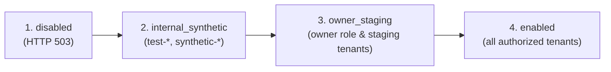

# Business Assistant — Operational Runbook & Telemetry Monitoring

> Authoritative reference for operating, monitoring, controlling rollout, and handling incidents for the native Business Assistant in FastAPI Bookings.

---

## 1. Staged Rollout Lifecycle & Flag Transitions

The native Business Assistant enforces a four-stage rollout lifecycle to guarantee zero production surprises, verified multi-tenant isolation, and controlled blast radius.

### Rollout Stages



| Stage | Identifier | Behavior & Scope | Error Fallback |
|---|---|---|---|
| **1. Disabled** | `disabled` | Feature is globally inactive across all tenants and users. Kill-switch state. | HTTP 503 `BUSINESS_ASSISTANT_DISABLED` |
| **2. Internal Synthetic** | `internal_synthetic` | Accessible strictly to synthetic/test tenants (`test-*`, `synthetic-*`, `internal-*`, or IDs in `BUSINESS_ASSISTANT_SYNTHETIC_TENANT_IDS`). | HTTP 403 `SYNTHETIC_TENANTS_ONLY` |
| **3. Owner-Only Staging** | `owner_staging` | Accessible exclusively by tenant owners (`role == "owner"`) in staging or allowlisted tenants (`BUSINESS_ASSISTANT_ALLOWLISTED_TENANT_IDS` or `APP_ENV in ("staging", "development", "test")`). | HTTP 403 `STAGING_TENANTS_ONLY` or `OWNER_ROLE_REQUIRED` |
| **4. Enabled** | `enabled` | Fully active for all authorized tenant users (owners, managers, providers) based on respective endpoint RBAC permissions. | Normal operation |

### Configuration Knobs

Configured in `app/core/config.py` via environment variables:

```bash
# Set effective lifecycle stage (disabled, internal_synthetic, owner_staging, enabled)
BUSINESS_ASSISTANT_ROLLOUT_STAGE="owner_staging"

# Allowlist specific tenant IDs for synthetic test evaluation
BUSINESS_ASSISTANT_SYNTHETIC_TENANT_IDS="[1, 2, 42]"

# Allowlist specific tenant IDs for staging / preview evaluation
BUSINESS_ASSISTANT_ALLOWLISTED_TENANT_IDS="[10, 15, 20]"
```

### Stage Promotion Checklist

1. **Promote to `internal_synthetic`**:
   - Verify automated regression suite: `pytest tests/test_business_assistant_hardening_and_rollout.py`.
   - Run synthetic onboarding, rule drafting, ticket generation, and website proposal flows.
   - Confirm zero telemetry errors in `business_assistant_tool_runs`.
2. **Promote to `owner_staging`**:
   - Verify non-owner staff users receive HTTP 403 `OWNER_ROLE_REQUIRED`.
   - Verify staging tenant owners can draft, preview, and approve operations.
   - Confirm cryptographic confirmation token validation for all elevated mutations.
3. **Promote to `enabled`**:
   - Executive sign-off on cost budget and error thresholds.
   - Ensure OTel exporter is connected to SigNoz.

---

## 2. Telemetry, Alerts & Audit Events

The Business Assistant records append-only structured audit records to dedicated PostgreSQL tables without logging credentials, raw LLM prompts, or sensitive customer message bodies.

### Database Audit Entities

1. **`business_assistant_tool_runs`**:
   - Records every server-authorised tool invocation.
   - Schema:
     - `tenant_id` (int, indexed)
     - `user_id` (int, indexed)
     - `conversation_id` (int, indexed)
     - `message_id` (int, nullable)
     - `tool_name` (string, max 96 chars)
     - `status` (`completed`, `rejected`, `failed`, `unavailable`)
     - `duration_ms` (integer millisecond latency)
     - `safe_metadata` (sanitized JSON dictionary; sensitive keys stripped)
     - `created_at` (UTC timestamp)

2. **`support_ticket_events`**:
   - Records lifecycle transitions for support and engineering tickets.
   - Schema:
     - `ticket_id` (int, indexed)
     - `event_type` (`created`, `approved`, `claimed`, `dispatched`, `progress_updated`, `resolved`, `rejected`)
     - `actor_type` (`user`, `owner`, `system`, `coding_worker`)
     - `summary` (sanitized, user-safe event summary)
     - `created_at` (UTC timestamp)

### Key Performance Indicators & Recommended Alerts

| Metric / Event | Target Threshold | Alert Condition | Severity | Action |
|---|---|---|---|---|
| **Tool Failure Rate** | `< 2%` of tool runs | `status in ('failed', 'unavailable') > 5% over 5m` | P2 - High | Inspect provider logs / adapters |
| **Tool Rejection Rate** | `< 1%` of tool runs | `status == 'rejected' > 10% over 5m` | P3 - Warning | Check tool confusion / schema changes |
| **Turn Latency** | `p95 < 4.0s` | `duration_ms > 15.0s over 5m` | P2 - High | Check OpenAI API status & timeout limits |
| **Confirmation Mismatches** | `0` | Any `ConfirmationSignatureError` or `ConfirmationScopeMismatchError` | P1 - Urgent | Investigate cross-tenant or replay attempt |
| **Rollout Denials** | Operational tracking | Unexpected spikes in `BUSINESS_ASSISTANT_DISABLED` | P3 - Info | Review tenant rollout stage configuration |

---

## 3. Fallback & Kill-Switch Procedures

### Instant Emergency Kill-Switch

If an unexpected vulnerability, upstream LLM outage, or uncontained error occurs in production, activate the immediate kill-switch:

```bash
# In production environment / Cloud Run configuration:
BUSINESS_ASSISTANT_ROLLOUT_STAGE="disabled"
```

**Effects**:
- All subsequent incoming requests to `/api/admin/business-assistant/*` immediately degrade with HTTP 503 `BUSINESS_ASSISTANT_DISABLED`.
- Existing database records, conversations, and tickets remain intact and protected.
- Frontend displays user-friendly "Business Assistant is temporarily undergoing maintenance" banner.
- No service crash, process termination, or side-effects occur.

### Reverting Unwanted Mutations

1. **Website Rollback**:
   - Use the built-in optimistic version rollback:
     `POST /api/admin/business-assistant/website/proposals/rollback`
   - Specify `target_version` to immediately restore previous published website configurations.
2. **Business Rule Deactivation**:
   - Business rules remain in `draft` until confirmed. Active rules can be superseded by submitting a replacement rule or disabling the rule flag in `app/services/business_assistant/repository.py`.
3. **Support Ticket Cancellation**:
   - Elevated tickets in `pending_approval` can be rejected or transitioned to `rejected` status by the tenant owner.

---

## 4. Cost, Token & Execution Bounds

The Business Assistant incorporates bounded constraints to prevent token runaway, loop execution, or excessive API cost:

| Parameter | Default | Config Setting | Enforcement Location |
|---|---|---|---|
| **Max History Messages** | `20` messages | `BUSINESS_ASSISTANT_MAX_HISTORY_MESSAGES` | `BusinessAssistantTextRuntime.generate_reply` |
| **Max Output Tokens** | `600` tokens | `BUSINESS_ASSISTANT_MAX_OUTPUT_TOKENS` | Provider chat completion `max_completion_tokens` |
| **Turn Timeout** | `30.0` seconds | `BUSINESS_ASSISTANT_TURN_TIMEOUT_SECONDS` | Provider client HTTP request timeout |
| **Max Tool Rounds** | `3` rounds | `BUSINESS_ASSISTANT_MAX_TOOL_ROUNDS` | Strict loop counter in `generate_reply` |
| **Realtime SDP Max Bytes** | `100,000` bytes | `BUSINESS_ASSISTANT_REALTIME_SDP_MAX_BYTES` | `validate_sdp` and router origin gate |
| **Idempotency Window** | `24` hours | Database unique constraints | `creation_request_key` on conversations, messages, proposals |

---

## 5. Security & Privacy Controls

1. **No Credentials in Storage**:
   - `OPENAI_API_KEY`, `.env` tokens, JWT secrets, database connection URLs, and ClickSend credentials are scrubbed by `scrub_sensitive_secrets` before output persistence.
2. **Strict Cryptographic Confirmation**:
   - All elevated mutations require HMAC-SHA256 confirmation tokens containing action type, tenant ID, user ID, target key, version number, and payload hash.
3. **Multi-Tenant Scoping**:
   - All queries filter by `tenant_id == self._tenant_id` and `user_id == self._user_id`. Cross-tenant lookups raise `LookupError` which surfaces as HTTP 404 to untrusted callers.
4. **Zero Legacy Dependencies**:
   - The native Business Assistant runs 100% inside `fastapi_bookings` with zero dependencies on legacy external repositories.
