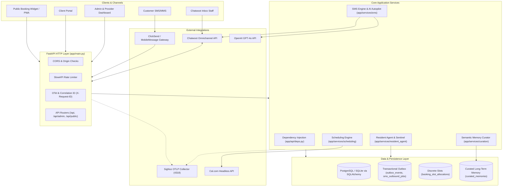

# FastAPI Bookings — Central Documentation Index

Welcome to the central documentation index for **FastAPI Bookings**, a high-concurrency, multi-tenant appointment scheduling, provider operations, and autonomous SMS/AI dialogue management system built with Python, FastAPI, SQLAlchemy, and Vite/React.

---

## 1. Purpose & Scope

This documentation suite serves as the single source of truth for the system architecture, component contracts, operational guides, and testing protocols. 

FastAPI Bookings owns:
- Multi-tenant appointment booking, scheduling rules, provider shifts, and resource constraints.
- Real-time availability calculation, discrete slot allocations, and double-booking prevention.
- Autonomous SMS/MMS dialogue engine with OpenAI function calling, local rules fallback, and human takeover.
- Bi-directional Chatwoot synchronization for customer messaging and omnichannel inbox management.
- Headless Cal.com adapter for external scheduling federation.
- Resident Autonomous Agent (Codex Sentinel) for static code audits, telemetry monitoring, and fuzzing.
- Long-term semantic memory curation with automated PII scrubbing (Mem0 pattern).
- Privacy-safe OpenTelemetry instrumentation exporting traces, metrics, and structured logs to SigNoz.

---

## 2. System Map & Core Architecture



---

## 3. Documentation Suite Index

| Document | Description | Key Topics |
| :--- | :--- | :--- |
| [ARCHITECTURE.md](file:///F:/Projects/fastapi_bookings/docs/ARCHITECTURE.md) | Comprehensive System Architecture | Multi-tenancy, DB bounds, Concurrency, SMS, Chatwoot, Cal.com, OTel |
| [MODULE_INDEX.md](file:///F:/Projects/fastapi_bookings/docs/MODULE_INDEX.md) | Application Module Catalog | Complete table of all directories, paths, domains, and health status |
| [app/api/routers/README.md](file:///F:/Projects/fastapi_bookings/app/api/routers/README.md) | HTTP REST API Router Layer | Authentication, dependencies, rate limits, routers registry, error handling |
| [app/services/sms/README.md](file:///F:/Projects/fastapi_bookings/app/services/sms/README.md) | Autonomous SMS Dialogue Engine | Inbound intake, Outbox worker, OpenAI tool calls, Chatwoot sync, Arrivals chime |
| [app/services/scheduling/README.md](file:///F:/Projects/fastapi_bookings/app/services/scheduling/README.md) | Scheduling Engine & Cal.com | 15-minute slot allocations, collision prevention, availability calculation |
| [app/services/resident_agent/README.md](file:///F:/Projects/fastapi_bookings/app/services/resident_agent/README.md) | Codex Resident Autonomous Agent | Static audits, telemetry sentinels, race condition fuzzer, self-healing runtime |
| [app/services/curation/README.md](file:///F:/Projects/fastapi_bookings/app/services/curation/README.md) | Semantic Memory Curator | Mem0 pattern, PII scrubbing (phone/email/address/card), pgvector storage |
| [app/models/README.md](file:///F:/Projects/fastapi_bookings/app/models/README.md) | SQLAlchemy ORM Catalog | Schema definitions, entity relationships, cascade behavior, tenant isolation |
| [app/core/README.md](file:///F:/Projects/fastapi_bookings/app/core/README.md) | Configuration & Core Primitives | `Settings`, JWT tokens, `BookingStatus` state machine, OTel telemetry |
| [scripts/README.md](file:///F:/Projects/fastapi_bookings/scripts/README.md) | Operational Automation Scripts | Numbered seeder, Chatwoot sync, PWA icon builder, release gate verification, secrets audit |
| [docs/operations/knowledge-production-runbook.md](file:///F:/Projects/fastapi_bookings/docs/operations/knowledge-production-runbook.md) | Production Operations Runbook | Backup/restore drills, worker recovery, dead-letter replay, zero-DDL rollback, canary rollout |
| [tests/README.md](file:///F:/Projects/fastapi_bookings/tests/README.md) | Testing Architecture & Protocols | Pytest test suites, socket connection guards, in-memory isolation |

---

## 4. Setup, Configuration & Quickstart

### Prerequisites
- Python 3.11+
- Node.js 18+ and npm
- PostgreSQL 15+ (Production) or SQLite 3.38+ (Development/Testing)
- Optional: Local SigNoz OTLP Collector (`http://localhost:4318`), Chatwoot instance

### Environment Setup
Copy [.env.example](file:///F:/Projects/fastapi_bookings/.env.example) to `.env`:
```bash
cp .env.example .env
```

Key environment configuration variables:
```dotenv
APP_ENV=development
PROJECT_NAME="FastAPI Bookings"
DATABASE_URL=sqlite:///./fastapi_bookings.db
SECRET_KEY=dev-insecure-secret-key-replace-in-prod
PUBLIC_API_KEY=local-public-key-change-me
FRONTEND_ORIGINS=http://localhost:7070,http://localhost:5173
OPENAI_API_KEY=
CHATWOOT_BASE_URL=https://app.chatwoot.com
CHATWOOT_API_ACCESS_TOKEN=
OTEL_EXPORTER_OTLP_ENDPOINT=http://localhost:4318
OTEL_SDK_DISABLED=true
```

### Backend Installation & Startup
```powershell
# Create virtual environment and activate
python -m venv .venv
.venv\Scripts\Activate.ps1

# Install dependencies
pip install -r requirements.txt

# Run migrations
alembic upgrade head

# Seed synthetic traceable development data
python scripts/seed_clean_numbered_data.py

# Start FastAPI backend
uvicorn app.main:app --host 0.0.0.0 --port 8000 --reload
```

### Frontend Dev Server
```powershell
cd frontend
npm install
npm run dev -- --port 7070
```

---

## 5. Developer Workflows & Quality Gates

All contributions and automated agent tasks must adhere to [AGENTS.md](file:///F:/Projects/fastapi_bookings/AGENTS.md). 

### 8 Release Verification Gates
Before any deployment or major release, run the consolidated gate checker:
```powershell
python scripts/verify_all_release_gates.py
```

The 8 release gates run in sequence:
1. **Gate 1**: Python Syntax & Bytecode Compilation (`python -m compileall app/`)
2. **Gate 2**: Unit & Integration Test Suite (`pytest tests/ --ignore=tests/test_fuzzer.py -v`)
3. **Gate 3**: First-Submit-Wins Concurrency Suite (`pytest tests/test_concurrency.py -v`)
4. **Gate 4**: Schemathesis API Fuzzer (`pytest tests/test_fuzzer.py -v`)
5. **Gate 5**: Frontend Production Build (`npm run build` in `frontend/`)
6. **Gate 6**: Frontend TypeScript Strict Typing (`npx tsc --noEmit` in `frontend/`)
7. **Gate 7**: Frontend Code Style & Linting (`npm run lint` in `frontend/`)
8. **Gate 8**: Live Smoke Sweep (`python run_live_smoke_sweep.py` or `python run_integration_tests.py`)

---

## 6. Data Safety, Multi-Tenancy & PII Isolation

FastAPI Bookings enforces strict data boundary and customer protection rules:
1. **Tenant Isolation**: Every database query in staff and public endpoints is scoped by `tenant_id`. Subdomains are parsed securely via `app.api.deps.get_current_tenant`.
2. **Deterministic PII Scrubbing**: All transcripts flowing to long-term memory or external LLMs pass through [pii_scrubber.py](file:///F:/Projects/fastapi_bookings/app/services/curation/pii_scrubber.py), replacing credit cards, phone numbers, emails, and street addresses with `<REDACTED_*>` markers.
3. **Telemetry Redaction**: OpenTelemetry traces and SigNoz logs enforce strict attribute key allowlists (`SAFE_ATTRIBUTE_KEYS` in [telemetry.py](file:///F:/Projects/fastapi_bookings/app/core/telemetry.py)). Customer names, phone numbers, booking notes, and authorization tokens are strictly filtered at the exporter wrapper level.
4. **Offline Test Isolation**: Tests execute against an in-memory SQLite database wrapped in rollbacks. Raw network sockets are intercepted and blocked by [conftest.py](file:///F:/Projects/fastapi_bookings/tests/conftest.py), preventing test execution from leaking live HTTP/SMS calls.

---

## 7. Known Issues & Operational Reference

- **SQLite vs PostgreSQL Concurrency**: Under SQLite in local dev, high-concurrency writes may trigger `database is locked` if connection pooling is misconfigured. In staging and production, PostgreSQL with `READ COMMITTED` and unique slot constraints (`uq_provider_slot_allocation`) is mandatory.
- **Background Worker Process**: In production, the outbox worker (`app.services.outbox_worker`) runs as a dedicated async loop process to guarantee sub-second delivery for transactional SMS jobs.
