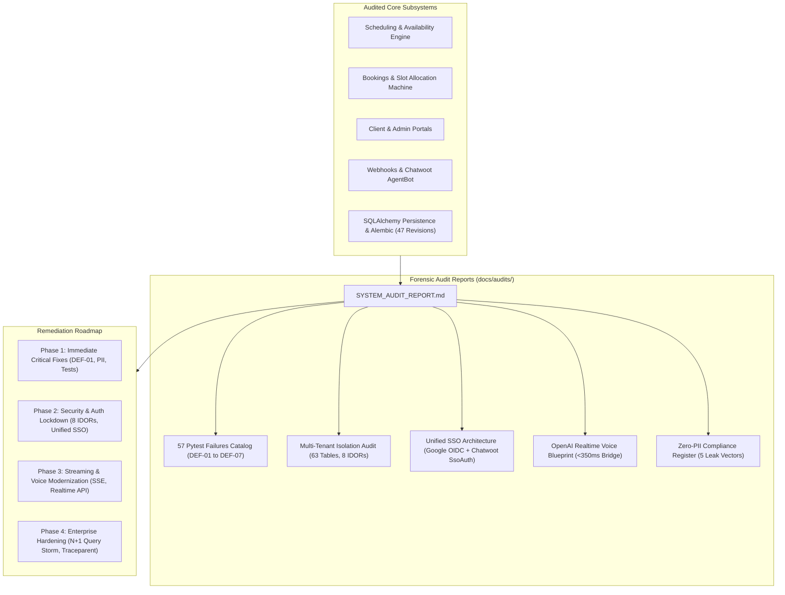

# Platform Audits, Security Reviews & Diagnostic Ledgers

Welcome to the **Platform Audits & Diagnostic Ledgers** module within **FastAPI Bookings**. This package serves as the authoritative repository of technical audits, vulnerability disclosures, failure catalogs, and architectural modernisation specifications for the application and its Chatwoot Enterprise integration.

---

## 1. Purpose & Scope

The Audits module provides forensic investigations, architectural gap assessments, and verified remediation blueprints across all core systems of the FastAPI Bookings platform.

### What This Module Owns:
- **Master Diagnostic Reports**: Comprehensive cross-subsystem evaluations analyzing scheduling, availability, discrete slot holds, bookings, customer portals, webhooks, and persistence layers.
- **Automated Test Failure Catalogs**: Forensic root-cause analysis of test suite regressions across pytest runs, categorizing systemic failure clusters (DEF-01 through DEF-07).
- **Multi-Tenant Isolation & IDOR Audits**: Complete schema inspection of 63 registered database tables, parent-FK traversals of child tables lacking `tenant_id`, and exact code-level analysis of Insecure Direct Object Reference (IDOR) vulnerabilities (IDOR-01 through IDOR-08).
- **Unified SSO Technical Specifications**: Architecture specifications detailing FastAPI Bookings as the central OAuth2/OIDC (Google Sign-In) and email/password identity broker with non-invasive session propagation into Chatwoot via Rails `SsoAuthenticatable` and Platform API.
- **Realtime Voice & Streaming Modernization Blueprints**: Specifications for migrating Business Assistant text from synchronous blocking HTTP to Server-Sent Events (SSE), and transitioning voice pipelines to the OpenAI Realtime API (GPT Live) with server-side WebSocket/WebRTC bridging, native G.711 μ-law 8kHz telephony support, and server VAD barge-in interruption.
- **Zero-PII Compliance & Observability Audits**: Systematic identification of cleartext PII vectors in application logs, database exception traces, SigNoz telemetry exporters, and correlation ID fallbacks.

### What This Module Deliberately Avoids:
- Executing destructive database migrations or dropping tenant tables.
- Hardcoding fake test mocks or circumventing real business validation rules.
- Storing unencrypted production credentials, customer PII, or carrier tokens.

---

## 2. Architecture & Key Files

```
docs/audits/
├── README.md               # Living documentation and operational contract (Rule 10)
└── SYSTEM_AUDIT_REPORT.md  # Comprehensive Master Diagnostic Report & Remediation Blueprint
```



### Primary Files & Artifacts:
- [SYSTEM_AUDIT_REPORT.md](file:///F:/Projects/fastapi_bookings/docs/audits/SYSTEM_AUDIT_REPORT.md): The consolidated diagnostic report containing verbatim code snippets, test catalogs, sequence diagrams, latency budgets, and technical remediation specifications.
- [README.md](file:///F:/Projects/fastapi_bookings/docs/audits/README.md): This living module documentation, fulfilling AGENTS.md Rule 10 standards and serving as the operational orientation guide for future engineering teams.

---

## 3. Setup, Configuration & Dependencies

### Prerequisites
- Python 3.11+ in a configured virtual environment (`.venv`).
- PostgreSQL 15+ (Production) or SQLite 3.38+ (Testing).
- Docker and Docker Compose (running Chatwoot Enterprise at `E:\Projects\chatwoot`).
- Local SigNoz OTLP Collector listening on port 4318 (optional for telemetry exports).

### Environment Configuration Flags
The audit identified several environment settings in `app/core/config.py` that govern subsystem behavior and test pass rates:

```dotenv
# Knowledge Graph Shadow Gates (Impacts 34 rollout tests if False)
GRAPH_SHADOW_WRITE=true
GRAPH_KNOWLEDGE_ENABLED=true

# Chatwoot Webhook Inbound Authentication
CHATWOOT_WEBHOOK_SECRET=

# Telemetry and Observability Configuration
OTEL_SDK_DISABLED=false
OTEL_EXPORTER_OTLP_ENDPOINT=http://localhost:4318

# Realtime Voice and AI Providers
OPENAI_API_KEY=your-live-openai-key
PUBLIC_API_KEY=local-public-key-change-me
SECRET_KEY=production-cryptographic-secret-key
```

---

## 4. Core Workflows & Contracts

### 4.1 Audit Synthesis & Verification Protocol
1. **Automated Test Harvest**: Full test suite execution using pytest to capture exact pass/fail distributions, deprecation warnings, and runtime metrics without fuzzing blockers.
2. **Database Metadata Reflection**: Inspecting all SQLAlchemy models registered under `Base.metadata.tables` to verify tenant column presence, foreign key cascading, and index coverage.
3. **API Endpoint Route Scanning**: Line-by-line inspection of all 67 FastAPI routers to identify un-scoped queries, missing tenant dependencies (`get_public_tenant`, `get_current_tenant`), and IDOR vulnerabilities.
4. **Upstream Rails/Docker Inspection**: Verifying Chatwoot Enterprise Docker containers to inspect `SsoAuthenticatable`, Devise controllers, and Platform API capabilities.
5. **Living Documentation Release Gate**: Auditing all module READMEs via `python scripts/verify_living_docs.py` to ensure 100% compliance across all 7 mandatory sections.

### 4.2 Defect Severity Classification Contract
- **CRITICAL**: Functional regressions causing complete failure of core business workflows (e.g., DEF-01 reschedule failure) or active PII leakage in unauthenticated logs (e.g., PII-01, PII-02).
- **HIGH**: Multi-tenant authorization bypasses (IDOR), authentication drifts breaking automated test suites, or unbatched N+1 database queries degrading platform capacity.
- **MEDIUM**: Deprecated or purged endpoint tests causing false alarm test suite noise, or minor Pydantic schema validation discrepancies.
- **LOW**: Isolated test fixture decoupling or SQLite-specific constraint nuances.

---

## 5. Data Safety & Isolation

The findings in this module define and enforce the data safety invariants across the platform:

1. **Multi-Tenant Isolation Enforcement**:
   - Every entity query must include `tenant_id` resolution.
   - Child tables without direct `tenant_id` (`package_steps`, `service_resource_requirements`) must always join their parent entity to assert tenant boundaries before update or delete mutations.
2. **Zero-PII Compliance**:
   - Application console formatters (`JSONFormatter` in `app/main.py`) must scrub raw messages and exception tracebacks using `scrub_pii()` to prevent customer phone numbers, names, and credit cards from persisting in log aggregators.
   - External telemetry exporters must strictly adhere to `SAFE_ATTRIBUTE_KEYS`.
3. **Cryptographic Key Separation**:
   - Integration credentials and webhook secrets must be encrypted using dedicated server keys (`SECRET_KEY`), never using `PUBLIC_API_KEY`.
4. **Safe Test Socket Blocking**:
   - Test suites must maintain outbound socket interception (`_block_outbound_network` in `tests/conftest.py`), ensuring synthetic verification runs never contact live carriers or external APIs.

---

## 6. Known Issues, Edge Cases & Outstanding Work

This section tracks the consolidated ledger of active platform defects identified during the audit, scheduled for resolution across the 4 remediation phases:

### Active Defect Ledger
- **DEF-01 (CRITICAL)**: Reschedule double-allocation integrity crash in `app/api/routers/bookings.py:557` and `itinerary_service.py:133` due to `autoflush=False` in `SessionLocal`.
- **DEF-02 (HIGH)**: Knowledge projection shadow gate default drift in `app/core/config.py:168` causing 34 tests to fail when `GRAPH_SHADOW_WRITE` defaults to `False`.
- **DEF-03 (HIGH)**: Chatwoot AgentBot webhook secret authentication drift in `chatwoot_agentbot.py:230` causing 401 Unauthorized in unit tests.
- **DEF-04 (HIGH)**: Availability computation N+1 query storm in `scheduling_service.py:388-404` querying `find_available_resources` on every 15-minute slot.
- **DEF-05 (MEDIUM)**: Purged mock route test drift in `test_clean_numbered_data_and_scenarios.py` referencing deleted `/seed-scenarios` endpoint.
- **DEF-06 (MEDIUM)**: Pydantic dynamic fact validation rejection in `app/schemas/curated_memory.py:46`.
- **IDOR-01 to IDOR-08 (HIGH)**: 8 distinct un-scoped router endpoints allowing cross-tenant schedule probing, device token hijacking, and package tampering.
- **PII-01 to PII-05 (CRITICAL/HIGH)**: 5 concrete PII and secret leakage vectors across application logging and error handlers.

### Outstanding Remediation Workpackages
- [ ] **Phase 1**: Apply `db.flush()` in `bookings.py:557`, universal `scrub_pii()` in `app/main.py:48`, and test fixture isolation in `tests/conftest.py`.
- [ ] **Phase 2**: Scope all 8 IDOR routes by `tenant_id`, add `google_sub` to `User` model, and implement Google OIDC + Chatwoot SSO broker.
- [ ] **Phase 3**: Implement Server-Sent Events (SSE) text streaming for Business Assistant, and build direct server-side WebSocket gateway for OpenAI Realtime Voice.
- [ ] **Phase 4**: Batch availability queries, propagate W3C `traceparent` across outbox jobs, and resolve correlation ID zeroes fallback.

---

## 7. Verification & Testing Commands

To independently reproduce the audit findings, verify documentation compliance, and validate fixes:

```powershell
# 1. Verify living documentation compliance against Rule 10 (all 7 sections)
python scripts/verify_living_docs.py

# 2. Re-index living documentation catalog and build SQLite FTS5 database
python scripts/index_living_docs.py

# 3. Inspect agent architectural boot snapshot
python scripts/query_docs.py --boot-snapshot

# 4. Run automated test suite baseline (1,222 tests)
.\.venv\Scripts\python.exe -m pytest tests/ --ignore=tests/test_fuzzer.py -q

# 5. Reproduce reschedule double-allocation bug (DEF-01)
.\.venv\Scripts\python.exe -m pytest tests/test_audit_fixes.py -k test_booking_reschedule_with_body_payload -v
.\.venv\Scripts\python.exe -m pytest tests/test_concurrency.py -k test_reschedule_atomically_updates_allocations -v

# 6. Reproduce AgentBot webhook secret authentication drift (DEF-03)
.\.venv\Scripts\python.exe -m pytest tests/test_chatwoot_agentbot.py -v

# 7. Verify existing Realtime Voice test baseline
.\.venv\Scripts\python.exe -m pytest tests/test_business_assistant_realtime_api.py tests/test_business_assistant_realtime_voice.py -q

# 8. Verify OpenTelemetry telemetry pipeline privacy tests
.\.venv\Scripts\python.exe -m pytest tests/test_telemetry_pipeline.py -q
```
