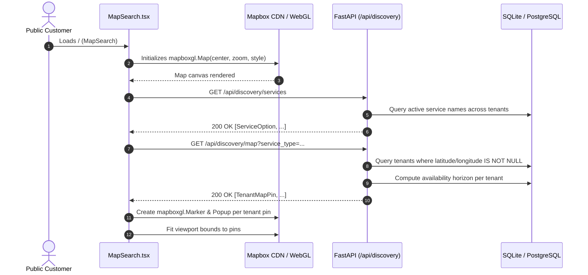

# Mapbox Discovery & Visualization Client (`mapbox/`)

## 1. Purpose & Scope

The `mapbox/` directory contains a dedicated, standalone React/Vite single-page web client (`fastapi-bookings-front-end-mapbox`) built to visualize multi-tenant booking discovery on an interactive Mapbox-GL map.

### Capabilities
- **Interactive Multi-Tenant Map**: Visualizes geocoded business locations with status indicators (`available_today`, `available_later`, `unavailable`).
- **Discovery Search**: Queries backend discovery endpoints (`GET /api/discovery/map`, `GET /api/discovery/services`) to filter service providers by service category and location.
- **Multiple Layout Modes**: Supports Airbnb-style split view (50% list / 50% map), map-only view, and list-only view with mobile responsiveness.
- **Map Styling Controls**: Provides runtime style switching between Dark, Light, Streets, Satellite, and Outdoors Mapbox map styles.
- **Administrative Navigation & Routing**: Houses legacy UI prototypes for catalog, location management, calendar, booking forms, and client portal views.

### Architectural Role & Migration Status
As established in `fastapi_bookings_frontend_mcd_v2.md`:
> *The existing `mapbox/` application is migration evidence and an operational prototype.*

Production customer and administrative workflows have migrated to the primary frontend (`frontend/`), which accesses address standardization via the backend `GET /api/public/travel/addresses` API. The `mapbox/` client serves as an independent visualization surface and ecosystem development module (registered in `dev-dashboard/project-modules.json`).

---

## 2. Architecture & Key Files

```
mapbox/
├── package.json                          # Vite + React 18 + Mapbox-GL ^3.26.0 dependencies
├── package-lock.json                     # Pinned lockfile for reproducible builds
├── vite.config.ts                        # Vite configuration with /api reverse proxy to FastAPI backend
├── tsconfig.json                         # TypeScript compiler configuration
├── index.html                            # Root HTML template mounting Mapbox GL CSS
├── App.tsx                               # Router configuration (Discovery, Client Portal, Admin Workspace)
├── types.ts                              # Frontend data types & error envelopes
├── COMPLETION_SUMMARY.md                 # Historic implementation record & MCD checklist
├── ROADMAP.md                            # Prototype module implementation roadmap
├── .env.example                          # Template for environment configuration
├── components/
│   ├── public/
│   │   ├── MapSearch.tsx                 # Core Mapbox GL interactive map & discovery panel
│   │   └── BookingWizard.tsx             # Public multi-step booking modal
│   ├── admin/
│   │   ├── LocationManager.tsx           # Administrative location CRUD and staff assignment
│   │   └── Dashboard.tsx                 # Admin metric cards and status views
│   └── client/
│       └── ClientProfile.tsx             # Client portal profile view
├── services/
│   ├── apiClient.ts                      # Fetch wrapper with tenant header injection & error translation
│   └── adminService.ts                   # Typed API service calls for admin endpoints
└── store/
    ├── AuthContext.tsx                   # JWT state and role-based route guard context
    ├── TenantContext.tsx                 # Active tenant resolution and feature flags
    └── BookingFlowContext.tsx            # Multi-step booking state container
```

### Key Components:
- **`MapSearch.tsx`**: Mounts `mapboxgl.Map`, adds `NavigationControl` and `GeolocateControl`, calculates bounds, renders animated HTML markers with color-coded status rings, and displays booking popups.
- **`apiClient.ts`**: Handles backend communication, injecting `X-Tenant` and `X-Token` headers. Throws `ApiError` if legacy `VITE_MOCK_API=true` is enabled.
- **`LocationManager.tsx`**: Admin panel for creating and editing `Location` models, assigning service/provider relationships, and configuring business hours.

---

## 3. Setup, Configuration & Dependencies

### Prerequisites
- Node.js 18+ (npm)
- Active FastAPI Bookings backend running on port 8000 (or as configured in proxy)

### Environment Variables (`mapbox/.env`)
| Variable | Description | Default / Example |
| :--- | :--- | :--- |
| `VITE_API_BASE_URL` | Base URL for FastAPI backend (leave empty to use Vite local proxy) | `http://localhost:8000` |
| `VITE_PUBLIC_API_KEY` | Public API key used for public bootstrap token requests | `local-public-key-change-me` |
| `VITE_TENANT_SUBDOMAIN`| Fallback tenant subdomain on localhost when `?tenant=` query param is absent | `simplydemo` |
| `VITE_MOCK_API` | Must remain `false` in production and live development | `false` |
| `VITE_MAPBOX_ACCESS_TOKEN` | Public Mapbox GL token for client-side raster/vector tile fetching | `pk.eyJ...` |

### NPM Dependencies
- `mapbox-gl` (`^3.26.0`): WebGL interactive mapping engine.
- `react` / `react-dom` (`^18.x` / `latest`): Component tree.
- `react-router-dom` (`^6.x` / `latest`): Hash-based client routing (`HashRouter`).

---

## 4. Core Workflows & Contracts

### 4.1 Discovery Map Rendering Workflow


### 4.2 API Contracts Consumed
- `GET /api/discovery/map`:
  - Output: `List[TenantMapPin]` (`tenant_id`, `business_name`, `slug`, `latitude`, `longitude`, `image_url`, `status`, `next_available_text`).
- `GET /api/discovery/services`:
  - Output: `List[ServiceOption]` (`name`).
- `GET /api/admin/locations`:
  - Output: `List[LocationDetail]` (`id`, `name`, `address`, `timezone`, `active`, `provider_ids`, `service_ids`, `category_ids`).

---

## 5. Data Safety & Isolation

- **Tenant Scoping**: All API calls pass `X-Tenant` resolved from query parameters or session storage via `TenantContext`.
- **Administrative Token Partitioning**: Admin and client tokens (`X-Token`) are held in browser `localStorage` and never shared across subdomains.
- **Client-Side Geocoding Isolation**: The frontend does *not* possess the backend server secret `MAPBOX_ACCESS_TOKEN`. However, it utilizes a public Mapbox token (`pk.*`) for tile rendering.

---

## 6. Known Issues, Edge Cases & Outstanding Work (Audited Shortcomings)

> [!WARNING]
> The following issues and non-compliances were identified during the systems audit and must be prioritized for remediation:

1. **[RESOLVED - Work Package 4] Rule 3 Compliance — Synthetic Mock Pins Purged**:
   - `mapbox/components/public/MapSearch.tsx` previously defined a hardcoded mock dataset `MOCK_COMPANION_PINS` with fallback substitutions.
   - **Resolution**: `MOCK_COMPANION_PINS` was deleted completely, fallback assignment in `fetchPins` was removed, and initial pin state starts empty. When `/api/discovery/map` returns empty results or errors, the UI renders real empty states ("No providers found matching your search criteria") or network error alerts without synthetic pins.
2. **[RESOLVED - Work Package 4] Mapbox Public Token Security**:
   - `mapbox/components/public/MapSearch.tsx` hardcoded a public Mapbox token.
   - **Resolution**: Replaced with `const token = import.meta.env.VITE_MAPBOX_ACCESS_TOKEN || ''; mapboxgl.accessToken = token;`. Documented `VITE_MAPBOX_ACCESS_TOKEN` in `mapbox/.env.example`.
3. **Legacy Mock Mode Toggle in `apiClient.ts`**:
   - `mapbox/services/apiClient.ts` lines 4 & 57–59 reference `VITE_MOCK_API`. While it currently throws an `ApiError` (`MOCK_API_DISABLED`), the dead scaffold remains and should be removed.
4. **Outdated Terminology & Coupling**:
   - `MapSearch.tsx` retains niche-specific terminology ("Book Companion", "Independent Network") rather than generic multi-tenant discovery terminology aligned with the main `frontend/` application.
5. **No Direct Mapbox Geocoding in Main Frontend**:
   - The primary application `frontend/` does not embed `mapbox-gl` or render Mapbox map pins; it relies on Google Maps iframe embeds for address previews (`pages/admin/catalog/locations.tsx`) and backend APIs for address completion.

---

## 7. Verification & Testing Commands

### Build & Typecheck
```powershell
# Navigate to the mapbox subproject
cd f:\Projects\fastapi_bookings\mapbox

# Verify clean TypeScript compilation and Vite production build
npm run check
# or
npm run build
```

### Dev Server Smoke Test
```powershell
# Launch local Vite dev server on configured port
npm run dev
```

### Lint Checks
```powershell
# Verify no lint regressions
npx oxlint
```
